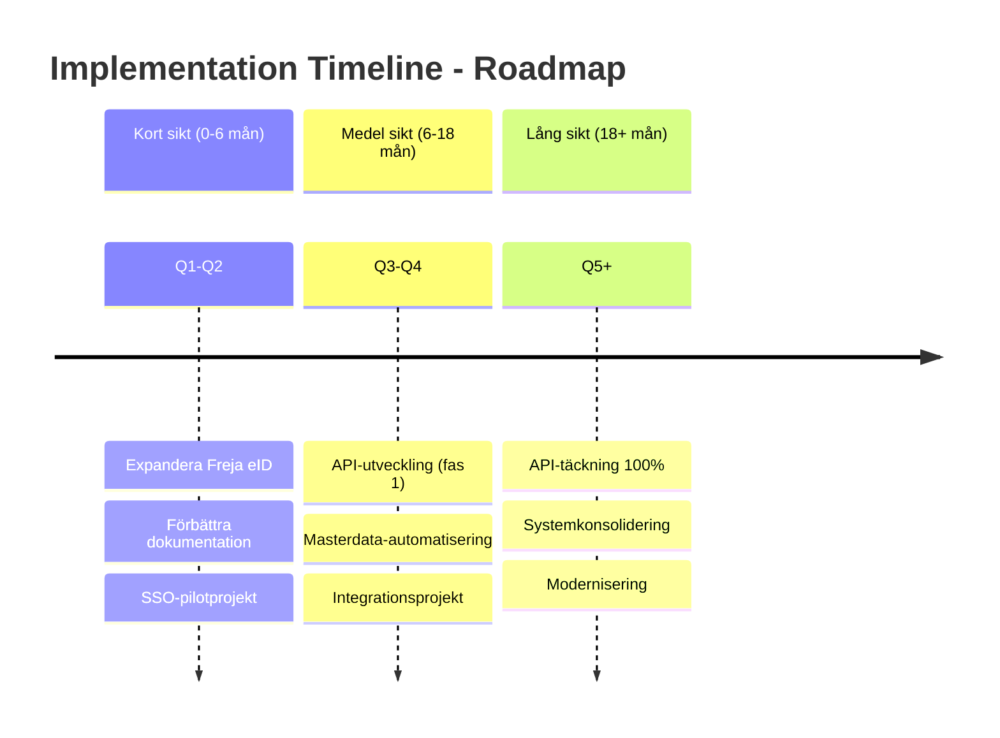

# 📊 Gap-analys - AS-IS vs TO-BE

## 🎯 Översikt

Denna analys identifierar gap mellan nuvarande (AS-IS) och önskad (TO-BE) systemarkitektur.

!!! info "Om denna analys"
    Identifiera vad som saknas för att nå målbilden och prioritera förbättringar.

**Genomfört med**:
- 📋 Systemanalys
- 🎤 Intervjuer med verksamhet
- 📈 Jämförelse med målbild

---

## 🔴 Gap 1: Autentisering

| Dimension | Nuläge (AS-IS) | Målbild (TO-BE) | Status |
|-----------|-----------------|----------------|----|
| **Metoder** | Användarnamn + lösenord | Freja eID | ❌ Gap |
| **SSO-stöd** | Begränsat | Alla system | ❌ Gap |
| **Tvåfaktorsauth** | Saknat | Implementerat | ❌ Gap |
| **Prioritet** | — | **Hög** | 🔴 Kritisk |

!!! warning "Säkerhetsgap"
    Många inloggningsmetoder minskar säkerheten. Användare väljer svagare lösenord och säkerhetsbristen ökar.

**Rekommendation**: Implementera Freja eID för fler system inom 6 månader

---

## 🔴 Gap 2: Masterdata-hantering

| Dimension | Nuläge (AS-IS) | Målbild (TO-BE) | Status |
|-----------|-----------------|----------------|----|
| **Hantering** | Manuell överföring | Automatisk dataöverföring | ❌ Gap |
| **Datakvalitet** | Inkonsekvent | Centraliserad | ❌ Gap |
| **Masterdata** | Flera kopior | Ett master per domän | ❌ Gap |
| **Prioritet** | — | **Hög** | 🔴 Kritisk |

<strong>🚨 Datakvalitet:</strong> Manuell överföring mellan 8+ system orsakar fel och datainkonsekvens

**Rekommendation**: Etablera automatisk dataöverföring för kritiska system inom 12 månader

---

## 🟡 Gap 3: API-täckning

| Dimension | Nuläge (AS-IS) | Målbild (TO-BE) | Status |
|-----------|-----------------|----------------|----|
| **API-täckning** | Begränsad (30%) | 100% | ❌ Gap |
| **Integrationstyp** | Batch + manuell | REST API realtid | ⚠️ Delvis |
| **Dokumentation** | Spridd | Centraliserad | ✅ Löst |
| **Prioritet** | — | **Medel** | 🟡 Högt |

| System | API-status | Behov |
|--------|-----------|-------|
| Lifecare-Procapita | 🔴 Ingen | 🔴 Kritisk |
| HRutan | 🔴 Begränsad | 🟡 Hög |
| Medvind | 🟡 Delvis | 🟡 Medel |
| Ekot | 🔴 Batch | 🔴 Kritisk |
| Koll-Qlikview | 🔴 Ingen | 🟡 Medel |

**Rekommendation**: Prioritera API-utveckling för de 5 kritiska systemen

---

## 🟢 Gap 4: Dokumentation

| Dimension | Nuläge (AS-IS) | Målbild (TO-BE) | Status |
|-----------|-----------------|----------------|----|
| **Lagring** | Spridd (Teams, Wiki, mail) | Centraliserad | ✅ Löst |
| **Uppdaterad** | Gammal (2021) | Aktuell | ✅ Löst |
| **Tillgänglig** | Svårhittat | Enkelt att hitta | ✅ Löst |
| **Prioritet** | — | **Låg** | 🟢 Löst |

!!! success "Framsteg"
    Denna dokumentationsplattform löser redan detta gap. Fortsätt att uppdatera regelbundet!

---

## 📅 Implementeringskarta

## 🎯 Prioriterad handlingsplan

| # | Gap | Prioritet | Start | Resultat | Ansvarig |
|---|-----|-----------|-------|----------|----------|
| 1 | Autentisering | 🔴 Hög | Q1 | Freja eID + SSO | IT-arkitektur |
| 2 | Masterdata | 🔴 Hög | Q2 | Automatisk synk | IT-arkitektur |
| 3 | API-täckning | 🟡 Medel | Q3 | 60% täckning | Leverantörer + IT |
| 4 | Dokumentation | 🟢 Låg | ✅ Pågår | Uppdaterad | Alla |

---

## 🔗 Läs mer

- 🚨 [Pain Points](pain-points.md) - Nuvarande problem
- 🗺️ [Systemlandskap](../systems/system-landscape.md) - Se alla system
- 🏗️ [Arkitekturprinciper](../overview/architecture-principles.md) - Designprinciper
- 📞 [Kontakt](../about/contact.md) - Frågor?

