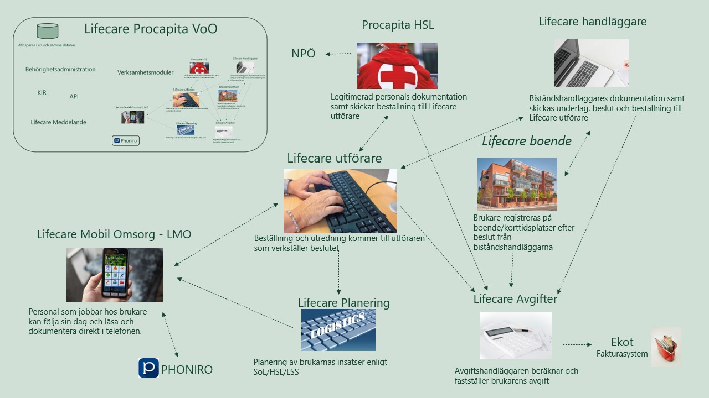
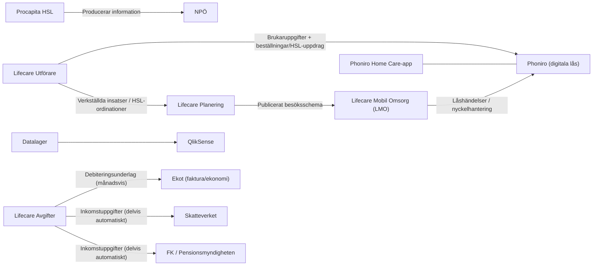

# Lifecare / Procapita – översikt

## Scope och lagrum

Lifecare/Procapita är det nuvarande verksamhetssystemet för äldreomsorg och omsorg vid funktionsnedsättning inom både FSF och HVOF. Systemet fungerar som en central plattform och nav för handläggning, boende, utförande, planering, mobil omsorg och avgifter. All primär data lagras i en **gemensam databas**, vilket säkerställer sammanhållen informationshantering.

Systemet stödjer verksamhet enligt tre huvudlagstiftningar:

| Lagstiftning | Förkortning | Användningsområde |
|--------------|-------------|-------------------|
| Hälso- och sjukvårdslagen | HSL | Dokumentation och processstöd för legitimerad personal (arbetsterapeuter, fysioterapeuter, sjuksköterskor) |
| Socialtjänstlagen | SoL | Bistånd, utförande och uppföljning inom äldreomsorg |
| Lagen om stöd och service till vissa funktionshindrade | LSS | Stöd och service till vissa funktionshindrade |

## Kontext och översikt

Bilden nedan visar en översikt över hur verksamhetssystemet samarbetar och hur modulerna interagerar med varandra och externa system.

{ width="100%" }

Diagrammet nedan visar hur plattformen integrerar med externa system och flöden:

## Systemkatalog – moduler i Lifecare / Procapita

Följande tabell ger en översikt över alla moduler i Lifecare/Procapita, deras syfte, nyckelfunktioner och integrationer:

| Modul | Syfte | Nyckelfunktioner / Processflöde | Integrationer |
|-------|-------|----------------------------------|---------------|
| **Procapita HSL** | Dokumentation och processstöd för legitimerad personal enligt HSL (arbetsterapeuter, fysioterapeuter, sjuksköterskor) | Ordinationshantering, delegeringar, besöksregistrering, vårdplaner och bedömningar. Registrerar HSL‑besök för patientavgift och statistik (KVÅ till Socialstyrelsen) | Producerar vårdinformation till **NPÖ** (Nationell patientöversikt). Levererar underlag till **Lifecare Utförare** och **Lifecare Planering** via den gemensamma plattformen |
| **Lifecare Handläggare** | Hantera ärenden från ansökan till beslut inom äldreomsorg och omsorg vid funktionsnedsättning (SoL/LSS) | Processflöde: Ansökan → utredning → beslut → beställning till **Lifecare Utförare**. Stöd för uppföljning, statistik och rapporter | Delar grunddata (brukare, beslut, insatser) med **Lifecare Utförare**, **Boende** och **Avgifter** via den gemensamma databasen. Underlag kan vidareföras till **datalager/BI** för analys |
| **Lifecare Boende** | Säkerställa att rätt brukare får rätt plats vid rätt tid, med spårbarhet kring beslut och beläggning. Administrerar särskilt boende, bostad med särskild service och korttidsboende | Boendebeslut och placering, köhantering, lägenhetsbokning, översikter och rapporter per boende/lägenhet/brukare. Hanterar boenden, enheter, lägenheter/platser, boendebeslut och köposter | Delar boendeinformation med **Utförare**, **Planering** och **Avgifter**. Används som källa till debiteringsunderlag i **Lifecare Avgifter** <!-- TODO: specificera vilka fält som används i avgiftsberäkningen --> |
| **Lifecare Utförare** | Verkställighet av beställningar (SoL, LSS, SFB) och HSL‑uppdrag med dokumentation och uppföljning | Genomförandeplaner, närvaro/frånvaro, månadsrapportering, besöksuppföljning och registrering av utförda insatser | Tar emot beslut/beställningar från **Lifecare Handläggare**, **Boende** och **Procapita HSL**. Skickar utförda insatser/HSL‑ordinationer till **Lifecare Planering** och **Lifecare Avgifter**. Skickar brukaruppgifter och beställningar till **Phoniro** för e‑låshantering |
| **Lifecare Planering** | Skapa brukarbesök, personalschema och dagliga besöksscheman | Processflöde: Tar emot brukare och insatser från **Lifecare Utförare** → genererar scheman baserat på uppdrag och genomförandeplaner → publicerar till **Lifecare Mobil Omsorg (LMO)**. Planeringsregler (restid, kompetenskrav) konfigurerade i HVOF:s miljö | Tar emot verkställda insatser/HSL‑ordinationer från **Lifecare Utförare**. Publicerar besöksscheman till **Lifecare Mobil Omsorg (LMO)** <!-- TODO: specificera exakt konfiguration --> |
| **Lifecare Mobil Omsorg (LMO)** | Mobil vy och spegling av brukardata och schema för utförarpersonal | Visar personuppgifter, planerade insatser, dokumentation och genomförandeplaner. Stöd för rapportering och dokumentation direkt i mobilen. Hantering av digitala nycklar och låshändelser | Tar emot publicerade besöksscheman från **Lifecare Planering**. Skickar låshändelser/nyckelhantering till **Phoniro**. Läser/lämnar data via den gemensamma plattformen (ingen egen databas) |
| **Lifecare Avgifter** | Beräkna avgifter enligt SoL/LSS/HSL – "sista länken i kedjan" innan fakturering | Indata: Utförda insatser och närvaro (Utförare), HSL‑uppgifter (Procapita HSL), boendeinformation (Boende), inkomstuppgifter (Skatteverket, FK/PM). Utdata: Månadsvisa debiteringskörningar → debiteringsunderlag till **Ekot** → underlag till **datalager** och **QlikSense** | Tar emot data från **Lifecare Utförare**, **Procapita HSL**, **Lifecare Boende**, **Skatteverket** och **Försäkringskassan/Pensionsmyndigheten**. Skickar debiteringsunderlag till **Ekot** och underlag till **datalager/QlikSense** |

## Omgivande system och analys

Följande system och tjänster integreras med Lifecare/Procapita för att säkerställa komplett funktionalitet från vårdplanering till fakturering och rapportering.

| System | Roll | Integration med Lifecare/Procapita |
|--------|------|-------------------------------------|
| **NPÖ** (Nationell patientöversikt) | Tar emot vårdinformation så att andra vårdgivare kan ta del av relevanta uppgifter | Procapita HSL producerar och skickar vårdinformation enligt nationella specifikationer (t.ex. HL7 FHIR) <!-- TODO: komplettera med lokal teknisk lösning --> |
| **Ekot** (ekonomi/fakturering) | Ekonomisystem för fakturering, redovisning och uppföljning av intäkter | Tar emot månadsvisa debiteringsunderlag från **Lifecare Avgifter** |
| **Datalager** | Centralt lager för analysdata | Tar emot data från Lifecare/Procapita (beslut, utförda insatser, avgifter) <!-- TODO: specificera tabeller och uppdateringsfrekvens --> |
| **QlikSense** | Business Intelligence och rapportering | Använder datalagret som källa för dashboards, produktionsuppföljning och kvalitetsrapporter |
| **Skatteverket** | Källa för inkomstuppgifter | Delvis automatiska hämtningar (fil eller API) till **Lifecare Avgifter** <!-- TODO: beskriva exakt arbetsflöde och teknik --> |
| **Försäkringskassan/Pensionsmyndigheten** | Källa för inkomstuppgifter | Delvis automatiska hämtningar (fil eller API) till **Lifecare Avgifter** <!-- TODO: beskriva exakt arbetsflöde och teknik --> |
| **Phoniro** (digitala nycklar/e‑lås) | Hanterar e‑lås, nycklar och låshändelser i brukarens hem | Tar emot brukaruppgifter och HSL‑uppdrag/beställningar från **Lifecare Utförare**. Används tillsammans med **LMO** för åtkomsthantering |
| **Phoniro Home Care‑appen** | Mobil app för personal | Används för att låsa upp/låsa, kvittera besök och dokumentera. Viss legitimerad personal kan behöva läggas upp manuellt <!-- TODO: verifiera lokal rutin --> |

