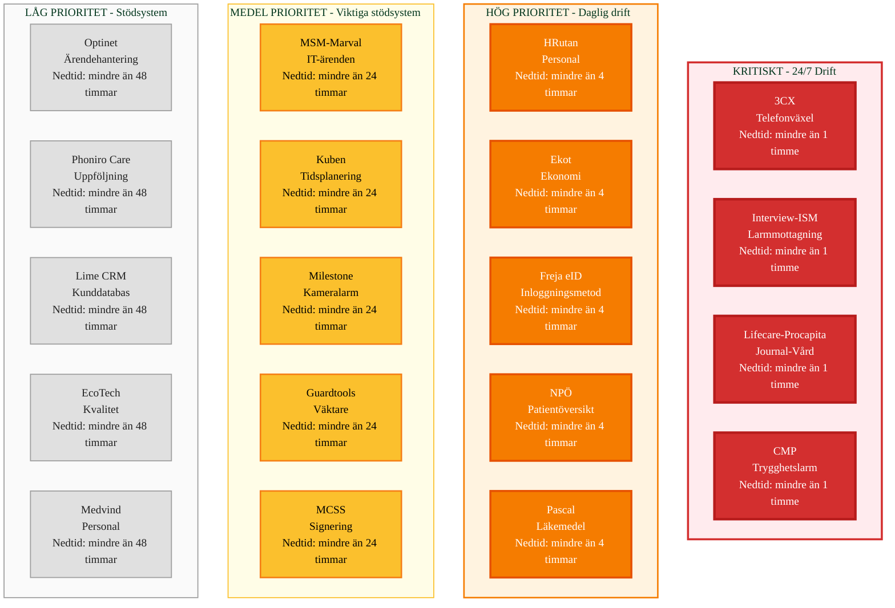

# Kritikalitet - Systemprioritering

## Översikt
Detta diagram visar systemens kritikalitet baserat på verksamhetspåverkan och driftkrav.

## Kritikalitetsdefinitioner

### KRITISKT (Röd) - 24/7 Drift
System som måste vara tillgängliga dygnet runt. Nedtid påverkar verksamheten omedelbart.

**System:**
- **3CX** - Telefonväxel (Larmcentral)
- **Interview/ISM** - Larmmottagning (Master)
- **Lifecare-Procapita** - Journal/Vård (Master)
- **CMP** - Trygghetslarm administration

**Krav:**
- 99.9% tillgänglighet
- Realtid monitoring
- Automatisk redundans
- Snabb återställning (< 1 timme)

### HÖG PRIORITET (Orange) - Daglig drift
System som används dagligen och påverkar verksamheten vid nedtid.

**System:**
- **HRutan** - Personal (Master)
- **Ekot** - Ekonomi (Master)
- **Freja eID** - Säker inloggning
- **NPÖ** - Patientöversikt
- **Pascal** - Läkemedel

**Krav:**
- 99% tillgänglighet
- Daglig monitoring
- Återställning inom 4 timmar

### MEDEL PRIORITET (Gul) - Viktiga stödsystem
System som är viktiga men kan hanteras med begränsad funktionalitet.

**System:**
- **MSM/Marval** - IT-ärenden
- **Kuben** - Tidsplanering
- **Milestone** - Kameralarm
- **Guardtools** - Väktare
- **MCSS** - Signering

**Krav:**
- 95% tillgänglighet
- Veckovis monitoring
- Återställning inom 24 timmar

### LÅG PRIORITET (Beige) - Stödsystem
System som kan vara nere utan omedelbar verksamhetspåverkan.

**System:**
- **Optinet** - Ärendehantering
- **Phoniro Care** - Uppföljning
- **Lime CRM** - Kunddatabas
- **EcoTech** - Kvalitet
- **Medvind** - Personal

**Krav:**
- 90% tillgänglighet
- Månadsvis monitoring
- Återställning inom 48 timmar

## Nedtidspåverkan

| Kritikalitet | Max Nedtid | Verksamhetspåverkan | Återställning |
|--------------|------------|---------------------|---------------|
| **Kritiskt** | < 1 timme | Omedelbar | < 1 timme |
| **Hög** | < 4 timmar | Daglig verksamhet | < 4 timmar |
| **Medel** | < 24 timmar | Begränsad funktionalitet | < 24 timmar |
| **Låg** | < 48 timmar | Minimal påverkan | < 48 timmar |

## Beroenden

### Kritiska Beroenden
- **3CX** → Interview/ISM (Kritisk integration)
- **Interview/ISM** → CMP (Kritisk integration)
- **Lifecare-Procapita** ↔ NPÖ, Pascal (Kritiska integrationer)
- **Freja eID** → HRutan, Lifecare-Procapita (Kritisk inloggning)

### Kaskadeffekter
Om ett kritiskt system faller:
- **3CX nere** → Interview/ISM kan inte ta emot samtal
- **Interview/ISM nere** → CMP kan inte administrera larm
- **Lifecare-Procapita nere** → NPÖ, Pascal kan inte synkronisera
- **Freja eID nere** → Användare kan inte logga in

