# Systemlandskap - RFI-fokus

## Översikt

Detta diagram visar systemlandskapet med fokus på system som är mest direkt kopplade till vård/omsorg, larm, planering och kvalitet - de system som är viktigast i RFI inför verksamhetssystems-byte.

```mermaid
%%{init: {
  'theme': 'default',
  'themeVariables': {
    'fontSize': '22px',
    'fontFamily': 'Arial, sans-serif',
    'primaryColor': '#01351C',
    'primaryTextColor': '#ffffff',
    'primaryBorderColor': '#01351C',
    'lineColor': '#01351C',
    'secondaryColor': '#FFC107',
    'tertiaryColor': '#4CAF50',
    'background': '#FAFAFA',
    'mainBkgColor': '#FFFFFF',
    'textColor': '#212121',
    'clusterBkg': '#E8F5E9',
    'clusterBorder': '#01351C'
  },
  'flowchart': {
    'nodeSpacing': 60,
    'rankSpacing': 80,
    'curve': 'basis',
    'padding': 20,
    'htmlLabels': true,
    'useMaxWidth': true
  }
}}%%
graph TB
    subgraph Core["Kärnverksamhet Omsorg"]
        direction TB
        Life["Lifecare-Procapita<br/>Core omsorgssystem<br/>Master: Vårddata"]
        Phoniro["Phoniro Care<br/>Tid- och insatsuppföljning"]
        MCSS["MCSS<br/>Digital signering"]
        Kuben["Kuben<br/>Planering"]
        MinaPlaner["Mina Planer<br/>Vårdplanering"]
        NPÖ["NPÖ<br/>Patientöversikt"]
        Pascal["Pascal<br/>Läkemedel"]
        Senior["Senior Alert<br/>Kvalitetsregister"]
        SESAM["Webb SESAM<br/>Hjälpmedel"]
    end
    
    subgraph Larm["Larm och Välfärdsteknik"]
        direction TB
        ISM["Interview-ISM<br/>Larmmottagning<br/>Master: Larmdata"]
        C3CX["3CX<br/>Telefonväxel"]
        CCMP["CMP Neat<br/>Trygghetslarm"]
        Guard["GuardTools<br/>Väktare"]
        Milestone["Milestone<br/>Kameralarm"]
        Viser["Viser-Sensio-Smooth<br/>Trygghetssensorer"]
        PhoniroLock["Phoniro Lock<br/>Digitala lås"]
    end
    
    subgraph Quality["Kvalitet och Ledning"]
        direction TB
        EcoTech["EcoTech<br/>Ledningssystem"]
        Agera["Agera<br/>Incidentrapportering"]
        Selfpoint["Selfpoint<br/>Avvikelser-Synpunkter"]
        Stratsys["Stratsys<br/>Mål-uppföljning"]
        Koll["Koll-QlikView<br/>BI-rapporter"]
    end
    
    subgraph HR["HR och Personal"]
        direction TB
        HRutan["HRutan<br/>Personal<br/>Master: Personaldata"]
        Medvind["Medvind<br/>Schema-Tid"]
        Vikarie["Vikariebanken<br/>Timvikarier"]
        Visma["Visma Recruit<br/>Rekrytering"]
        Adato["Adato<br/>Rehab-Sjukfrånvaro"]
    end
    
    subgraph Security["Säkerhet och Access"]
        direction TB
        ARX["ARX<br/>Passagesystem"]
        KeyWin["KeyWin-Traka<br/>Nyckelskåp"]
        Stanley["Stanley-RCO-SoliCard<br/>Passer-Säkerhet"]
    end
    
    subgraph Infrastructure["Infrastruktur IT"]
        direction TB
        MSM["MSM-Marval<br/>IT-ärenden"]
        Snipe["Snipe-IT<br/>IT-inventarie"]
        EasyApp["EasyApp<br/>Inventarie-märkning"]
        Intune["Intune<br/>MDM-MEM"]
        KomKat["KomKat-HSA<br/>Behörigheter"]
        Imprivata["Imprivata<br/>SSO-Klinisk åtkomst"]
    end
    
    subgraph National["Nationella-Regionala Tjänster"]
        direction TB
        Freja["Freja eID<br/>SSO Inloggning"]
        SITHS["SITHS<br/>Vårdinloggning"]
        NPÖ2["NPÖ<br/>Patientöversikt"]
        Pascal2["Pascal<br/>Läkemedel"]
        MinaPlaner2["Mina Planer<br/>Vårdplanering"]
        Senior2["Senior Alert<br/>Kvalitetsregister"]
    end
    
    %% Kärnverksamhet integrationer
    Life -->|Beställning| Phoniro
    Phoniro -->|Tid-Insats| Life
    Life -->|Ordination| MCSS
    Life -->|Planering| Kuben
    Life -->|Vårdplan| MinaPlaner
    Life -->|Journal| NPÖ
    Life -->|Läkemedel| Pascal
    Life -->|Riskbedömning| Senior
    Life -->|Hjälpmedel| SESAM
    
    %% Larm integrationer
    C3CX -->|Samtal| ISM
    ISM -->|Larmdata| CCMP
    ISM -->|Aviseringar| Guard
    Milestone -->|Alarm| ISM
    Viser -->|Sensorlarm| ISM
    PhoniroLock -->|Kvittens| Phoniro
    
    %% Kvalitet integrationer
    Life -->|Avvikelser| Agera
    Life -->|Avvikelser| Selfpoint
    Agera -->|Rapporter| Stratsys
    Life -->|Data| Koll
    
    %% HR integrationer
    HRutan -->|Personaldata| Medvind
    HRutan -->|Personaldata| Phoniro
    HRutan -->|Personaldata| Life
    Visma -->|Anställning| HRutan
    HRutan -->|Rehab| Adato
    
    %% Säkerhet integrationer
    ARX -->|Behörighet| Life
    KeyWin -->|Nycklar| ARX
    
    %% Infrastruktur integrationer
    EasyApp -->|Utrustning| CCMP
    EasyApp -->|Utrustning| Viser
    
    %% Nationella tjänster
    Freja -->|SSO| Life
    Freja -->|SSO| HRutan
    SITHS -->|Inloggning| NPÖ2
    SITHS -->|Inloggning| Pascal2
    SITHS -->|Inloggning| MCSS
    
    %% Styling
    style Life fill:#01351C,stroke:#012414,stroke-width:5px,color:#FFFFFF
    style ISM fill:#F44336,stroke:#C62828,stroke-width:4px,color:#FFFFFF
    style HRutan fill:#2196F3,stroke:#1976D2,stroke-width:4px,color:#FFFFFF
    style Freja fill:#FFC107,stroke:#F57C00,stroke-width:3px,color:#000000
    style SITHS fill:#FF6F00,stroke:#E65100,stroke-width:3px,color:#FFFFFF
    
    style Core fill:#E8F5E9,stroke:#4CAF50,stroke-width:3px
    style Larm fill:#FFEBEE,stroke:#F44336,stroke-width:3px
    style Quality fill:#FFF3E0,stroke:#FF9800,stroke-width:3px
    style HR fill:#E3F2FD,stroke:#2196F3,stroke-width:3px
    style Security fill:#F3E5F5,stroke:#9C27B0,stroke-width:3px
    style Infrastructure fill:#FAFAFA,stroke:#9E9E9E,stroke-width:2px
    style National fill:#FFF9C4,stroke:#FFC107,stroke-width:3px
```

## Systemdomäner

### 1. Kärnverksamhet Omsorg
**Fokus**: System som stödjer kärnprocesserna i vård och omsorg.

**Kärnsystem**: Lifecare-Procapita (core omsorgssystem)

**Stödsystem**:
- Phoniro Care (tid/insats)
- MCSS (signering)
- Kuben (planering)
- Mina Planer (vårdplanering)

**Nationella tjänster**:
- NPÖ (patientöversikt)
- Pascal (läkemedel)
- Senior Alert (kvalitetsregister)

### 2. Larm och Välfärdsteknik
**Fokus**: System för trygghetslarm, välfärdsteknik och larmhantering.

**Kärnsystem**: Interview/ISM (larmmottagning)

**Stödsystem**:
- 3CX (telefoni)
- CMP (trygghetslarm)
- GuardTools (väktare)
- Milestone (kameralarm)
- Viser/Sensio/Smooth (sensorer)
- Phoniro Lock (digitala lås)

### 3. Kvalitet och Ledning
**Fokus**: System för kvalitetsledning, avvikelsehantering och rapportering.

**System**:
- EcoTech (ledningssystem)
- Agera (incidentrapportering)
- Selfpoint (avvikelser/synpunkter)
- Stratsys (mål/uppföljning)
- Koll-QlikView (BI)

### 4. HR och Personal
**Fokus**: System för personalhantering och HR-processer.

**Kärnsystem**: HRutan (master för personaldata)

**Stödsystem**:
- Medvind (schema/tid)
- Vikariebanken (timvikarier)
- Visma Recruit (rekrytering)
- Adato (rehab/sjukfrånvaro)

### 5. Säkerhet och Access
**Fokus**: System för säkerhet, passerkontroll och accesshantering.

**System**:
- ARX (passagesystem)
- KeyWin/Traka (nyckelskåp)
- Stanley/RCO/SoliCard (passer/säkerhet)

### 6. Infrastruktur/IT-förvaltning
**Fokus**: System för IT-infrastruktur och förvaltning.

**System**:
- MSM/Marval (IT-ärenden)
- Snipe-IT (IT-inventarie)
- EasyApp (inventarie/märkning)
- Intune (MDM/MEM)
- KomKat/HSA (behörigheter)
- Imprivata (SSO/klinisk åtkomst)

### 7. Nationella/Regionala Tjänster
**Fokus**: Autentisering och nationella e-hälsotjänster.

**Autentisering**:
- Freja eID (SSO)
- SITHS (vårdinloggning)

**E-hälsotjänster**:
- NPÖ (patientöversikt)
- Pascal (läkemedel)
- Mina Planer (vårdplanering)
- Senior Alert (kvalitetsregister)

## Kritiska integrationer för RFI

### Must Have integrationer

1. **Nationella tjänster**
   - NPÖ (konsumera och publicera)
   - Pascal (läkemedel)
   - Senior Alert (kvalitetsregister)

2. **Regionala tjänster**
   - Mina Planer (vårdplanering)

3. **Välfärdsteknik**
   - CMP (trygghetslarm)
   - Phoniro Lock (digitala lås)
   - Viser/Sensio/Smooth (sensorer)

4. **Tid- och insatsuppföljning**
   - Phoniro Care eller inbyggd funktion

5. **Digital signering**
   - MCSS eller inbyggd funktion

6. **Larmcentral**
   - Interview/ISM
   - 3CX
   - Milestone

7. **Personal**
   - HRutan/Medvind

8. **Ekonomi**
   - Ekot (debitering)

## Smärtpunkter

1. **Dubbel dokumentation** - Mellan Lifecare, Phoniro, Senior Alert, Mina Planer
2. **Välfärdsteknik** - Flera leverantörer, behov av sammanhållen plattform
3. **Integrationer** - Många olika typer (API, batch, manuell)
4. **Nationella tjänster** - Komplex integration, dubbel dokumentation

## Relaterade dokument

- [Systemlandskap RFI-fokus](../systems/system-landscape-rfi.md)
- [RFI-material](../../rfi-rfp/rfi-material.md)
- [Integrationskarta](../architecture/integration-detailed.md)

