# Masterdata-flöde - Diagram

## Översikt
Detta diagram visar hur masterdata flödar mellan system och vilka system som är master för olika datadomäner.

```mermaid
%%{init: {
  'theme': 'default',
  'themeVariables': {
    'fontSize': '22px',
    'fontFamily': 'Arial, sans-serif',
    'primaryColor': '#01351C',
    'primaryTextColor': '#ffffff',
    'primaryBorderColor': '#01351C',
    'lineColor': '#01351C',
    'secondaryColor': '#FFC107',
    'tertiaryColor': '#4CAF50',
    'background': '#FAFAFA',
    'mainBkgColor': '#FFFFFF',
    'textColor': '#212121',
    'clusterBkg': '#E8F5E9',
    'clusterBorder': '#01351C'
  },
  'flowchart': {
    'nodeSpacing': 60,
    'rankSpacing': 80,
    'curve': 'basis',
    'padding': 20,
    'htmlLabels': true,
    'useMaxWidth': true
  }
}}%%
graph TB
    subgraph Master["⭐ MASTER DATA SYSTEMS"]
        direction LR
        HR["👥 HRutan<br/>━━━━━━━━━━━━━━<br/>⭐ MASTER: Personal<br/>━━━━━━━━━━━━━━"]
        Life["🏥 Lifecare-Procapita<br/>━━━━━━━━━━━━━━<br/>⭐ MASTER: Vårddata<br/>━━━━━━━━━━━━━━"]
        Ekot["💰 Ekot/Raindance<br/>━━━━━━━━━━━━━━<br/>⭐ MASTER: Ekonomi<br/>━━━━━━━━━━━━━━"]
        ISM["🚨 Interview/ISM<br/>━━━━━━━━━━━━━━<br/>⭐ MASTER: Larmdata<br/>━━━━━━━━━━━━━━"]
        MSM["💻 MSM/Marval<br/>━━━━━━━━━━━━━━<br/>⭐ MASTER: IT-ärenden<br/>━━━━━━━━━━━━━━"]
    end
    
    subgraph Personal["👥 Personal Data Flow"]
        direction TB
        HR -->|"📊 Personaldata<br/>Batch/Daglig"| Medvind["👥 Medvind<br/>Personal"]
        HR -->|"📊 Personaldata<br/>API"| Visma["💼 Visma<br/>Rekrytering"]
        HR -->|"📊 Personaldata<br/>Batch"| Vikariebanken["⏰ Vikariebanken<br/>Timvikarier"]
        Freja["🔑 Freja eID<br/>Inloggningsmetod"] -.->|"🔐 SSO"| HR
    end
    
    subgraph Vard["🏥 Vårddata Flow"]
        direction TB
        Life -->|"👤 Patientdata<br/>API HL7"| NPÖ["📋 NPÖ<br/>Patientöversikt"]
        Life -->|"💊 Läkemedel<br/>API"| Pascal["💊 Pascal<br/>Läkemedel"]
        Life -->|"✍️ Signering<br/>API"| MCSS["✍️ MCSS<br/>Signering"]
        Life -->|"⏰ Tidsdata<br/>Batch"| Phoniro["⏰ Phoniro Care<br/>Uppföljning"]
        Kuben["⏰ Kuben<br/>Tidsplanering"] -->|"📅 Tidsplanering<br/>API/Databas"| Life
        Freja -.->|"🔐 SSO"| Life
        SITHS["🆔 SITHS<br/>Inloggningsmetod"] -.->|"🔐 Inloggning"| NPÖ
        SITHS -.->|"🔐 Inloggning"| Pascal
        SITHS -.->|"🔐 Inloggning"| MCSS
    end
    
    subgraph Ekonomi["💰 Ekonomidata Flow"]
        direction TB
        Ekot -->|"📊 Ekonomidata<br/>Batch/Daglig"| Koll["📈 Koll-Qlikview<br/>Business Intelligence"]
        Ekot -->|"📊 Statistik<br/>Batch/Daglig"| Stratsys["📊 Stratsys<br/>Statistik"]
    end
    
    subgraph Larm["🚨 Larmdata Flow"]
        direction TB
        ISM -->|"🚨 Larmdata<br/>API/Batch"| CMP["🔔 CMP<br/>Trygghetslarm"]
        ISM -->|"👮 Aviseringar<br/>API"| Guard["👮 Guardtools<br/>Väktare"]
        3CX["📞 3CX<br/>Telefonväxel"] -->|"📞 Samtal<br/>Realtid API"| ISM
        Milestone["📹 Milestone<br/>Kameralarm"] -->|"🚨 Alarm<br/>Meddelandekö"| ISM
    end
    
    subgraph IT["💻 IT-ärenden Flow"]
        direction TB
        MSM -->|"💻 IT-support<br/>Ärenden"| ITD["💻 ITD<br/>IT-avdelning"]
    end
    
    style HR fill:#01351C,stroke:#012414,stroke-width:4px,color:#FFFFFF
    style Life fill:#4CAF50,stroke:#2E7D32,stroke-width:4px,color:#FFFFFF
    style Ekot fill:#FF9800,stroke:#E65100,stroke-width:4px,color:#FFFFFF
    style ISM fill:#F44336,stroke:#C62828,stroke-width:4px,color:#FFFFFF
    style MSM fill:#9C27B0,stroke:#6A1B9A,stroke-width:4px,color:#FFFFFF
    
    style Freja fill:#FFC107,stroke:#F57C00,stroke-width:3px,color:#000000
    style SITHS fill:#FF6F00,stroke:#E65100,stroke-width:3px,color:#FFFFFF
    
    style Master fill:#E8F5E9,stroke:#01351C,stroke-width:3px
    style Personal fill:#E1F5FE,stroke:#0288D1,stroke-width:2px
    style Vard fill:#E8F5E9,stroke:#4CAF50,stroke-width:2px
    style Ekonomi fill:#FFF3E0,stroke:#FF9800,stroke-width:2px
    style Larm fill:#FFEBEE,stroke:#F44336,stroke-width:2px
    style IT fill:#F3E5F5,stroke:#9C27B0,stroke-width:2px
```

## Masterdata-ansvar

| Datadomän | Master System | Sekundära System | Dataägare |
|-----------|--------------|------------------|-----------|
| **Personal** | HRutan | Medvind, Visma, Vikariebanken | HR/SEF |
| **Vårddata** | Lifecare-Procapita | NPÖ, Pascal, MCSS, Kuben, Phoniro Care | ÖSA/FSF |
| **Ekonomi** | Ekot (Raindance) | Koll-Qlikview, Stratsys | Ekonomi |
| **Larmdata** | Interview/ISM | 3CX, CMP, Guardtools, Milestone | Larmcentralen |
| **IT-ärenden** | MSM (Marval) | - | ITD |

## Dataflödesregler

1. **Personaldata** flödar från HRutan (master) till sekundära system
2. **Vårddata** flödar från Lifecare-Procapita (master) till externa system (NPÖ, Pascal)
3. **Ekonomidata** flödar från Ekot (master) till BI-system
4. **Larmdata** flödar från Interview/ISM (master) till stödsystem
5. **IT-ärenden** hanteras centralt i MSM/Marval

## Inloggningsmetoder

- **Freja eID** - SSO (Single Sign-On) för HRutan och Lifecare-Procapita
- **SITHS** - Inloggning för vårdtjänster (NPÖ, Pascal, MCSS)
