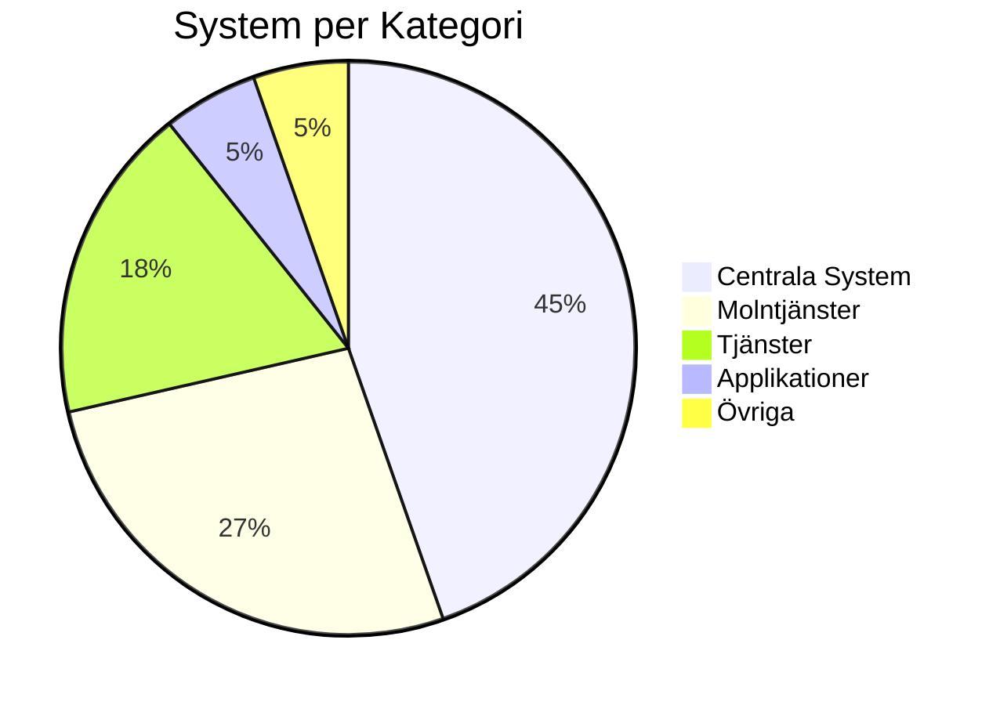

# RFI - Verksamhetssystemet för HVOF

{ width="200" }

Välkommen till **Request for Information (RFI)** för **Hälsa, Vård och Omsorgsförvaltningen (HVOF)** systemarkitektur.

## 🎯 Syfte med denna RFI

Detta dokument är en föresprågan om information från leverantörer angående möjligheten att tillhandahålla ett integrerat verksamhetssystem för HVOF. Systemet ska stödja alla verksamhetsområden inom Malmö stads HVOF från larmcentral till välfärdstjänster.

**Vi söker:** Verksamhetssystem som kan ersätta dagens Lifecare-Procapita och integrera med befintlig IT-miljö.

## 📋 RFI-dokumentation

### Huvuddokument
- **[RFI-Material](rfi-rfp/rfi-material.md)** - Komplett RFI med systemöversikt, kritiska krav och integrationer
- **[Systemlandskap](systems/system-landscape-rfi.md)** - Visuell överblick av systemet och dess kopplingar
- **[Kravspecifikation](rfi-rfp/requirements-list.md)** - Detaljerade funktionella och tekniska krav

### Verksamhet & Processer
- **[Verksamhetsbeskrivning](overview/verksamhetsbeskrivning.md)** - Beskrivning av HVOF:s verksamhet
- **[Processer](processes/core-processes/overview.md)** - Kärnprocesser: Larmhantering, Vårdhantering, Personalhantering
- **[Organisationsstruktur](overview/organisation.md)** - HVOF:s organisation och roller

### Teknik & Integration
- **[Integrationer](systems/integrations.md)** - Alla systemkopplingar och datautväxlingar
- **[Masterdata-flöde](diagrams/data-flows/masterdata-flow.md)** - Beskrivning av kritiska dataflöden
- **[Autentisering & Säkerhet](diagrams/architecture/autentisering.md)** - Säkerhetskrav och autentiseringsmetoder

### Frågor & Utvärdering
- **[Frågor till leverantörer](rfi-rfp/supplier-questions.md)** - Specifika frågor om systemets kapacitet
- **[Utvärderingskriterier](rfi-rfp/evaluation-criteria.md)** - Hur svar utvärderas

## 🏥 Verksamhetsområden

HVOF ansvarar för fem huvudsakliga verksamhetsområden:

1. **Larmcentral** - Mottagning och dispatch av larmsamtal
2. **Vård & Omsorg** - Socialtjänst, hemtjänst, särskilt boende, LSS
3. **Kvalitet & Säkerhet** - Avvikelsehantering, rapportering
4. **Personal & HR** - Bemanning, schemaläggning, personaladministration
5. **Ekonomi & Fakturering** - Ekonomistyrning, debitering, rapporter

## 📊 Systemöversikt

**Dagens system:**
- **Huvudsystem:** Lifecare-Procapita (verksamhet, journal, dokumentation)
- **Stödsystem:** 56 integrerade system (från små specialistlösningar till stora plattformar)
- **Criticals:** 4 system (24/7 drift)
- **Användargrupper:** ~500 användare

## ⏰ RFI-process

1. **Information** - Du läser denna RFI
2. **Frågor** - Skicka frågor via e-post eller möte
3. **Svar & Demo** - Leverantörer presenterar sina lösningar
4. **Analys** - Vi utvärderar baserat på kriterierna
5. **RFP** - Utvalda leverantörer bjuds in till formell upphandling (RFP)

## 📞 Kontakt

För frågor eller mer information om denna RFI, kontakta:

- **Projektledning:** [Se Kontakt](about/contact.md)
- **Tekniska frågor:** Se kontaktpersoner i respektive systemdokumentation

---

**Datum:** December 2025  
**Giltig tom:** Framgår av RFI-ritningsmeddelandet  
**Malmö stad - Hälsa, Vård och Omsorgsförvaltningen**
- Teknisk information

## 📈 Systemöversikt

## 🎨 Verksamhetsområden

1. **Larmcentral** - Trygghetslarm och larmmottagning
2. **Vård & Omsorg** - Journal, vårdplanering, läkemedel
3. **Personal & HR** - Personalsystem, rekrytering
4. **Ekonomi** - Ekonomisystem, rapportering
5. **IT & Infrastruktur** - IT-ärenden, inventarie

## 📝 Uppdatering

Dokumentationen uppdateras kontinuerligt. Alla ändringar spåras i Git.

## 🤝 Bidra

För att uppdatera dokumentationen:
1. Redigera `systems_data.py` eller Markdown-filer
2. Kör `python3 generate_docs.py` för att generera dokumentation
3. Commit och push till Git

## 📞 Kontakt

För frågor om systemarkitekturen, kontakta:
- **Systemarkitektur:** [Kontaktperson]
- **IT:** ITD
- **Verksamhet:** [Kontaktperson]

