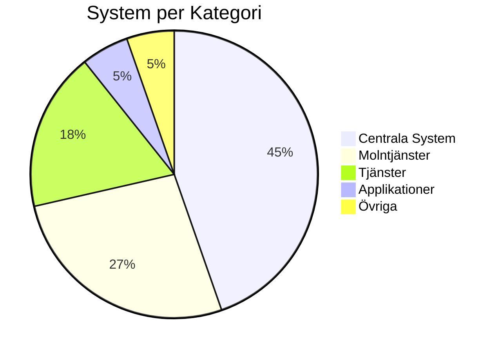

# HVOF Systemarkitektur

{ width="200" }

Välkommen till systemarkitekturdokumentationen för **Hälsa, Vård och Omsorgsförvaltningen (HVOF)**.

## 🎯 Syfte

Denna dokumentation ger en komplett översikt av HVOFs systemlandskap för:
- **Ledning** - Strategisk översikt och beslutsunderlag
- **Verksamhet** - Förståelse av system och processer
- **IT** - Teknisk dokumentation och integrationer
- **Leverantörer** - Underlag för RFI och upphandling

## 📊 Snabböversikt

- **Totalt antal system:** 57
- **Verksamhetsområden:** 5 (Larmcentral, Vård & Omsorg, Personal & HR, Ekonomi, IT)
- **Masterdata-system:** 5 (HRutan, Lifecare-Procapita, Ekot, Interview/ISM, MSM)
- **Kritiska system:** 4 (24/7 drift)

## 🗺️ Navigering

### För Ledning
- [Verksamhetsbeskrivning](overview/verksamhetsbeskrivning.md)
- [Organisationsstruktur](overview/organisation.md)
- [Systemkarta](systems/system-landscape.md)
- [Kritikalitet](diagrams/architecture/kritikalitet.md)

### För Verksamhet
- [Verksamhetsområden](diagrams/03-verksamhetsomrade-larmcentral.md)
- [Processer](diagrams/process/larmcentral.md)
- [Systemdokumentation](02-system/)

### För IT
- [Integrationskarta](systems/integrations.md)
- [Masterdata-flöde](diagrams/data-flows/masterdata-flow.md)
- [Teknisk dokumentation](systems/)

### För Leverantörer
- [RFI-material](rfi-rfp/rfi-material.md)
- [Systemlandskap RFI-fokus](systems/system-landscape-rfi.md)
- [Kravlista](rfi-rfp/requirements-list.md)

## 🔍 Sök och Filtrera

Använd sökfunktionen (tryck `S` eller klicka på sökikonen) för att hitta:
- System efter namn
- Kontaktpersoner
- Integrationer
- Teknisk information

## 📈 Systemöversikt

## 🎨 Verksamhetsområden

1. **Larmcentral** - Trygghetslarm och larmmottagning
2. **Vård & Omsorg** - Journal, vårdplanering, läkemedel
3. **Personal & HR** - Personalsystem, rekrytering
4. **Ekonomi** - Ekonomisystem, rapportering
5. **IT & Infrastruktur** - IT-ärenden, inventarie

## 📝 Uppdatering

Dokumentationen uppdateras kontinuerligt. Alla ändringar spåras i Git.

## 🤝 Bidra

För att uppdatera dokumentationen:
1. Redigera `systems_data.py` eller Markdown-filer
2. Kör `python3 generate_docs.py` för att generera dokumentation
3. Commit och push till Git

## 📞 Kontakt

För frågor om systemarkitekturen, kontakta:
- **Systemarkitektur:** [Kontaktperson]
- **IT:** ITD
- **Verksamhet:** [Kontaktperson]

