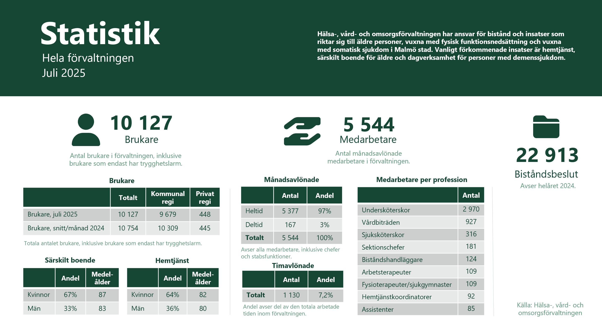
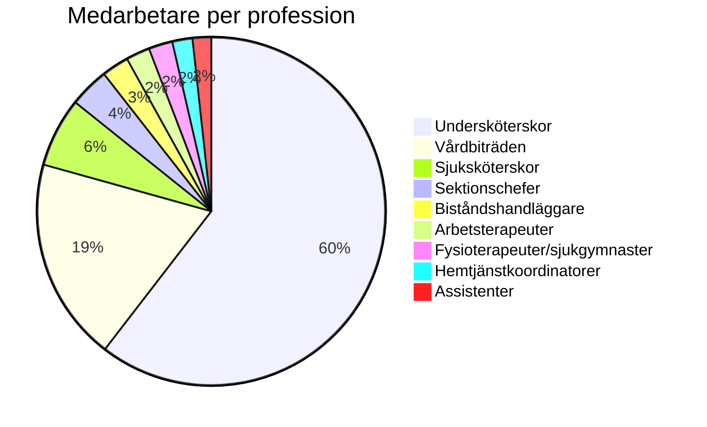
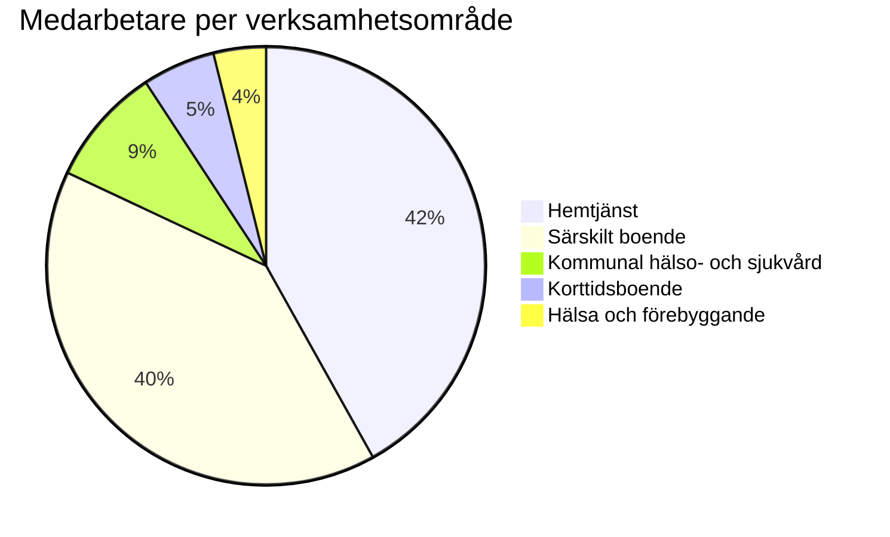

# Organisation
## Malmö stad | Hälsa, Vård och Omsorg (HVOF)

Malmö stads HVOF ansvarar för äldreomsorg, funktionsnedsättning och vård. Förvaltningen ansvarar för bistånd och insatser för äldre, vuxna med fysisk funktionsnedsättning och vuxna med somatisk sjukdom i Malmö stad. Vanliga insatser är hemtjänst, särskilt boende och dagverksamhet för personer med demenssjukdom.

HVOF använder idag **57 system** organiserade i fem kategorier. Denna RFI fokuserar på verksamhetssystem, inte larmsystem.

## Organisationsskiss

{ width="800" align="center" }

## Statistik - Hela förvaltningen

{ width="800" align="center" }

*Källa: Hälsa-, vård och omsorgsförvaltningen. Juli 2025.*

## Medarbetare och roller

HVOF har totalt **5 544 månadslönade medarbetare** och **1 130 timavlönade medarbetare** (7,2% av total arbetad tid). Av de månadslönade arbetar 5 377 (97%) på heltid och 167 (3%) på deltid. Dessa medarbetare arbetar inom olika professioner och verksamhetsområden, vilket ställer krav på att ett nytt verksamhetssystem ska stödja olika användargrupper och arbetsprocesser.

### Medarbetare per profession

Förvaltningen består av nio huvudsakliga professioner med olika ansvarsområden och behov av systemstöd.

| Profession | Antal medarbetare |
|------------|-------------------|
| **Undersköterskor** | 2 970 |
| **Vårdbiträden** | 927 |
| **Sjuksköterskor** | 316 |
| **Sektionschefer** | 181 |
| **Biståndshandläggare** | 124 |
| **Arbetsterapeuter** | 109 |
| **Fysioterapeuter/sjukgymnaster** | 109 |
| **Hemtjänstkoordinatorer** | 92 |
| **Assistenter** | 85 |

### Medarbetare per verksamhetsområde

Medarbetare är fördelade över olika verksamhetsområden med olika behov av systemstöd och funktionalitet.

| Verksamhetsområde | Antal medarbetare (månadslönade) |
|-------------------|----------------------------------|
| **Hemtjänst** | 2 091 |
| **Särskilt boende** | 2 000 |
| **Kommunal hälso- och sjukvård** | 438 |
| **Korttidsboende** | 268 |
| **Hälsa och förebyggande** | 193 |

*Källa: Hälsa-, vård och omsorgsförvaltningen. Juli 2025.*

---

## Verksamhetsområden

| Område | Beskrivning | Omfattning | Medarbetare |
|--------|-------------|------------|-------------|
| **Hemtjänst** | Personlig omvårdnad, serviceinsatser, måltidsservice | 8 311 brukare (juli 2025) | 2 091 |
| **Särskilt boende** | Långtidsboende för äldre med omfattande vårdbehov | 1 895 brukare (juli 2025) | 2 000 |
| **Kommunal hälso- och sjukvård** | Hemsjukvård och vårdplanering | 2 712 patienter (juli 2025) | 438 |
| **Dagverksamhet** | Verksamhet för personer med demenssjukdom | 165 beviljade insatser (juli 2025) | 193 |
| **Trygghetslarm** | Larmtjänst för äldre och funktionsnedsatta | 3 069 brukare (endast larm) | - |

---

**Malmö stad | Hälsa, Vård och Omsorg (HVOF)**

