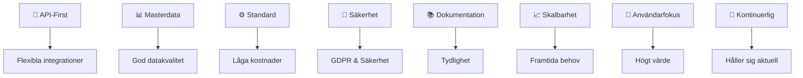
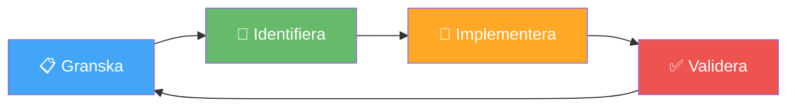

# 🏗️ Arkitekturprinciper

## 🎯 Vad är detta?

!!! note "Definition"
    Dessa principer styr hur vi designar, bygger och förvaltar systemarkitekturen inom HVOF för att säkerställa flexibilitet, säkerhet och framtida tillväxt.

---

## 🔌 Princip 1: API-First

| Element | Beskrivning |
|---------|------------|
| **Mål** | Alla system ska exponera funktionalitet via API:er |
| **Fördelar** | Möjliggör integrationer, underlättar systembyte, stödjer framtiden |
| **Implementering** | Nya system kräver API:er; befintliga migreras |

<strong>✅ Resultat:</strong> Flexibel systemarkitektur som inte blir låst till en leverantör

---

## 📊 Princip 2: Masterdata-princip

| Datadomän | Master System | Ansvarig |
|-----------|---------------|----------|
| 👥 Personal | HRutan | HR-avdelning |
| 🏥 Vårddata | Lifecare-Procapita | IT-verksamhet |
| 💰 Ekonomi | Ekot | Ekonomi |
| 🚨 Larmdata | Interview/ISM | Larmnav |

!!! info "Datakvalitet"
    Genom att definiera ett master per domän, undviker vi datadubbletter och säkerställer konsistens

---

## ⚙️ Princip 3: Standard före Special

| Område | Standard | Alternativ |
|--------|----------|-----------|
| 🩺 Sjukvårdsdata | HL7 | Proprietary format |
| 🔌 Integrationer | REST API | SOAP, File transfer |
| 🔐 Autentisering | Freja eID, SITHS | Lokalt AD |
| 📊 BI-verktyg | Qlikview | Powerpoint reports |

<strong>💡 Fördelar:</strong> Lägre kostnad, enklare underhål,  bättre leverantörsuppgift

---

## 🔐 Princip 4: Säkerhet by Design

!!! warning "Säkerhet först"
    Säkerhet ska vara inbyggd från början, inte tillagd efteråt

| Område | Implementering |
|--------|----------------|
| 🔐 **Autentisering** | SITHS för vårddata, Freja eID för SSO |
| **Tvåfaktor** | Implementerat för känsliga system |
| **Kryptering** | TLS för överföring, AES för lagring |
| **Loggning** | Full spårbarhet av åtkomst |
| **GDPR** | PII-skydd, dataminimering |

---

## 📚 Princip 5: Dokumentation & Transparens

!!! success "Denna dokumentationsplattform"
    Alla system och integrationer ska vara dokumenterade för att underlätta förståelse och systembyte

**Omfattning**:
- ✅ Systemdokumentation för alla 57 system
- ✅ Integrationdiagram och dataflöden
- ✅ Processöversikter
- ✅ Kontakt- och ansvarsinformation

---

## 📈 Princip 6: Skalbarhet & Prestanda

| Dimension | Målbild |
|-----------|---------|
| 📊 **Belastning** | Stödjer 2x nuvarande volymer |
| ⏱️ **Svarstider** | <500ms för normala operationer |
| 🔴 **Kritiska** | <100ms för larmhantering |
| 📈 **Tillväxt** | Cloud-baserad för flexibilitet |

---

## 👤 Princip 7: Användarcentrerad Design

| Fokus | Tillvägagångssätt |
|--------|------------------|
| 🎤 **Input** | Regelbundna användarintervjuer |
| 🧪 **Testning** | Användaracceptanstestning (UAT) |
| 📣 **Feedback** | Kontinuerlig feedback-samling |
| 🎯 **Mål** | Högt värde för verksamheten |

---

## 🔄 Princip 8: Kontinuerlig Förbättring

!!! note "Livscykel"
    Systemarkitekturen utvecklas kontinuerligt baserat på feedback, nya behov och teknikskiften

---

## 📅 Implementeringsöversikt

### 🟢 Kort sikt (0-1 år)

| Fokus | Aktivitet | Effekt |
|-------|----------|--------|
| 🔐 Autentisering | Expandera Freja eID | 🔴 Kritisk |
| 🔌 API | Förbättra täckning | 🔴 Kritisk |
| 📚 Dokumentation | Dokumentera integrationer | 🟡 Medel |

### 🟡 Medellång sikt (1-3 år)

| Fokus | Aktivitet | Effekt |
|-------|----------|--------|
| 🔄 Modernisering | Uppdatera kritiska system | 🔴 Kritisk |
| 📊 Masterdata | Automatisera överföringar | 🔴 Kritisk |
| 🚪 Gateway | Implementera API-gateway | 🟡 Medel |

### 🔵 Lång sikt (3+ år)

| Fokus | Aktivitet | Effekt |
|-------|----------|--------|
| ☁️ Cloud | Molnbaserad arkitektur | 🔴 Kritisk |
| 🔹 Microservices | Där lämpligt | 🟡 Medel |
| 🤖 AI/ML | Processoptimering | 🟢 Låg |

---

## 🔗 Läs mer

- 🗺️ [Systemlandskap](../systems/system-landscape.md)
- 📊 [Integrationskarta](../systems/integrations.md)
- 🔴 [Pain Points](../analyses/pain-points.md)
- 📈 [Gap-analys](../analyses/gap-analysis.md)
