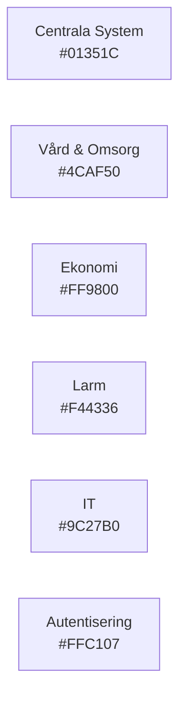
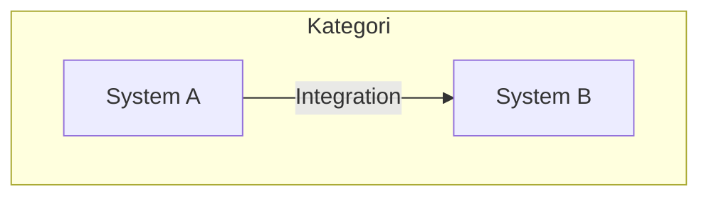
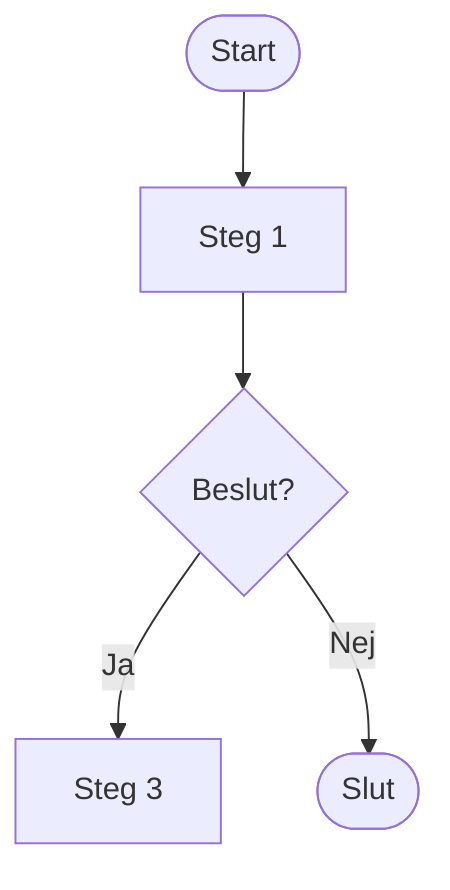
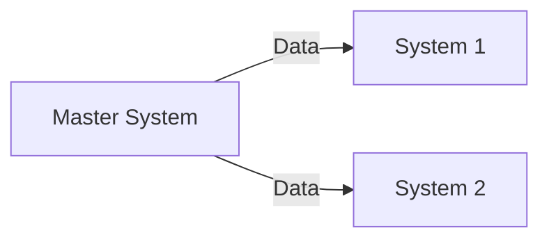
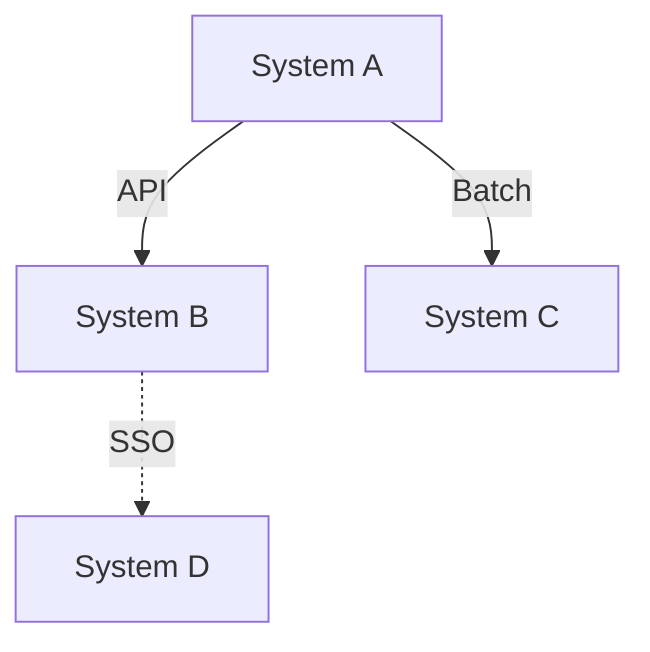
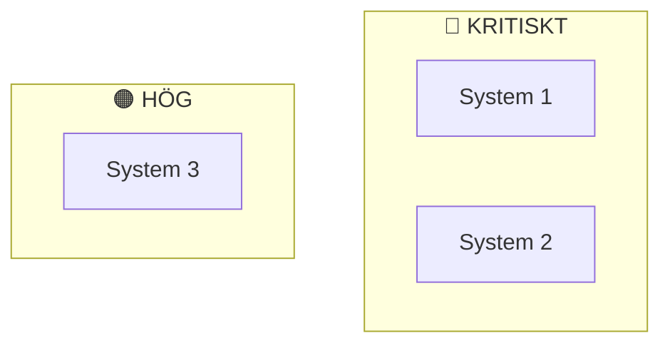
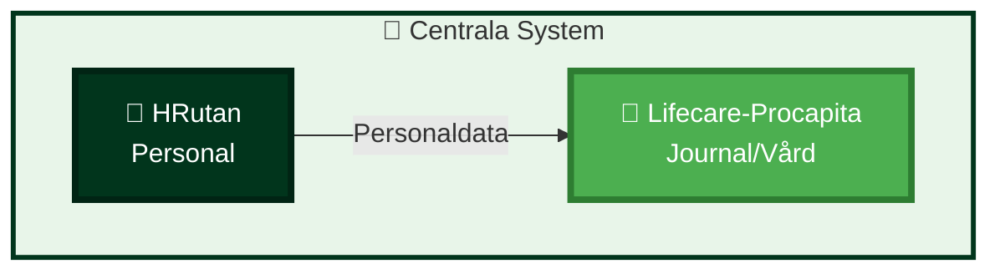
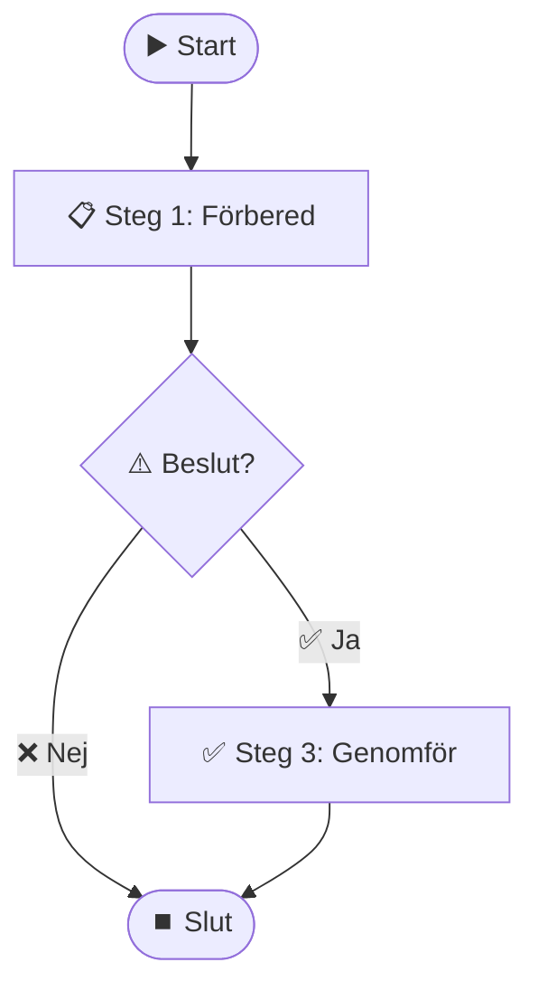

# Design Style Guide

## Översikt

Denna guide definierar standarder för visuell design, färger, ikoner och diagramtyper i dokumentationen.

## Färger

### Primära färger

| Färg | Hex | Användning |
|------|-----|------------|
| **Stadsgrön** | `#01351C` | Primär färg, Malmö stad, centrala system |
| **Grön** | `#4CAF50` | Vård & Omsorg, framgång, aktiv |
| **Orange** | `#FF9800` | Ekonomi, varningar |
| **Röd** | `#F44336` | Kritiska system, fel, stopp |
| **Lila** | `#9C27B0` | IT-system, molntjänster |
| **Gul** | `#FFC107` | Autentisering, viktig information |

**Stadsgrön (Malmö stad)**:
- PANTONE: 3435 C
- CMYK: 93 / 24 / 85 / 68
- RGB: 1 / 53 / 28
- HEX: `#01351C`
- RAL: 6009
- NCS: 8010-G10Y

### Färgkodning per kategori

#### Systemkategorier



#### Kritikalitet

- **Kritisk** (Röd `#D32F2F`): 24/7 drift, nedtid < 1 timme
- **Hög** (Orange `#F57C00`): Daglig drift, nedtid < 4 timmar
- **Medel** (Gul `#FBC02D`): Viktiga stödsystem, nedtid < 24 timmar
- **Låg** (Grå `#9E9E9E`): Stödsystem, nedtid < 48 timmar

## Ikoner

### Systemikoner

| Ikon | Användning |
|------|------------|
| 🔐 | Autentisering, säkerhet |
| 🏥 | Vård & Omsorg |
| 💰 | Ekonomi |
| 🚨 | Larm, kritiska system |
| 👥 | Personal, HR |
| 💻 | IT-system |
| 📞 | Telefoni, kommunikation |
| 📊 | Data, rapporter |
| ⏰ | Tidsplanering |
| 🔔 | Aviseringar |
| 📋 | Dokumentation, listor |
| 💊 | Läkemedel |
| ✍️ | Signering |
| 📹 | Video, övervakning |
| 👮 | Säkerhet, väktare |

### Processikoner

| Ikon | Användning |
|------|------------|
| ▶️ | Start |
| ⏹️ | Stopp |
| ⚠️ | Varning |
| ✅ | Framgång, klar |
| ❌ | Fel, misslyckad |
| 🔄 | Loop, upprepning |
| ➡️ | Flöde, nästa steg |

## Diagramtyper

### 1. Systemlandskap (System Landscape)

**Syfte**: Översikt över alla system och deras relationer.

**Mall:**


### 2. Processflöde (Process Flow)

**Syfte**: Visa steg i en process.

**Mall:**


### 3. Dataflöde (Data Flow)

**Syfte**: Visa hur data flödar mellan system.

**Mall:**


### 4. Integration (Integration Diagram)

**Syfte**: Detaljerad bild av integrationer.

**Mall:**


### 5. Kritikalitet (Criticality)

**Syfte**: Visa systemprioritering.

**Mall:**


## Typografi

### Rubriker

- **H1** (`#`): Sidsrubrik
- **H2** (`##`): Huvudsektion
- **H3** (`###`): Undersektion
- **H4** (`####`): Detaljer

### Textstil

- **Fetstil** (`**text**`): Viktig information
- *Kursiv* (`*text*`): Betoning
- `Kod` (`` `text` ``): Systemnamn, tekniska termer

## Layout och struktur

### Dokumentstruktur

Varje dokument ska ha:

1. **Rubrik** (H1)
2. **Översikt** (H2) - Kort beskrivning
3. **Huvudinnehåll** (H2-H4)
4. **Relaterade länkar** (H2) - Till andra dokument

### Tabeller

Använd tabeller för strukturerad information:

```markdown
| Kolumn 1 | Kolumn 2 | Kolumn 3 |
|----------|----------|----------|
| Data 1   | Data 2   | Data 3   |
```

### Listor

**Punktlista** för icke-ordnade:
```markdown
- Punkt 1
- Punkt 2
```

**Numrerad lista** för steg:
```markdown
1. Steg 1
2. Steg 2
```

## Mermaid-styling

### Standard init-block

```mermaid
%%{init: {
  'theme': 'default',
  'themeVariables': {
    'fontSize': '22px',
    'fontFamily': 'Arial, sans-serif',
    'primaryColor': '#01351C',
    'primaryTextColor': '#ffffff',
    'primaryBorderColor': '#01351C',
    'lineColor': '#01351C',
    'secondaryColor': '#FFC107',
    'tertiaryColor': '#4CAF50',
    'background': '#FAFAFA',
    'mainBkgColor': '#FFFFFF',
    'textColor': '#212121',
    'clusterBkg': '#E8F5E9',
    'clusterBorder': '#01351C'
  },
  'flowchart': {
    'nodeSpacing': 60,
    'rankSpacing': 80,
    'curve': 'basis',
    'padding': 20,
    'htmlLabels': true,
    'useMaxWidth': true
  }
}}%%
```

### Färgstyling för noder

```mermaid
style SystemA fill:#01351C,stroke:#012414,stroke-width:4px,color:#FFFFFF
style SystemB fill:#4CAF50,stroke:#2E7D32,stroke-width:4px,color:#FFFFFF
```

## Exempel

### Exempel 1: Systemlandskap



### Exempel 2: Processflöde



## Checklista

Innan du publicerar ett dokument, kontrollera:

- [ ] Följer färgschema
- [ ] Använder rätt ikoner
- [ ] Diagram är tillräckligt stora
- [ ] Tydliga rubriker och struktur
- [ ] Länkar fungerar
- [ ] Stavning och grammatik korrekt
- [ ] Följer mall för dokumenttyp

## Uppdateringar

Denna guide uppdateras kontinuerligt. För förslag på förbättringar, kontakta IT-avdelningen.

