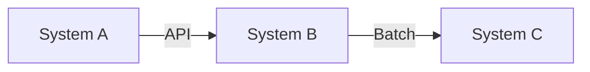
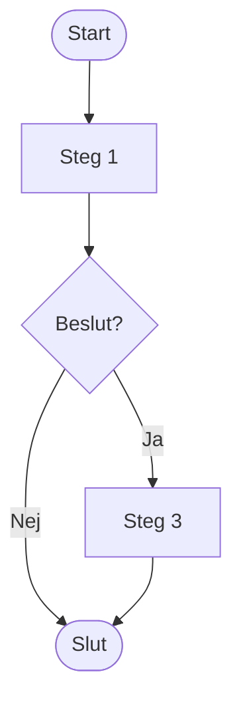
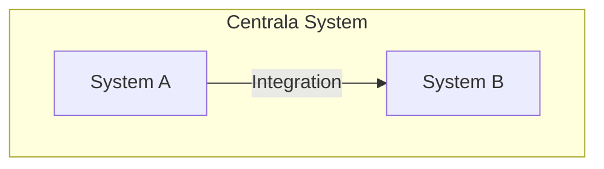

# Hur man arbetar i dokumentationen

## Översikt

Denna guide beskriver hur du arbetar med MkDocs-dokumentationen för HVOF Systemarkitektur.

## Förutsättningar

- Git installerat
- Redigeringsverktyg (VS Code, Cursor, eller liknande)
- Tillgång till GitHub-repositoryt

## 1. Skapa nya dokument

### Använd mallar

Alla dokumenttyper har mallar i `templates/`:

- **Process**: `templates/process-template.md`
- **System**: `templates/system-template.md`
- **Analys**: `templates/analysis-template.md`

### Steg för steg

1. **Kopiera relevant mall**
   ```bash
   cp templates/process-template.md processes/core-processes/min-process.md
   ```

2. **Fyll i informationen**
   - Ersätt placeholder-text
   - Lägg till specifik information
   - Följ [Design Style Guide](design-style-guide.md)

3. **Lägg till i navigation**
   - Redigera `mkdocs.yml`
   - Lägg till i rätt sektion under `nav:`

4. **Commit och push**
   ```bash
   git add .
   git commit -m "Lägger till process X"
   git push
   ```

## 2. Rita diagram

### Mermaid (rekommenderat)

Mermaid är enkelt och fungerar direkt i MkDocs:



**Exempel - Processflöde:**


**Exempel - Systemlandskap:**


### PlantUML (för avancerade diagram)

PlantUML kräver extra konfiguration. Se [PlantUML Setup](plantuml-setup.md) för instruktioner.

### Tips för diagram

- **Använd ikoner** för visuell tydlighet (🔐, 🏥, 💰, etc.)
- **Färgkodning** för kategorier
- **Tydliga etiketter** på länkar
- **Storlek**: Använd `%%{init: ...}%%` för större diagram

Se [Design Style Guide](design-style-guide.md) för färger och stilar.

## 3. Lägga in länkar och filer

### Interna länkar

```markdown
[Länktext](path/to/file.md)
[Länktext med ankare](path/to/file.md#section)
```

**Exempel:**
```markdown
Se [Systemkarta](../systems/system-landscape.md) för översikt.
```

### Externa länkar

```markdown
[Länktext](https://example.com)
```

### Bilder

1. Lägg bilder i `docs/images/`
2. Referera med:

```markdown

```

### Filer

1. Lägg filer i `docs/files/`
2. Länka med:

```markdown
[Ladda ner fil](files/filename.pdf)
```

## 4. Generera dokumentation

### Lokal utveckling

1. **Starta lokal server**
   ```bash
   mkdocs serve
   ```
   Öppna http://127.0.0.1:8000

2. **Bygg statisk sida**
   ```bash
   mkdocs build
   ```
   Skapar `site/` med statiska filer

### Deployment

**GitHub Pages (automatiskt):**
```bash
mkdocs gh-deploy
```

**Manuell deployment:**
```bash
mkdocs build
# Ladda upp site/ till webbserver
```

## 5. Versionshantering

### Git Workflow

1. **Skapa branch**
   ```bash
   git checkout -b feature/ny-process
   ```

2. **Gör ändringar**
   - Redigera filer
   - Testa lokalt med `mkdocs serve`

3. **Commit**
   ```bash
   git add .
   git commit -m "Beskrivande meddelande"
   ```

4. **Push och skapa Pull Request**
   ```bash
   git push origin feature/ny-process
   ```
   Skapa PR på GitHub för granskning

### Commit-meddelanden

Använd tydliga meddelanden:
- `Lägger till process X`
- `Uppdaterar systemdokumentation för Y`
- `Förbättrar diagram Z`

## 6. Använda AI/Copilot

### Exempel på prompts

**Skapa diagram:**
```
"Skapa ett Mermaid-diagram som visar flödet från larm till vård"
```

**Förbättra dokumentation:**
```
"Förbättra denna processbeskrivning med tydligare steg"
```

**Översätta:**
```
"Översätt denna text till svenska"
```

## 7. Felsökning

### Diagram visas inte

1. Kontrollera Mermaid-syntax
2. Testa i [Mermaid Live Editor](https://mermaid.live)
3. Kontrollera `mkdocs.yml` konfiguration

### Länkar fungerar inte

1. Kontrollera sökvägar (relativa från `docs/`)
2. Kontrollera filnamn (case-sensitive)
3. Kontrollera att filen finns

### Bygget misslyckas

1. Kontrollera YAML-syntax i `mkdocs.yml`
2. Kontrollera Markdown-syntax
3. Kör `mkdocs build --verbose` för detaljer

## 8. Best Practices

### Dokumentation

- ✅ **Tydlig struktur** - Använd rubriker och listor
- ✅ **Konsekvent språk** - Följ terminologi i [Ordlista](glossary.md)
- ✅ **Uppdaterad** - Håll informationen aktuell
- ✅ **Visuellt** - Använd diagram där det hjälper

### Diagram

- ✅ **Tydliga namn** - Använd beskrivande systemnamn
- ✅ **Färgkodning** - Följ [Design Style Guide](design-style-guide.md)
- ✅ **Storlek** - Gör diagram stora nog att läsa
- ✅ **Uppdaterade** - Håll diagram i synk med verkligheten

### Git

- ✅ **Små commits** - Committa ofta med tydliga meddelanden
- ✅ **Pull Requests** - Använd PR för större ändringar
- ✅ **Granskning** - Låt kollegor granska ändringar

## Ytterligare resurser

- [MkDocs Documentation](https://www.mkdocs.org/)
- [Mermaid Documentation](https://mermaid.js.org/)
- [Markdown Guide](https://www.markdownguide.org/)

## Support

För frågor eller problem, kontakta IT-avdelningen eller skapa ett issue på GitHub.

