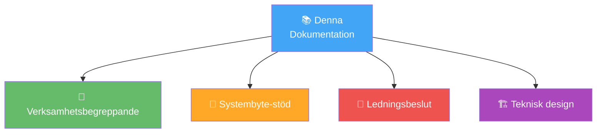

# 👋 Välkommen till HVOF Systemarkitektur

## 🏢 Om denna dokumentation

!!! note "Central kunskapsbas"
    Detta är den centrala dokumentationsplatsen för **systemarkitektur, processer och systemlandskap** inom Hälsa, Vård och Omsorgsförvaltningen (HVOF) i Malmö stad.

---

## 🎯 Huvudsyften

| Syfte | Beskrivning | Målgrupp |
|-------|------------|----------|
| 📖 **Förstå verksamheten** | Ge tydlig bild av HVOF systemlandskap | Alla |
| 🔄 **Stödja systembyte** | RFI/upphandling, migration & integration | ITD, Ledning |
| 💡 **Dela kunskap** | Central, uppdaterad kunskapsbank | Alla |
| 🎯 **Planera framtiden** | Arkitektur, principer & roadmap | IT-ledning |

---

## 👥 Målgrupper

| Grupp | Intresse | Se |
|-------|----------|-----|
| 🎓 **Ledning** | Strategiska beslut, budget, risker | [Gap-analys](../analyses/gap-analysis.md), [Risk-analys](../analyses/risk-analysis.md) |
| 💼 **Verksamhet** | Processer, systemanvändning, support | [Kärnprocesser](../processes/core-processes/overview.md), [Systemkatalog](../systems/systemkatalog.md) |
| 🔧 **IT-avdelning** | Arkitektur, integrationer, drift | [Systemlandskap](../systems/system-landscape.md), [Integrationer](../systems/integrations.md) |
| 🤝 **Leverantörer** | RFI-material, krav, integration points | [RFI-material](../rfi-rfp/rfi-material.md), [Supplier-frågor](../rfi-rfp/supplier-questions.md) |

---

## 🏛️ Om HVOF

**Hälsa, Vård och Omsorg (HVOF)** är Malmö stads största förvaltning. Vi ansvarar för tjänster till:

| Målgrupp | Tjänster | System |
|----------|----------|--------|
| 👴 **Äldre personer** | Äldreomsorg, hemtjänst, larmtjänst | Lifecare, Kuben, Interview/ISM |
| ♿ **Fysisk funktionsnedsättning** | Personlig assistans, arbetsergoterapi | Lifecare, Medvind |
| 🏥 **Somatisk sjukdom** | Rehab, sjukvård | Lifecare, NPÖ, Pascal |

**Omfattning**:
- 📊 57 system i landskapet
- 👥 ~350 anställda
- 👨‍👩‍👧‍👦 ~10000 brukare

---

## 📚 Dokumentstrukt

| Område | Innehål | Syfte |
|--------|---------|-------|
| 📖 **Översikt** | Introduktion, organisation, principer, verksamhetsbeskrivning | Förståelse |
| 🔄 **Processer** | Kärnprocesser, arbetsgång, dataflöden | Operationell vägledning |
| 🗺️ **System** | Systemlandskap, integrationer, masterdata, enskilda systemdokumentation | Teknisk referens |
| 📊 **Diagram** | Arkitektur, processer, dataflöden, kritikalitet | Visuell förståelse |
| 📈 **Analyser** | Gap-analys, pain points, risk-analys | Strategisk planering |
| 📋 **RFI/RFP** | RFI-material, leverantörsfrågor, kravlistor | Upphandling |

---

## 🚀 Snabbstart

### 👀 Jag vill förstå systemlandskapet
→ Se **[Systemlandskap](../systems/system-landscape.md)** (visuell översikt av alla 57 system)

### 🔄 Jag arbetar med systembyte
→ Se **[RFI-material](../rfi-rfp/rfi-material.md)** + **[Gap-analys](../analyses/gap-analysis.md)**

### 👥 Jag vill förstå processerna
→ Se **[Kärnprocesser](../processes/core-processes/overview.md)**

### 🔧 Jag behöver teknisk arkitektur
→ Se **[Arkitekturprinciper](./architecture-principles.md)** + **[Integrationer](../systems/integrations.md)**

### ⚠️ Jag behöver förstå riskerna
→ Se **[Risk-analys](../analyses/risk-analysis.md)** + **[Pain Points](../analyses/pain-points.md)**

### 📱 Jag behöver detaljer om ett specifikt system
→ Gå till **[Systemkatalog](../systems/systemkatalog.md)** och sök

---

## 📖 Hur man arbetar

Se [Hur man arbetar](how-to-work.md) för detaljerade instruktioner:
- ✏️ Skapa nya dokument
- 📊 Rita diagram (Mermaid)
- 🔗 Länka rätt
- 📤 Generera & publicera

---

## 🔗 Viktiga länkar

| Länk | Syfte |
|------|-------|
| [🗺️ Systemlandskap](../systems/system-landscape.md) | Oversikt över alla 57 system |
| [📊 Integrationskarta](../systems/integrations.md) | Se hur system kommunicerar |
| [🏗️ Arkitekturprinciper](./architecture-principles.md) | Designriktlinjer |
| [📈 Gap-analys](../analyses/gap-analysis.md) | Vad behöver förbättras? |
| [🚨 Pain Points](../analyses/pain-points.md) | Nuvarande utmaningar |
| [⚠️ Risk-analys](../analyses/risk-analysis.md) | Systembyterisker |
| [📋 RFI-material](../rfi-rfp/rfi-material.md) | RFI för leverantörer |
| [📞 Kontakt](../about/contact.md) | Vem ska jag fråga? |

---

## 💬 Feedback & uppdateringar

!!! tip "Var denna dokumentation användbar?"
    - ✅ Ja, mycket bra → [Kontakta oss](../about/contact.md)
    - ❓ Saknar något → [Föreslå uppdatering](../about/contact.md)
    - ❌ Fel information → [Rapportera](../about/contact.md)

---

## 📞 Support

För frågor eller förslag, kontakta:
- **📧 IT-arkitektur**: [it-arkitektur@malmo.se](mailto:it-arkitektur@malmo.se)
- **📞 IT-suppuort**: Se [Kontakt](../about/contact.md)

