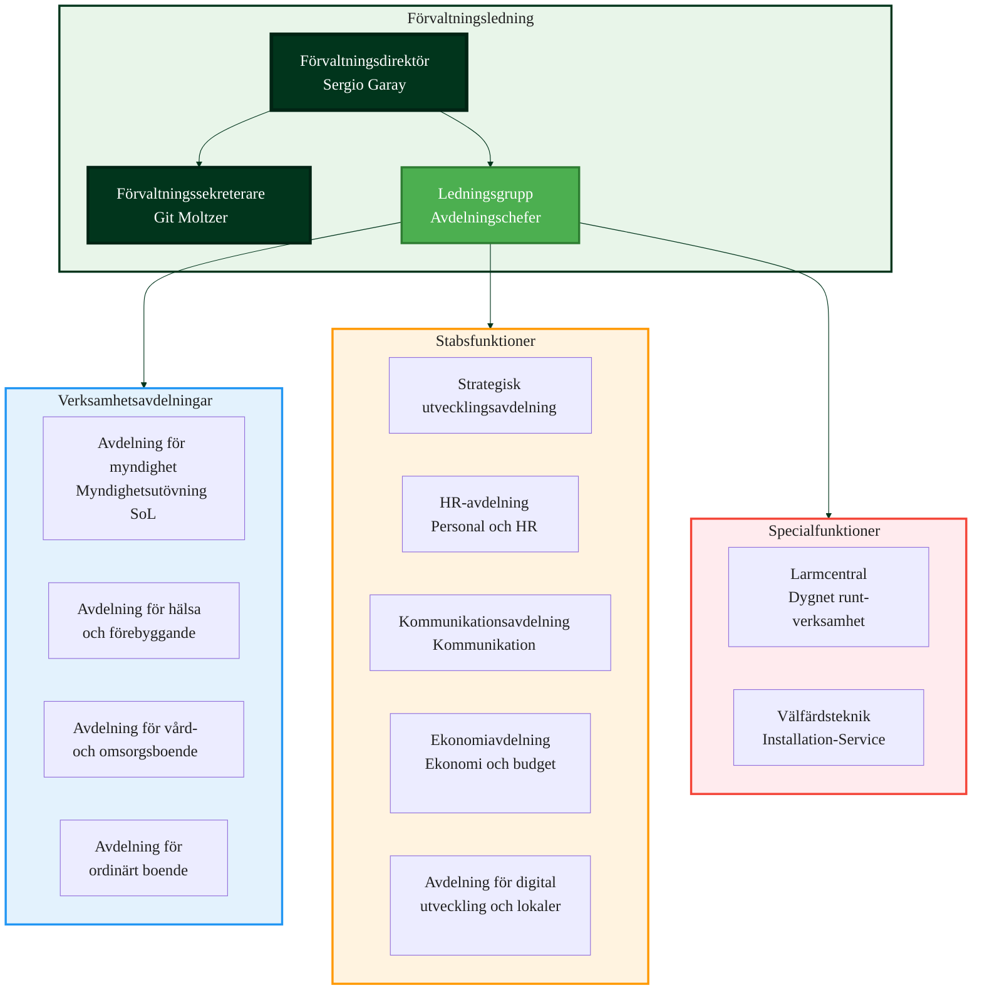

# Organisationsstruktur - HVOF

## Översikt

Hälsa-, Vård och Omsorgsförvaltningen (HVOF) leds av förvaltningsdirektör **Sergio Garay** som tillsammans med ledningsgruppen planerar och följer upp verksamheten. Förvaltningen ansvarar för insatser som riktar sig till äldre personer, vuxna med fysisk funktionsnedsättning och vuxna med somatisk sjukdom i Malmö stad.

## Förvaltningens löfte

**"Varje dag är viktigast!"**

Ramberättelsen är en kulturbärare och en inspiration när vi arbetar med att utveckla verksamheten. I förlängningen kan den vara en del kvaliteten för brukarna.

## Förvaltningsledning

**Förvaltningsdirektör**: Sergio Garay

**Ledningsgruppen** består av:
- Förvaltningsdirektör Sergio Garay
- Avdelningschefer för verksamheter och stabsfunktioner
- Förvaltningssekreterare Git Moltzer

## Organisationsstruktur

## Avdelningar

### 1. Avdelning för myndighet

**Ansvar**: Myndighetsutövning enligt socialtjänstlagen (SoL) för den målgrupp som HVOF ansvarar för.

**Uppdrag**:
- Handläggning enligt SoL
- Beslut och verkställighet
- Myndighetsutövning

**System**: Lifecare-Procapita (myndighetsutövning)

**Kontakt**: Se minnesanteckningar från ledningsgruppens möten

### 2. Avdelning för hälsa och förebyggande

**Ansvar**: Insatser inom områdena hälsofrämjande och förebyggande arbete.

**Uppdrag**:
- Hälsofrämjande arbete
- Förebyggande insatser
- Hälsoutveckling

**Kontakt**: Se minnesanteckningar från ledningsgruppens möten

### 3. Avdelning för vård- och omsorgsboende

**Ansvar**: Insatser som utförs åt brukare i vård- och omsorgsboenden.

**Uppdrag**:
- Vård och omsorg i särskilt boende
- Dokumentation och journalföring
- Kvalitetssäkring

**System**:
- Lifecare-Procapita (journal/vård)
- Phoniro Care (tid/insats)
- Senior Alert (kvalitetsregister)
- Viser/Sensio/Smooth (trygghetssensorer)
- Milestone (digital tillsyn)

**Kontakt**: Se minnesanteckningar från ledningsgruppens möten

### 4. Avdelning för ordinärt boende

**Ansvar**: Insatser som utförs i brukarnas ordinära boende.

**Uppdrag**:
- Hemtjänst
- Vård och omsorg i hemmet
- Dokumentation och uppföljning

**System**:
- Lifecare-Procapita (journal/vård)
- Phoniro Care (tid/insats)
- Phoniro Lock (digitala lås)
- CMP (trygghetslarm)
- 3CX (telefoni via larmcentral)

**Kontakt**: Se minnesanteckningar från ledningsgruppens möten

### 5. Strategisk utvecklingsavdelning

**Ansvar**: Strategisk utveckling och förbättring av verksamheten.

**Uppdrag**:
- Strategisk planering
- Utvecklingsarbete
- Förbättringsinitiativ

**System**: Stratsys (mål/uppföljning)

### 6. HR-avdelning

**Ansvar**: Stärkande, proaktivt och verksamhetsnära stöd inom HR-området.

**Uppdrag**:
- HR-processer och stöd till chefer
- Identifiera behov och initiera förändringsarbete
- Utvecklingsarbete som påverkar förvaltningens mål positivt

**System**:
- HRutan (personal)
- Medvind (schema/tid)
- Vikariebanken (timvikarier)
- Visma Recruit (rekrytering)
- Adato (rehab/sjukfrånvaro)

### 7. Kommunikationsavdelning

**Ansvar**: Kommunikationsstöd till HVOF:s medarbetare och chefer.

**Organisation**:
- Kommunikationschef
- 7 kommunikatörer
- Malmö stads äldreombudsman

**Uppdrag**:
- Intern och extern kommunikation
- Informationsspridning
- Äldreombudsman

### 8. Ekonomiavdelning

**Ansvar**: Ekonomistyrning, budget, uppföljning, redovisning och inköpssamordning.

**Uppdrag**:
- Ekonomistyrning och budget
- Uppföljning och redovisning
- Inköpssamordning
- Konsultativt stöd till verksamheten

**Organisation**: Två enheter

**System**:
- Ekot/Raindance (ekonomi)
- Koll-QlikView (BI/rapporter)
- Stratsys (uppföljning)

### 9. Avdelning för digital utveckling och lokaler

**Ansvar**: Digitalisering, välfärdsteknik och lokalfrågor.

**Uppdrag**:
- Digitalisering
- Välfärdsteknik
- Lokalfrågor
- Stärka förvaltningen kring framtidens arbetsplats och teknikanvändning

**System**: Alla IT- och välfärdstekniksystem

## Larmcentral

**Ansvar**: Dygnet runt-verksamhet för larmhantering.

**Uppdrag**:
- Hantera larm från trygghetslarm, personlarm och inbrottslarm
- Trafikrummet är alltid bemannat med interncertifierade larmoperatörer
- Koordinering av larm och aviseringar

**System**:
- Interview/ISM (larmmottagning - Master)
- 3CX (telefonväxel)
- CMP (trygghetslarm)
- GuardTools (väktare)
- Milestone (kameralarm)

**Kontakt**: Patrik Wiren, Sten Möller

## Välfärdsteknik

**Ansvar**: Installation, service och avinstallation av välfärdstekniska tjänster.

**Uppdrag**:
- Installation av välfärdsteknik
- Service och underhåll
- Avinstallation
- Support till brukare

**Välfärdstekniska tjänster**:

### 1. Trygghetslarm
- Trygghetstelefoner i hemmen
- Administration via CMP (Neat)
- Larm till larmcentral

**System**: CMP (Neat), 3CX, Interview/ISM

### 2. Nödsändare
- Personbärna nödsändare
- Kopplade till trygghetslarm

**System**: CMP (Neat), Interview/ISM

### 3. Tillsyn med trygghetskamera
- Digital tillsyn nattetid
- Kameralarm

**System**: Milestone (VMS), Interview/ISM

### 4. Digitala nycklar - digitala lås
- Digitala dörrlås för hemtjänstbrukare
- Mobil åtkomst
- Koppling till tidsregistrering

**System**: Phoniro Lock, Phoniro Care

### 5. Trygghetssensorer
- Sängsensorer
- Rörelsesensorer
- I särskilt boende

**System**: Viser (SensioCare), Smooth Lite (Great Security)

**System**:
- CMP (Neat) - Trygghetslarm
- Phoniro Lock - Digitala lås
- Viser/Sensio/Smooth - Trygghetssensorer
- Milestone - Kameralarm
- EasyApp - Inventarie av välfärdsteknik

## Målgrupper

HVOF ansvarar för insatser som riktar sig till:

1. **Äldre personer**
2. **Vuxna med fysisk funktionsnedsättning**
3. **Vuxna med somatisk sjukdom**

## System per avdelning

### Verksamhetsavdelningar

| Avdelning | Primära System |
|-----------|----------------|
| **Myndighet** | Lifecare-Procapita |
| **Hälsa och förebyggande** | Lifecare-Procapita, Stratsys |
| **Vård- och omsorgsboende** | Lifecare-Procapita, Phoniro Care, Senior Alert, Viser/Sensio, Milestone |
| **Ordinärt boende** | Lifecare-Procapita, Phoniro Care, Phoniro Lock, CMP, 3CX |

### Stabsfunktioner

| Avdelning | Primära System |
|-----------|----------------|
| **HR** | HRutan, Medvind, Vikariebanken, Visma Recruit, Adato |
| **Ekonomi** | Ekot/Raindance, Koll-QlikView, Stratsys |
| **Digital utveckling** | Alla IT- och välfärdstekniksystem |
| **Kommunikation** | Open e-plattformen, Miro |
| **Strategisk utveckling** | Stratsys |

### Specialfunktioner

| Funktion | Primära System |
|----------|----------------|
| **Larmcentral** | Interview/ISM, 3CX, CMP, GuardTools, Milestone |
| **Välfärdsteknik** | CMP, Phoniro Lock, Viser/Sensio/Smooth, Milestone, EasyApp |

## Kontaktinformation

### Förvaltningsledning
- **Förvaltningsdirektör**: Sergio Garay
- **Förvaltningssekreterare**: Git Moltzer

### Larmcentral
- **Kontakt**: Patrik Wiren, Sten Möller
- **Verksamhet**: Dygnet runt

### Avdelningar
Se minnesanteckningar från ledningsgruppens möten för kontaktuppgifter per avdelning.

## Relaterade dokument

- [Verksamhetsbeskrivning](verksamhetsbeskrivning.md)
- [Systemlandskap](../systems/system-landscape.md)
- [Systemlandskap RFI-fokus](../systems/system-landscape-rfi.md)
- [Välfärdsteknik](../systems/system-landscape-rfi.md)

## Uppdaterad

Senast uppdaterad: 2024-12-10
Uppdaterad av: [Namn]
