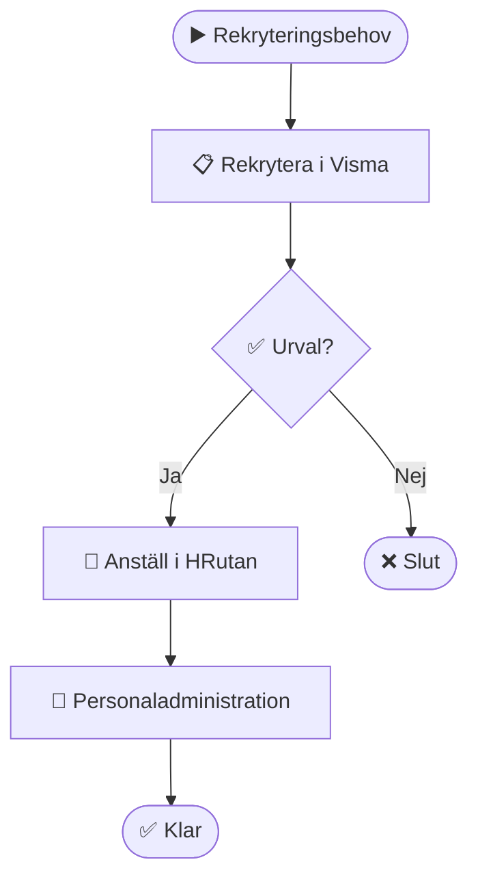
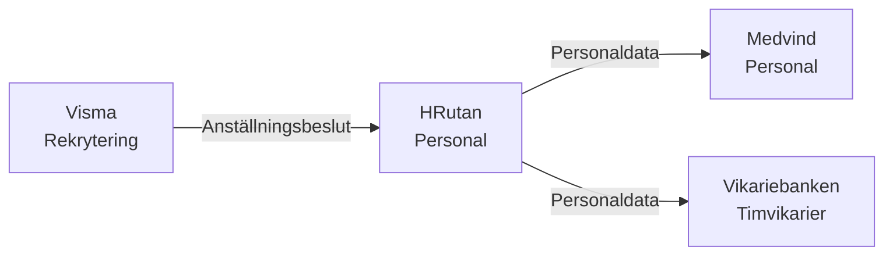

# Personalhantering

## Översikt

Processen för att rekrytera, anställa och hantera personal inom HVOF.

## Syfte

Säkerställa att HVOF har rätt kompetens och personal för att utföra verksamheten.

## Omfattning

- Rekrytering
- Anställning
- Personaladministration
- Kompetensutveckling
- Personalplanering

## Roller och ansvar

| Roll | Ansvar | System |
|------|--------|--------|
| **Rekryterare** | Rekrytering och urval | Visma |
| **HR-administratör** | Personaladministration | HRutan |
| **Chef** | Personalplanering | HRutan, Medvind |
| **Personal** | Uppdatera sin information | HRutan |

## Processflöde

### Steg 1: Rekrytering

**Beskrivning**: Identifiera behov och rekrytera personal.

**Aktörer**: Rekryterare, Chef

**System**: Visma

**Input**: Behovsanalys, jobbannons

**Output**: Kandidater, urval

### Steg 2: Anställning

**Beskrivning**: Anställa vald kandidat.

**Aktörer**: HR-administratör

**System**: HRutan

**Input**: Anställningsbeslut, kontrakt

**Output**: Anställd i HRutan

### Steg 3: Personaladministration

**Beskrivning**: Hantera personaldata och administrativa uppgifter.

**Aktörer**: HR-administratör, Personal

**System**: HRutan, Medvind

**Input**: Personaldata, ändringar

**Output**: Uppdaterad personaldata

## Diagram

### Processflöde

### Systeminvolvering

## Volym och frekvens

- **Volym**: ~500 rekryteringar per år
- **Frekvens**: Kontinuerligt
- **Toppar**: Vår och höst

## Pain Points

1. **Många system**: Personaldata finns i flera system
2. **Manuell dataöverföring**: Data måste kopieras mellan system
3. **Saknad integration**: Visma och HRutan är inte integrerade

## Förbättringsmöjligheter

1. **Integrera Visma och HRutan**: Automatisk överföring av anställningsdata
2. **Enhetlig personaldata**: Ett master system för personaldata
3. **Självservice**: Personal kan uppdatera sin egen information

## Relaterade processer

- [Vårdhantering](follow-up.md) - Använder personaldata
- [Larmhantering](../core-processes/case-management.md) - Använder personaldata

## Relaterade system

- [HRutan](../systems/centrala-system/hrutan.md)
- [Visma](../systems/centrala-system/visma.md)
- [Medvind](../systems/centrala-system/medvind.md)
- [Vikariebanken](../systems/centrala-system/vikariebanken.md)

## Kontakt

För frågor om personalhantering, kontakta HR/SEF.

## Uppdaterad

Senast uppdaterad: 2024-01-XX
Uppdaterad av: [Namn]

