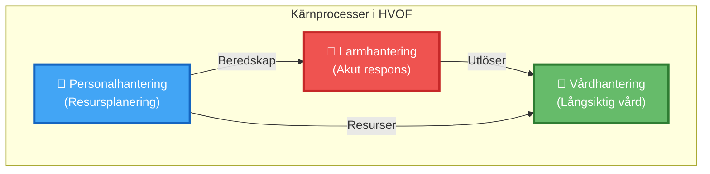
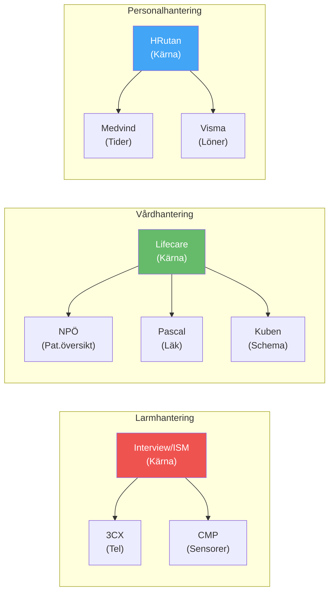

# Kärnprocesser - Översikt

## Översikt

Kärnprocesser är de huvudsakliga processerna som stödjer HVOF:s primära uppdrag.

# 🔄 Kärnprocesser - Översikt

## 📌 Vad är kärnprocesser?

!!! note "Definition"
    Kärnprocesser är de huvudsakliga processerna som stödjer HVOF:s primära uppdrag för äldre och personer med funktionsnedsättning.

---

## 📋 Processöversikt

| # | Process | Syfte | System | Detaljer |
|---|---------|-------|--------|----------|
| 🚨 | **Larmhantering** | Ta emot och hantera akuta larm | Interview/ISM, 3CX, CMP, Guardtools, Milestone | [Se detaljer](case-management.md) |
| 🏥 | **Vårdhantering** | Planera och genomföra vård & omsorg | Lifecare-Procapita, NPÖ, Pascal, MCSS, Kuben | [Se detaljer](follow-up.md) |
| 👥 | **Personalhantering** | Hantera personal och schema | HRutan, Medvind, Visma, Vikariebanken | [Se detaljer](onboarding.md) |

---

## 🔄 Processflöden

---

## 🚨 Larmhantering

**Ansvar**: Mottagning och hantering av akuta larm från äldre och personer med behov

| Element | Detalj |
|---------|--------|
| **Huvudsystem** | Interview/ISM (larmmottagning) |
| **Integrerat med** | 3CX (telefoni), CMP (sensorer), Milestone (kamera), Guardtools (smartklockor) |
| **Tidskritisk** | Ja - måste hålla <5 min svarstid |
| **Operatörer** | ~15 personer i larmnav |
| **Volymer** | 200-500 larm/dag under säsong |

!!! info "Kritisk process"
    Detta är en kritisk process för patienternas säkerhet. Systembyte kräver noll-downtime-migrering.

[🔍 Läs mer om larmhantering →](case-management.md)

---

## 🏥 Vårdhantering

**Ansvar**: Planering, genomförande och uppföljning av vård och omsorgstjänster

| Element | Detalj |
|---------|--------|
| **Huvudsystem** | Lifecare-Procapita (journalföring) |
| **Integrerat med** | NPÖ (patientöversikt), Pascal (läkemedel), MCSS (hemtjänst), Kuben (schemaläggning) |
| **Användargrupper** | Sjuksköterskor, undersköterskor, rehabiliterare |
| **Antal användare** | ~200 aktiva |
| **Komplexitet** | Mycket hög - många integrationer |

<strong>💡 Viktigt:</strong> Denna process är helt beroende av nätverk och pålitliga integrationer.

[🔍 Läs mer om vårdhantering →](follow-up.md)

---

## 👥 Personalhantering

**Ansvar**: Rekrytering, anställning, schemaläggning och HR-administration

| Element | Detalj |
|---------|--------|
| **Huvudsystem** | HRutan (HR-administration) |
| **Integrerat med** | Medvind (tidrapportering), Visma (löner), Vikariebanken (vikarier) |
| **HR-personal** | ~8 personer |
| **Omfattning** | ~350 anställda + vikarier |
| **Typ** | Icke-kritisk men affärsväsentlig |

[🔍 Läs mer om personalhantering →](onboarding.md)

---

## 🎯 Stödprocesser

!!! tip "Relaterade processer"
    Utöver kärnprocesserna finns också viktiga stödprocesser:
    - **Ärendehantering** (MSM/Marval)
    - **Ekonomihantering** (Ekot)
    - **Masterdata-hantering** (HR-data, patientdata)
    - **IT-drift** (Nätverk, säkerhet, backup)

---

## 📊 Systemintegrationer per process

---

## 🔗 Relaterade dokument

- 🗺️ [Systemlandskap](../../systems/system-landscape.md)
- 📊 [Processdiagram](../../diagrams/process/)
- 🏗️ [Arkitekturprinciper](../../overview/architecture-principles.md)
- 📈 [Integrationskarta](../../systems/integrations.md)

