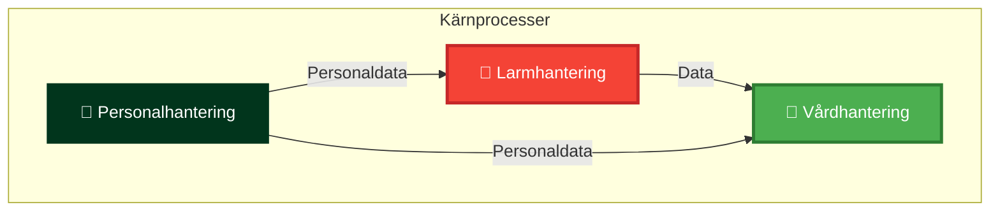

# Kärnprocesser - Översikt

## Översikt

Kärnprocesser är de huvudsakliga processerna som stödjer HVOF:s primära uppdrag.

## Processer

### 1. Larmhantering

**Beskrivning**: Processen för att ta emot, hantera och följa upp larm.

**System**: Interview/ISM, 3CX, CMP, Guardtools, Milestone

**Se**: [Larmhantering](case-management.md)

### 2. Vårdhantering

**Beskrivning**: Processen för att planera, genomföra och följa upp vård och omsorg.

**System**: Lifecare-Procapita, NPÖ, Pascal, MCSS, Kuben

**Se**: [Vårdhantering](follow-up.md)

### 3. Personalhantering

**Beskrivning**: Processen för att rekrytera, anställa och hantera personal.

**System**: HRutan, Medvind, Visma, Vikariebanken

**Se**: [Personalhantering](onboarding.md)

## Processkarta

## Relaterade dokument

- [Systemlandskap](../systems/system-landscape.md)
- [Processdiagram](../diagrams/process/)

