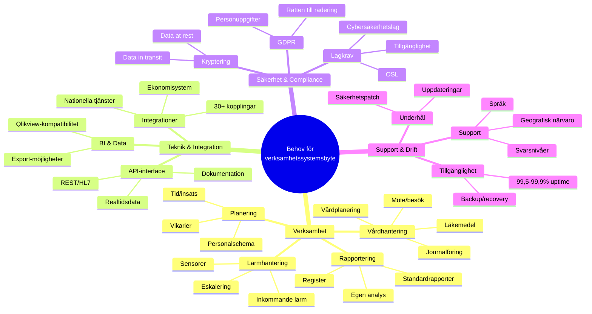
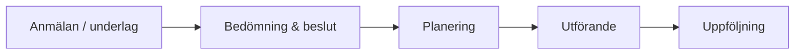

# Behov - RFI för verksamhetssystem
## Malmö stad | Hälsa, Vård och Omsorg (HVOF)

!!! info "Detta är BEHOV, inte bindande krav"
    Vi presenterar våra verksamhetsbehov på strategisk nivå för att leverantörer ska kunna bedöma sin lämplighet.
    
    **Detta är en del av informationsinsamlingen (RFI)**, inte en bindande kravspecifikation eller upphandling.

---

## Snabböversikt

Detta dokument beskriver våra behov organiserat i logiska områden:

| Område | Innehåll |
|--------|----------|
| **Funktionalitet** | Vårdhantering, resursplanering, rapportering |
| **Teknik och integration** | API:er, integrationer, datamigration |
| **Säkerhet och compliance** | GDPR, OSL, NIS 2, autentisering, kryptering |
| **Prestanda och drift** | SLA, skalbarhet, support, underhåll |

---

## Våra behov - Funktionalitet

### Snabböversikt över våra behov

---

### Vårdhantering och journalföring

Vi behöver stöd för en sammanhållen vårdprocess från anmälan till uppföljning. Elektronisk patientjournal är central och bör kombinera strukturerad information med fri text.

| Behov | Beskrivning | Varför viktigt |
|-------|-------------|---------------|
| **Elektronisk patientjournal** | Komplett journal för alla brukare/patienter | Kärnverksamhet, juridiskt krav |
| **Strukturerad dokumentation** | Möjlighet att dokumentera både strukturerad och fri text | Effektivitet och datakvalitet |
| **Vårdplanering och uppföljning** | SIP/SVP-stöd, samordning mellan verksamheter | Lagkrav, samordning |
| **Möte- och besöksplanering** | Schemaläggning av insatser, möten, hembesök | Resurseffektivitet |
| **Läkemedelshantering** | Ordinering, delegering, elektronisk signering | Patientsäkerhet, GDPR |
| **Ärendehantering** | Från anmälan till insats till uppföljning | Strukturerad handläggning |
| **Remisshantering** | Skicka och ta emot remisser mellan enheter | Samordning i vården |

### Resursplanering och bemanning

Resursplaneringen omfattar personalschema, tid- och insatsuppföljning och resursoptimering. Systemet ska kunna planera arbetstider, ta höjd för vikarier och knyta rätt kompetens till rätt uppdrag.

| Behov | Beskrivning | Varför viktigt |
|-------|-------------|---------------|
| **Personalschema** | Planering av arbetstider och vikarier | Arbetsmiljö och bemanning |
| **Tid- och insatsuppföljning** | Dokumentera utförda insatser och tider | Debitering och kvalitet |
| **Resursoptimering** | Matcha behov med tillgänglig personal | Kostnadseffektivitet |
| **Sjukfrånvaro och vikariehantering** | Hantera frånvaro och vikariebehov | Kontinuitet i vården |

### Rapportering och styrning

Vi ser tre nivåer av rapportering och analys:

| Behov | Beskrivning | Varför viktigt |
|-------|-------------|---------------|
| **Standardrapporter** | Fördefinierade rapporter för verksamhetsledning | Snabb överblick |
| **Anpassningsbar rapportering** | Möjlighet att bygga egna rapporter | Specifika behov |
| **Kvalitetsregister** | Export till nationella register (ex Senior Alert) | Nationella rapporteringskrav |
| **BI och analys** | Visuella dashboards och trendanalys | Datadriven styrning |
| **Registeröverrapportering** | Skicka data till Socialstyrelsen och andra myndigheter | Lagkrav |

---

## Våra behov - Teknik och integration

### Integrationer

Vi behöver förstå hur er lösning integrerar med befintliga system. Tabellen visar prioritet och inriktning.

| Prioritet | System | Syfte |
|-----------|--------|-------|
| **Primär** | NPÖ | Nationell patientöversikt |
| **Primär** | Pascal | Läkemedelshantering |
| **Primär** | MCSS | Digital signering |
| **Sekundär** | Senior Alert | Kvalitetsregister |
| **Sekundär** | Mina Planer | Samordnad vårdplan |
| **Sekundär** | Phoniro Care | Tid- och insatsuppföljning |
| **Sekundär** | Välfärdsteknik | Sensorer och välfärdsteknik |
| **Möjlig** | Larmcentral | Larmhantering |

Vi har ett komplext systemlandskap med många integrationer. Vi vill förstå hur ert system exponerar API:er och stödjer relevanta standarder som HL7 FHIR där det är lämpligt.

### Datamigration

Datamigration är en kritisk del av systemimplementeringen. Vi behöver migrera data från befintliga system med bibehållen datakvalitet.

| Domän | Migreringsbehov |
|-------|-----------------|
| **Vårddata och journalhistorik** | Historisk journaldata från befintliga system |
| **Tid- och insatsregistreringar** | Historiska registreringar av utförda insatser |
| **Läkemedelsordinationer** | Aktiva och historiska läkemedelsordinationer |
| **Kvalitetsregistersdata** | Register och rapporter |
| **Personal- och organisationsdata** | Personalregister och organisationsdata |

Migrationen måste ske utan verksamhetsstopp och med möjlighet till rollback vid problem.

### Pågående systembyte som påverkar

Flera pågående förändringar i vår IT-miljö påverkar systemkrav och integrationer:

| Projekt | Påverkan på nytt system |
|--------|-------------------------|
| **MCSS** - Digital signering | Måste stödja e-SITHS och Freja eID |
| **Ekonomisystem** - Byte | Måste kunna integrera med nytt ekonomisystem |
| **Integrationsplattform** - iPaaS | Måste kunna exponera API:er |

---

## Våra behov - Säkerhet och compliance

Säkerhet och efterlevnad är prioriterat. Beskriv hur er lösning möter dessa behov:

| Område | Krav | Standard |
|--------|------|----------|
| **GDPR** | Dataskydd, DPA, radering och dataportabilitet | EU-lag |
| **Autentisering** | Freja eID och e-SITHS, enkel inloggning (SSO), RBAC | Nationella standarder |
| **Kryptering** | TLS 1.2+ i transit, AES-256 i vila, hantering enligt OSL 10 kap 2a § | Säkerhetsteknik |
| **Lagkrav** | NIS 2, OSL 10 kap 2a §, GDPR; spårbarhet och loggning | Lagstiftning |
| **Certifieringar** | ISO 27001 eller motsvarande | Säkerhetscertifiering |
| **Dataplacering** | Sverige eller EU | Datahemvist |

---

## Våra behov - Prestanda och tillgänglighet

Vi vill förstå hur ni adresserar dessa stödjande behov. Beskriv er kapabilitet och arbetssätt för följande områden.

### Prestanda

Vi behöver ett system som kan hantera vår verksamhets omfattning med god prestanda och skalbarhet. Beskriv hur ni säkerställer:

- **Svarstid** – Genomsnittlig svarstid för normala operationer
- **Tillgänglighet** – Systemtillgänglighet och hantering av planerat underhåll
- **Samtidiga användare** – Kapacitet för samtidiga användare
- **Datalagring** – Hantering av historisk data och växande datamängder

### Tillgänglighet

Systemet bör stödja tillgänglighetsstandarder för webbgränssnitt, inklusive stöd för skärmläsare, tangentbordsnavigering och kontrast.

### Datakvalitet

Vi behöver förstå hur ni säkerställer:

- **Dataintegritet** – Mekanismer för att förhindra dataförlust
- **Backup och återställning** – Strategi för säkerhetskopiering och disaster recovery
- **Datakvalitetskontroller** – Validering vid inmatning och integration

### Support och drift

Systemet behöver kontinuerlig support och drift för att säkerställa verksamhetskontinuitet. Beskriv er supportmodell, supportprocesser och hur ni hanterar systemunderhåll och incidenter.

---

Se [Frågor till leverantörer](fragor.md) för alla frågor som ska besvaras.

**Malmö stad | Hälsa, Vård och Omsorg (HVOF)**

