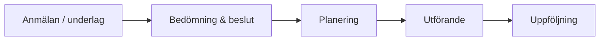

# Behovsbeskrivning (RFI)
## Malmö stad | Hälsa, Vård och Omsorg (HVOF)

!!! info "Detta är BEHOV, inte bindande krav"
    Vi presenterar våra verksamhetsbehov på strategisk nivå för att leverantörer ska kunna bedöma sin lämplighet.

**Snabböversikt**

!!! tip "Hur vi vill att ni läser detta avsnitt"
    Fokus ligger på **hur** er lösning möter behoven – inte på bindande krav.  
    Vi vill förstå ert **angreppssätt**, era **styrkor** och eventuella **begränsningar** kopplat till behoven nedan.

---

## Funktionella behov

### Vårdhantering

Vi behöver stöd för en sammanhållen vårdprocess från anmälan till uppföljning. Elektronisk patientjournal är central och bör kombinera strukturerad information med fri text. Systemet ska kunna knyta samman vårdkontakter, beslut och åtgärder så att processen i flödesskissen ovan blir tydlig för användaren.

Vårdplanering behöver stödja samordnade planer (t.ex. SIP/SVP) och möjliggöra mötes- och besöksplanering, gärna i samspel med schemaläggningssystem. Läkemedelshantering omfattar ordinering, delegering och elektronisk signering med integration till Pascal och MCSS. Ärendehantering ska spegla hela kedjan från inkommen begäran till uppföljd insats, med god spårbarhet.

### Resursplanering

Resursplaneringen omfattar personalschema, tid- och insatsuppföljning och resursoptimering. Systemet ska kunna planera arbetstider, ta höjd för vikarier och knyta rätt kompetens till rätt uppdrag.  
Uppföljning av tid och insats är viktig både för kvalitet och debitering och kan ske antingen i verksamhetssystemet eller via integrationer (t.ex. Phoniro Care). På sikt ser vi gärna funktioner som hjälper till att föreslå en smartare resursfördelning utifrån brukarnas behov.

### Rapportering

Vi ser tre nivåer av rapportering och analys:

- Färdiga standardrapporter för ledning och uppföljning (t.ex. brukarstatistik, personal, kvalitetsindikatorer).
- Möjlighet att bygga egna rapporter baserat på systemets data, anpassat efter olika verksamhetsområden.
- Export och exponering av data mot kvalitetsregister och externa BI‑verktyg (t.ex. Qlikview), inklusive stöd för automatiserad export mot nationella register som Senior Alert.

---

## Integrationer

Vi behöver förstå hur er lösning integrerar med befintliga system. Tabellen visar prioritet och inriktning; beskriv gärna ert angreppssätt.

| Prioritet | System | Integrationstyp (exempel) | Syfte | Notering |
|-----------|--------|---------------------------|-------|----------|
| **Primär** | NPÖ | HL7 FHIR API | Nationell patientöversikt | Kritisk koppling |
| **Primär** | Pascal | API/SSO | Läkemedelshantering | Kritisk koppling |
| **Primär** | MCSS | API/SSO | Digital signering | Kritisk koppling |
| **Sekundär** | Senior Alert | API/export | Kvalitetsregister | Bör stödjas |
| **Sekundär** | Mina Planer | API/dokument | Samordnad vårdplan | Bör stödjas |
| **Sekundär** | Phoniro Care | API | Tid- och insatsuppföljning | Bör stödjas |
| **Sekundär** | Välfärdsteknik | API/event | CMP, Sensio, Viser | Bör stödjas |
| **Möjlig** | Larmcentral | API/CTI | Larmhantering | Möjlig koppling |

**Indikation**: Cirka 30+ huvudintegrationer, 170+ tekniska kopplingar. Vi vill förstå hur ert system exponerar API:er och stödjer HL7 FHIR där det är relevant.

---

## Säkerhet och compliance

Säkerhet och efterlevnad är prioriterat. Beskriv hur er lösning möter dessa behov:

- **GDPR** – dataskydd, DPA, radering och dataportabilitet.
- **Autentisering** – Freja eID och SITHS, enkel inloggning (SSO), RBAC.
- **Kryptering** – TLS 1.2+ i transit, AES-256 i vila, hantering enligt OSL 10 kap 2a §.
- **Lagkrav** – NIS 2, OSL 10 kap 2a §, GDPR; spårbarhet och loggning.
- **Certifieringar** – t.ex. ISO 27001 eller motsvarande.
- **Dataplacering** – Sverige eller EU.

---

## Stödjande behov (prestanda, tillgänglighet, data)

Vi vill förstå hur ni adresserar dessa stödjande behov. Siffror nedan är indikationer för målbild, inte bindande krav.

### Prestanda

| Aspekt | Önskad nivå (exempel) | Beskrivning |
|--------|-----------------------|-------------|
| **Svarstid** | ~2 sekunder | Genomsnittlig svarstid för normala operationer |
| **Tillgänglighet** | ~99,5% per månad | Exklusive planerat underhåll |
| **Samtidiga användare** | ~500 | Förväntad samtidighet |
| **Datalagring** | 5-10 TB | Indikation för initial drift |

### Tillgänglighet

Systemet bör stödja WCAG 2.1 AA-nivå (skärmläsare, tangentbordsnavigering, kontrast).

### Datakvalitet

| Aspekt | Önskat arbetssätt | Beskrivning |
|--------|------------------|-------------|
| **Dataintegritet** | Ingen dataförlust | Mekanismer för att förhindra dataförlust |
| **Backup/Återställning** | RPO ~1h, RTO ~4h | Indikation på nivå vi vill förstå er capability för |
| **Datakvalitetskontroller** | Automatisk validering | Validering vid inmatning och integration

---

## Datamigration

Datamigration är en kritisk del av systemimplementeringen. Vi behöver migrera data från befintliga system med bibehållen datakvalitet.

Följande datatyper behöver migreras:
- **Vårddata** - Journalposter och vårddokumentation
- **Tid- och insatsdata** - Historiska registreringar av utförda insatser
- **Läkemedel** - Aktiva läkemedelsordiner och historik
- **Personaldata** - Personalregister och anställningsdata

Migrationen måste ske utan verksamhetsstopp och med möjlighet till rollback vid problem.

---

## Införandeplan och utbildning

Systeminförandet är en komplex process som kräver noggrann planering och koordinering. Med 6 600 medarbetare och verksamhet som behöver fortsätta under övergången vill vi förstå ert angreppssätt för införande.

### Utmaningar med systeminförande

**Datamigration från befintliga system** är en stor utmaning. Vi behöver migrera data med bibehållen datakvalitet och säkerställa att historik är tillgänglig. Migrationen bör ske utan verksamhetsstopp, gärna med parallell drift under övergångsperioden.

**Utbildning av 6 600 medarbetare** är omfattande. Olika roller har olika behov: undersköterskor/vårdbiträden behöver grundutbildning; sjuksköterskor/administratörer mer avancerad; chefer/koordinatorer behöver rapporterings- och styrningsstöd.

**Parallell drift under övergång** behövs för verksamhetskontinuitet. Det kräver koordinering och datasynkronisering.

**Rollback-möjligheter** behövs för att hantera oförutsedda problem och kunna återgå utan dataförlust.

### Vad är rimligt att förvänta av leverantör (exempel)

- **Utbildningsmaterial och metoder**: Svenskt material (handböcker, video, interaktiva guider) anpassat för olika användargrupper och inlärningsstilar (klassrum, e-learning, praktiska övningar).
- **Superanvändare och champions**: Stöd i att identifiera och utbilda superanvändare som kan fungera som lokala experter, med uppföljning.
- **Stegvis rollout**: Pilot → utökning, med milstolpar och successkriterier.
- **Support under införande**: Förstärkt support (dedikerad kanal, snabb respons, ev. on-site) under verksamhetstid.
- **Utbildningskapacitet**: Leverantören utbildar superanvändare/chefer som sprider kunskap; material och stöd för intern utbildning.
- **Kvalitetssäkring och testning**: Plan för UAT och integrationstester innan produktionsdrift.

---

## Pågående förändringar

Flera pågående förändringar i vår IT-miljö påverkar systemkrav och integrationer.

**MCSS** genomgår en modernisering med digital signering. Systemet kommer att använda SITHS/Freja eID för autentisering, vilket innebär att nytt verksamhetssystem behöver stödja dessa autentiseringsmetoder.

**Ekonomisystem** byts ut. Detta påverkar integrationer för kostnadsdata och fakturering. Nytt verksamhetssystem behöver kunna integrera med det nya ekonomisystemet.

**Molnmigration** pågår med fokus på Azure. Cloud-native lösningar är önskvärda för att möjliggöra skalbarhet och flexibilitet.

**Integrationsplattform** byts ut med ny iPaaS-lösning. Systemet behöver kunna exponera API:er för integration via integrationsplattformen.

---

## Support och drift

Systemet behöver kontinuerlig support och drift för att säkerställa verksamhetskontinuitet. Vi behöver förstå er supportmodell, supportprocesser och hur ni hanterar systemunderhåll och incidenter.

---

**Malmö stad | Hälsa, Vård och Omsorg (HVOF)**
