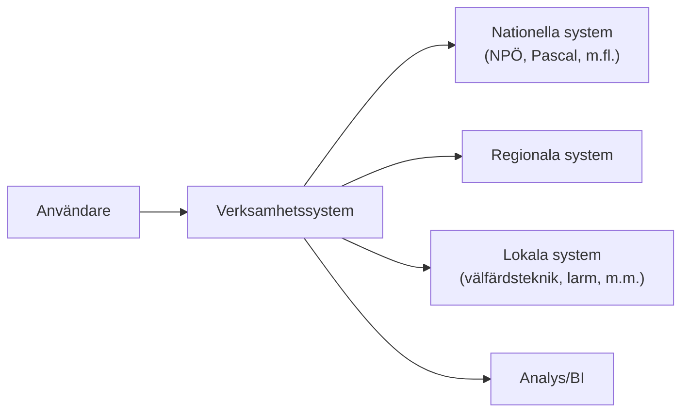

# Utmaningar och scope
## Malmö stad | Hälsa, Vård och Omsorg (HVOF)

## Identifierade utmaningar

HVOF står inför flera utmaningar i nuvarande systemlandskap som vi hoppas att ett nytt verksamhetssystem kan adressera. Figuren nedan visar de viktigaste områdena – detaljer följer i efterföljande avsnitt.

```markmap
---
markmap:
  direction: 1
---
- Utmaningar
  - Fragmenterad arkitektur
    - Många system
    - Punkt‑till‑punkt‑integrationer
  - Säkerhet
    - Många inloggningar
    - Splittrad behörighet
  - Analytik
    - Data på flera ställen
    - Svårt med helhetsbild
  - Utvecklingstakt
    - Flera system att ändra
    - Långsamma leveranser
```

### Fragmenterad arkitektur

Med 57 system och många punkt‑till‑punkt‑integrationer blir systemlandskapet komplext att underhålla och utveckla. Varje förändring kräver koordinering mellan flera system, vilket förlänger utvecklingstider och ökar risken för fel. Ett mer integrerat system, med central plattform och tydliga integrationsmönster, skulle förenkla både förvaltning och vidareutveckling.

### Säkerhetsutmaningar

Många olika inloggningsmetoder och fragmenterad åtkomstkontroll skapar säkerhetsutmaningar och extra administration. Användare behöver hantera flera inloggningar och lösenord, och det blir svårt att införa enhetliga säkerhetspolicyer. Enhetlig autentisering (SSO) och en gemensam behörighetsmodell skulle minska risker och förenkla vardagen för både användare och IT.

### Bristande analytik

När data är spridd över många system blir det svårt att få en helhetsbild av verksamheten och arbeta datadrivet. Ett nytt verksamhetssystem bör bidra till en sammanhållen datamodell där data kan användas för rapportering, uppföljning och BI/analys utan omfattande manuellt arbete.

### Långsam utveckling

Behov av förändringar i verksamheten leder i dag ofta till parallella förändringar i flera system, med lång ledtid och hög testbörda som följd. Ett system med färre beroenden och tydlig livscykelhantering kan korta tiden från behov till levererad funktion och minska kostnaden för förändring.

## Konkreta integrationsutmaningar

Baserat på vår nuvarande IT‑miljö ser vi några återkommande integrationsmönster som ett nytt verksamhetssystem måste kunna hantera.



### Autentisering och identitet

En av de största utmaningarna är att hantera flera autentiseringsmetoder samtidigt. SITHS krävs för de flesta nationella och regionala system, Freja eID används lokalt och många system använder fortfarande användarnamn + lösenord. Detta skapar både supportbörda och säkerhetsrisker. Ett nytt verksamhetssystem bör kunna agera mot en gemensam identitetslösning och erbjuda SSO, så att inloggning och behörighet upplevs som enhetlig.

### Tekniska integrationsmönster

Nationella system kräver ofta HL7 FHIR och väldefinierade API:er, medan regionala och lokala system kan variera i teknik och mognadsgrad. Verksamhetssystemet behöver därför stödja både realtidsintegrationer via API:er och mer traditionella batchflöden, utan att integrationskomplexiteten hamnar hos slutanvändaren.

### Dubbeldokumentation

Idag behöver medarbetare ofta dokumentera samma uppgift i flera system, exempelvis i journal, signeringslösning, patientöversikt och läkemedelssystem. Det skapar merarbete och risk för fel. Ett nytt verksamhetssystem bör samla så mycket som möjligt av dokumentationen i ett gemensamt gränssnitt och minimera antalet separata registreringar.

### Systemförvaltning och ägarskap

Att system ägs av olika aktörer (nationellt, regionalt, lokalt) gör ansvar, support och uppdateringar splittrade. Verksamhetssystemet behöver kunna integrera mot system oavsett ägare, med tydliga integrationskontrakt och planering kring versioner och releaser.

### Mobil arbetsplats

Flera centrala system är inte anpassade för mobil användning, vilket begränsar möjligheterna för personal i fält. Ett nytt verksamhetssystem bör utgå från responsiv design och mobilanpassade arbetsflöden, så att användarna kan utföra sina viktigaste uppgifter även på platta eller telefon.

---

## Scope

Denna RFI syftar till att förstå er lösning på strategisk nivå. Vi söker information om er arkitektur, kapabilitet och erfarenhet för att bedöma lämpligheten för våra behov.

**Arkitektur och teknik** är centralt. Vi behöver förstå er systemarkitektur, vilka komponenter som ingår, och hur systemet är uppbyggt. Tekniska aspekter som skalbarhet, prestanda och underhållbarhet är viktiga.

**Integrationer** är kritiska för vår verksamhet. Systemet måste kunna integrera med befintliga system via API:er och stödja HL7 FHIR-standard för sjukvårdsdata. Vi behöver förstå er kapabilitet att bygga och underhålla integrationer.

**Erfarenhet från liknande projekt** hjälper oss att bedöma er förmåga att leverera. Vi söker referenser från kommuner eller regioner med liknande verksamhet och systemomfattning.

**Datamigration från befintliga system** är en stor utmaning. Vi behöver förstå er metodik, erfarenhet och kapabilitet att migrera stora datamängder med bibehållen datakvalitet.

**Drift och säkerhet** är avgörande för vår verksamhet. Vi behöver information om certifieringar, datalagring, backup-procedurer och säkerhetsåtgärder. Systemet måste uppfylla GDPR, NIS 2 och andra relevanta lagkrav.

**Indicativ kostnadsnivå** är frivilligt men hjälpsamt för vår budgetplanering. Detta är inte en bindande kostnad utan en indikation på kostnadsnivå.

---

**Malmö stad | Hälsa, Vård och Omsorg (HVOF)**


