# Frågor till leverantörer - Molntjänster, lagkrav och säkerhet
## Malmö stad | Hälsa, Vård och Omsorg (HVOF)

!!! info "Särskild fokusområde - Molntjänster och regelefterlevnad"
    Detta avsnitt kompletterar huvudfrågor till leverantörer. Fokus ligger på molnarkitektur, Cybersäkerhetslagen (NIS 2), Offentlighet- och Sekretesslagen (OSL) och tekniska säkerhetskrav. Alla svar måste åtföljas av verifierbar dokumentation.

## Snabbnavigation för Cloud & Compliance

```mermaid
graph LR
    A["1. Datalagrering<br/>(Var?)"] --> B["2. Licensmodell<br/>(Kostnad?)"]
    B --> C["3. SLA & Tillgänglighet<br/>(Driftsäkerhet?)"]
    C --> D["4. Certifieringar<br/>(Säkerhetsproof?)"]
    D --> E["5. Kryptering<br/>(Vilken nyckelkontroll?)"]
    E --> F["6. Incidenter<br/>(Beredskap?)"]
    F --> G["7. GDPR & Avtal<br/>(Juridik?)"]
    G --> H["8-12. Övrigt<br/>(Compliance)"]
    
    style D fill:#FF6B6B,color:#fff
    style E fill:#FF6B6B,color:#fff
    style H fill:#45B7D1,color:#fff
```

| Område | Fråga | Min läsningstid | Varför viktigt |
|--------|-------|----------------|---|
| **Cloud Architecture** | Fråga 1-3 | 10 min | VAR data lagras, KOSTNAD, TILLGÄNGLIGHET |
| **Säkerhet (NIS 2)** | Fråga 4-6 | 15 min | CERTIFIERINGAR, KRYPTERING, INCIDENTER |
| **Juridik (GDPR, OSL)** | Fråga 7-12 | 15 min | AVTAL, LAGKRAV, DATABYTE |
| **TOTAL** | **12 frågor** | **~40 min** | Kritiska för systemval |

---

## Molntjänster och hostingmodell

### Fråga 1: Var lagras data geografiskt och under vilka juridiska ramverk?

**Kontext**: Malmö stad kräver att känslig patientdata och personuppgifter lagras inom Sverige eller EU enligt OSL och GDPR.

**Vi vill veta**:

1. **Fysisk datacentersplats**: Vilka länder använder ni för datalagrering? (Vi kräver Sverige eller EU)
2. **Redundans**: Var befinner sig backups och disaster recovery-miljöer geografiskt?
3. **Juridisk jurisdiktion**: Under vilken jurisdiktion regleras databehandlingen? (EU/EES-länder rekommenderas)
4. **Ägande av datacentret**: Ägs datacentret av er eller av en tredjepartsoperatör? Om tredjeparten: vad är deras namn och vilka säkerhetskrav har ni på dem?
5. **Underleverantörer**: Kan data hamna hos tredjepartsoperatörer eller molnleverantörer utanför EU? (Vi behöver ett "nej" för känslig data)
6. **Gränsövervakningsmöjlighet**: Kan Malmö stad övervaka att data inte överförs till tredje länder utan vår tillåtelse?

**Dokumentation vi förväntar**:
- Datalagringsavtal (data processing agreement) som specificerar lagring endast i Sverige/EU
- Karta eller beskrivning av datacenters fysiska platser
- Certifikat eller attestation från datacenter-operatör angående säkerhet

---

### Fråga 2: Vilken SaaS-modell använder ni och vad är licensieringsmodellen?

**Kontext**: Vi behöver förstå om systemet är en shared SaaS, dedicated SaaS, eller hybrid-modell. Kostnadsstrukturen måste vara transparent.

**Vi vill veta**:

1. **Delning av data**: Kan Malmö stads data komma att lagras tillsammans med andra kunders data i samma databas?
2. **Isolering**: Vilka tekniska åtgärder säkerställer att våra data är åtskilda från andra kunders?
3. **Kostnadsmodell**: 
   - Licensering per användare, per system, per GB data, eller något annat?
   - Finns möjlighet för dedikerad (ensam) instans? Vad kostar det?
   - Finns "volym-rabatter" för större organisationer?
4. **Hidden costs**: Vilka tilläggskostnader kan komma?
   - Integrationer (API-anrop): Gräns? Kostnad per överskriden gräns?
   - Datalagrering: Gräns? Kostnad per extra GB?
   - Support: Ingår i licensering eller extra?
   - Uppdateringar: Ingår eller extra?
5. **Kostnadsövervakning**: Kan vi se i realtid vad vi använder och vad som kommer att kosta?

**Dokumentation vi förväntar**:
- Licensieringsavtal med prisexempel
- Kalkyl för Malmö stad: 10 000 brukare, 200 dagliga användare, 100 GB data

---

### Fråga 3: Tillgänglighet och Service Level Agreement (SLA)

**Kontext**: Larmhantering kräver 99,9% tillgänglighet. Övrig verksamhet kan acceptera 99,5%. Vi behöver klara SLA-åtaganden.

**Vi vill veta**:

1. **Systemtillgänglighet**: Vad är er garanterad SLA för systemet?
   - Uptime procent (mål: min 99,5%, bör vara 99,9% för larmfunktioner)
   - Planerat underhål: Max hur många timmar per månad?
   - Notifieringstid före underhål: Minst hur många dagar?
2. **Incidentrespons**:
   - Vad är er svarsprocedur när systemet är nere?
   - Genomsnittlig tid till återställning (RTO)? (Mål: < 4 timmar)
   - Datapunktsåterhämtningsmål (RPO)? (Mål: < 1 timme)
3. **Backup och disaster recovery**:
   - Hur ofta säkerhetskopieras data? (Mål: minst dagligt)
   - Var lagras backups? (Måste vara geografiskt åtskild från primär miljö)
   - Har ni testat disaster recovery? (Vi vill se testrapporter från senaste året)
4. **Eskalering**: Hur hanteras kritiska problem?
   - Vem kontaktar vi vid kritisk incident? (Namn, telefon, e-post 24/7)
   - Finns supportlinjer på svenska?
5. **Kompensation**: Vad kompenserar ni om SLA-nivån missgynnas?
   - Rabatt på licens? Hur mycket?
   - Maximalt kredit per år?

**Dokumentation vi förväntar**:
- SLA-avtal med konkreta åtaganden
- Historiska uptime-statistik från senaste 12 månader
- Disaster recovery-testrapport

---

## Cybersäkerhetslagen (NIS 2) - Obligatoriska säkerhetskrav

### Fråga 4: Säkerhetscertifieringar och tredjepartsrapporter

**Kontext**: Cybersäkerhetslagen kräver att vi kan verifyera säkerheten. Vi behöver dokumenterat bevis från oberoende revisorer, inte bara leverantörens egna påståenden.

**Vi vill veta**:

| Certifiering | Behöves | Förklaring |
|--------------|---------|-----------|
| **SOC 2 Type II** | JA | Rapport från oberoende revisor om säkerhet och tillgänglighet |
| **ISO 27001** | JA | Internationell säkerhetscertifiering för informationssäkerhet |
| **ISO 27018** | BÖR | Specifik standard för skydd av personuppgifter i molnet |
| **Sikkerhetsvetting av personal** | JA | Dokumentation att personal undergått säkerhetsvetting |
| **Pentrationstest rapporter** | JA | Årliga rapporter från externa säkerhetstestare |

**Specifika frågor**:

1. **SOC 2 Type II**:
   - Har ni en aktuell SOC 2 Type II-rapport?
   - Från vilken revisor? (Big 4 bokförare/revisionsbolag rekommenderas)
   - Datum? (Max 12 månader gammal)
   - Omfattar rapporten er tjänst för Malmö stad?
   - Kan vi få en redacted kopia för inspektion?

2. **ISO 27001**:
   - Är ni certifierade för ISO 27001?
   - Giltigt till när?
   - Omfattar certifieringen era molnservices?
   - Bifoga Statement of Applicability (SoA) för er tjänst

3. **Personalsäkerhet**:
   - Genomgår all personal säkerhetsvetting innan anställning?
   - Genomgår de årlig säkerhetsvetting?
   - Finns sekretessavtal för all personal?
   - Genomgår personalen regelbunden säkerutbildning?

4. **Penetrationstester**:
   - Utför ni årliga penetrationstester av er miljö?
   - Av externa säkerhetstestare?
   - Kan vi få en sammanfattning av resultat och åtgärder?

5. **Säkerhetsvulnerabiliteter**:
   - Hur rapporterar ni säkerhetshål?
   - Vad är er tidslinje för att patcha kritiska sårbarheter?
   - Har ni en "responsible disclosure"-process?

**Dokumentation vi förväntar**:
- SOC 2 Type II-rapport (redacted om nödvändigt under NDA)
- ISO 27001-certifikat
- Statement of Applicability
- Sammanfattning av penetrationstestrapporter

---

### Fråga 5: Kryptering enligt Cybersäkerhetslagen

**Kontext**: Cybersäkerhetslagen kräver stark kryptering av känslig data. OSL kräver att vi kan dekryptera data utan leverantörens hjälp.

**Vi vill veta**:

1. **Kryptering i transit**:
   - Vilken protokoll använder ni för datakommunikation? (TLS 1.2 minimum, helst 1.3)
   - Vilka krypteringsalgoritmer använder ni? (Listingsaxel med bitstorlek)
   - Är all kommunikation till systemet krypterad? (API, webbgränssnitt, dataöverföringar?)

2. **Kryptering at rest**:
   - Är all patientdata och personuppgifter krypterad vid lagring?
   - Vilken algoritm använner ni? (AES-256 rekommenderas)
   - Krypteras endast känslig data eller all data?

3. **Nyckelhantering** (KRITISK för OSL):
   - **KÅ VI LAGRA OCH KONTROLLERA VÅRA EGNA KRYPTERINGSNYCKLAR?** (Malmö stad måste kunna dekryptera utan er hjälp)
   - Var lagras nycklar? (On-premise hos Malmö stad rekommenderas)
   - Kan vi rotera nycklar utan er hjälp?
   - Kan vi tvinga omkryptering av data med nya nycklar?
   - Om ni lagrar nycklarna: Under vilka villkor kan ni tvinga dekryptering? (Vi behöver ett nej för känslig data)

4. **Prestanda**:
   - Märker användare någon prestandapåverkan från krypteringen?
   - Har ni mätt krypteringsoverhead? (Målvärde: < 5% påverkan)

**Svaret på fråga 3 är KRITISK**: Malmö stad kan inte använda systemet om vi inte kan kontrollera dekrypteringen av känslig data.

**Dokumentation vi förväntar**:
- Teknisk beskrivning av kryptering (white paper eller arkitektur-dokument)
- Testresultat på krypteringsprestanda

---

### Fråga 6: Incidenthantering och kontinuitetshantering

**Kontext**: Cybersäkerhetslagen kräver dokumenterad process för incidenthantering och kontinuitet vid driftstörningar.

**Vi vill veta**:

1. **Incidenthantering**:
   - Har ni en dokumenterad incidenthanteringspolicy?
   - Vem kontaktar ni vid en säkerhetshändelse? (Vi måste kunna meddelas omedelbar)
   - Vad är er maximala tid till ett svar från er säkerhetsrespons-team? (Målvärde: < 1 timme för kritiska)
   - Hur rapporterar ni incidenter till oss? (Format, tidslinje)
   - Gör ni rootcause-analys och förbättringspunkter efter incidenter?
   - Kan vi få se er incidenthanteringspolicy?

2. **Kontinuitetshantering**:
   - Har ni en dokumenterad kontinuitetsplan?
   - Testar ni disaster recovery regelbundet? (Vi vill se testprotokoll från senaste året)
   - Vad är Recovery Time Objective (RTO)? (Målvärde: < 4 timmar för kritiska funktioner)
   - Vad är Recovery Point Objective (RPO)? (Målvärde: < 1 timme för kritiska data)
   - Var lagras backups geografiskt? (Måste vara åtskild från primär miljö)
   - Kan Malmö stad göra independenta backups av våra data?

3. **Kommunikation vid incident**:
   - Vad är er process för att underrätta kunder om incidenter?
   - Vad är maximal tid före meddelande? (Målvärde: < 24 timmar för bekräftelse av incidens)
   - Genom vilka kanaler kommunicerar ni? (E-post, SMS, telefon?)

**Dokumentation vi förväntar**:
- Incidenthanteringspolicy
- Kontinuitetsplan (kan vara redacted)
- Testresultat från DR-test
- RTO/RPO-målvärden

---

## Offentlighet- och Sekretesslagen (OSL) - Dataskyddskrav

### Fråga 7: Åtkomst till data - vem kan läsa Malmö stads information?

**Kontext**: OSL förbjuder att sekretessbelagd information delas med tredje parter om de inte är rent tekniska databearbetare utan eget inflytande. Vi måste veta **exakt** vem som kan läsa våra data.

**Vi vill veta**:

1. **Direktanställda hos leverantören**:
   - Vilka anställda har åtkomst till Malmö stads data?
   - Namn, titel, avdelning?
   - Omfattas de av sekretessavtal eller lagstadgad tystnadsplikt?
   - Genomgår de säkerhetsvetting?
   - Genomgår de årlig säkerutbildning?

2. **Underleverantörer**:
   - Vilka underleverantörer (ex. molnoperatörer, backup-leverantörer, support-bolag) har åtkomst till Malmö stads data?
   - Listansaxel: Namn, land, typ av tillgång
   - Är de också bundna av sekretess?
   - Har vi möjlighet att granska deras säkerhet?

3. **Moderbolag och ägarföretag**:
   - Om ni är en del av ett större bolagsföretag: Har moderbolaget åtkomst till våra data?
   - Under vilka villkor?
   - Kan moderbolaget använda våra data för något ändamål?

4. **Geografisk spridning av åtkomst**:
   - I vilka länder kan personal läsa våra data? (Vi kräver endast Sverige eller EU)
   - Kan IT-support i USA eller Indien komma åt Malmö stads data?
   - Under vilka omständigheter tillåter ni åtkomst från tredje länder?

**KRITISK PUNKT**: Om okrypterad data kan läsas av leverantörens personal eller underleverantörer utanför EU är OSL-efterlevnaden tveksam.

**Dokumentation vi förväntar**:
- Förteckning över all personal med åtkomst till Malmö stads data
- Förteckning över underleverantörer
- Sekretessavtal (eller påstående om lagstadgad tystnadsplikt)

---

### Fråga 8: Datalagrering och datai samlokalisering

**Kontext**: OSL tillåter datadelning med tekniska databearbetare endast om det inte är "olämpligt med hänsyn till omständigheterna". Om våra känsliga patientjournaler lagras tillsammans med andra kunders data ökar risken för dataleakage.

**Vi vill veta**:

1. **Samlokalisering av data**:
   - Lagras Malmö stads data tillsammans med andra kunders data i samma databas?
   - Eller har vi dedikerad lagring?
   - Vad kostar dedikerad lagring?

2. **Dataisolering**:
   - Vilka tekniska åtgärder säkerställer att våra data är åtskilda från andra kunders?
   - Row-level security (RLS)?
   - Separat databas?
   - Separat tabell?
   - Enkel applikations-nivå-filtrering (svagast)?

3. **Riskanalys**:
   - Finns risk att andra kunders administratörer eller personal kan läsa våra data?
   - Kan en databas-administratör hos er läsa Malmö stads data utan kryptering? (Vi behöver ett nej)
   - Vad skulle det kräva för att data läcker till andra kunder? (Felkonfiguration? Kodfel? Sabotage?)

4. **Regulatory compliance**:
   - Omfattas er SaaS-miljö av någon granskning eller certifiering som säkerställer dataisolering?
   - (Ex. SOC 2 eller ISO 27001 bör säga något om detta)

**Dokumentation vi förväntar**:
- Arkitektur-diagram över dataisolering
- Referens till SOC 2 eller ISO 27001-rapport gällande dataisolering

---

### Fråga 9: Säkerhetsmål för OSL-kompatibilitet

**Kontext**: Vi måste kunna dokumentera säkerhetsmål för att OSL-efterlevnad kan säkerställas. 10 kap 2a § OSL kräver att vi kan säga att sekretess inte hindrar datadelning **med hänsyn till omständigheterna**.

**Vi vill veta - Vilka säkerhetsmål har ni för Malmö stads data?**

| Säkerhetsmål | Målvärde | Dokumentation |
|--------------|----------|---------------|
| **Kryptering vid lagring** | AES-256 eller motsvarande | Teknisk specifikation |
| **Kryptering i transit** | TLS 1.2+ | Teknisk specifikation |
| **Åtkomstkontroll** | Multi-factor autentisering | Systemkonfiguration |
| **Loggning av åtkomst** | All åtkomst loggad | Loggexempel |
| **Brandvägg och nätverk** | IP-whitelist, VPN | Nätverksdiagram |
| **DDoS-skydd** | Standard eller premium? | Teknisk specifikation |
| **Intrusion detection** | Har ni IDS/IPS? | System-lista |
| **Regular backups** | Hur ofta? Hur testat? | Backup-policy |
| **Personalsäkerhet** | Säkerhetsvetting av personal | Procedurer |
| **Säkerhetsvulnerabiliteter** | Hur snabbt patchar ni? | Patch-policy |

**Malmö stad behöver kunna säga till JO (Justitieombudsmannen)**:
*"Vi delar känslig data med leverantör X för rent teknisk bearbetning. Vi har verifierat följande säkerhetsmål: [lista]. Dessa åtgärder säkerställer att data är tillräckligt skyddat för att OSL 10 kap 2a § blir tillämplig."*

**Dokumentation vi förväntar**:
- Säkerhetsöversikt med målvärden
- Verifierande dokument för varje målvärde

---

## Tekniska integrations- och datakravkrav

### Fråga 10: Integrationer och kostnadsmodell

**Kontext**: Malmö stad har ca 30 huvudintegrationer bestående av 170+ tekniska integrationspunkter. Vi behöver förstå er integrationsstrategi och kostnadsmodell.

**Vi vill veta**:

1. **Integrationsmöjligheter**:
   - Vilka API:er exponerar systemet? (REST? GraphQL? SOAP? HL7?)
   - Dokumentation tillgänglig? (Länk?)
   - Realtids-API eller endast batch-API?
   - Vilka autentiseringsmetoder för API? (OAuth 2.0? API-keys? Andra?)

2. **Kostnadsmodell för integrationer**:
   - Ingår integrationer i basarlicensen?
   - Eller finns det en separat kostnadsmodell?
   - Om separat: 
     - Beräknas det per API-anrop? (Pris per 1000 anrop?)
     - Eller per integrationsyta?
     - Eller som en fast årsavgift?
   - Vilka "grånserna"? (T.ex. "80 000 API-anrop per dag ingår, därefter 0,0001 kr per anrop")

3. **Begränsningar**:
   - Finns det en maximal gräns för API-anrop per dag/timme?
   - Finns det tidsbegränsningar? (Ex. "integrationer endast kl 6-18 vardagar"?)
   - Kan vi throttle (begränsa) bandbredd för att minska kostnader?

4. **On-prem vs SaaS**:
   - Om ni erbjuder både on-prem och SaaS: Gäller samma kostnadsmodell för integrationer?
   - Eller är on-prem billigare/dyrare för integrationer?

**Exempel på kalkyl vi behöver**:
- 25 integrationer in-till-systemet
- 5 integrationer ut-från-systemet
- Totalt ca 500 000 API-anrop per månad (16 500 per dag i snitt)
- Vad blir integrationskostnaden per år?

**Dokumentation vi förväntar**:
- Prislista för integrationer
- API-dokumentation
- Exempel på kostnadsberäkning för vår miljö

---

### Fråga 11: Utdataplattform och BI-åtkomst

**Kontext**: Malmö stad använder idag Qlikview för BI. Vi behöver kunna extrahera data från systemet för rapportering och analys.

**Vi vill veta**:

1. **Utdataplattform - finns den?**
   - Kan vi får åtkomst till data för rapportering?
   - Via vilka metoder? (SQL-frågor? API? Export-funktioner? Annat?)
   - Är det en dedikerad BI-plattform eller general API?

2. **Data-format och aktualet**:
   - I vilket format får vi data? (CSV? JSON? SQL-resultat? Annat?)
   - Hur aktuell är data? (Realtid? Daglig uppdatering? Veckovis?)
   - Kan vi ställa custom-rapporter i realtid eller måste vi importera data?

3. **Kostnadssäkerhet**:
   - Ingår utdataplattformen i basarlicensen?
   - Eller finns en separat kostnadsmodell?
   - Om separat:
     - Beräknas det per användare, per GB data, per rapport, eller något annat?
     - Vilken är den maximala data-volym vi kan exportera per månad/år?

4. **Kompatibilitet med Qlikview**:
   - Kan vi ansluta Qlikview direkt till er API/utdataplattform?
   - Eller måste vi importera data först?
   - Kräver det en connector eller kan vi använda standard SQL/REST?

5. **On-prem vs SaaS**:
   - Om ni erbjuder både on-prem och SaaS: Samma åtkomst till utdataplattform för on-prem?
   - Eller är on-prem-kunder begränsade till lokal databaskoppling?

**Dokumentation vi förväntar**:
- Dokumentation för utdataplattform/BI-åtkomst
- Exempel på vad data ser ut i respektive format
- Kostnadsmodell (om separat)

---

## Avslutande compliance-fråga

### Fråga 12: Sammanfattning - Kan ni uppfylla alla lagkrav?

**Vi vill veta**:

1. **Cybersäkerhetslagen (NIS 2)**:
   - Bekräfta att systemet kan uppfylla alla obligatoriska riskhanteringsåtgärder
   - Lista vilka ni redan uppfyller
   - Lista vilka ni kan uppfylla med konfiguration
   - Lista vilka ni INTE kan uppfylla (om några)

2. **Offentlighet- och Sekretesslagen (OSL)**:
   - Bekräfta att vi kan tillämpa 10 kap 2a § OSL med er tjänst
   - Bekräfta att vi kan dekryptera känslig data utan er hjälp
   - Bekräfta att okrypterad data INTE är tillgänglig för er personal eller underleverantörer

3. **GDPR och dataskydd**:
   - Erbjuder ni ett Datbehandlaravtal (Data Processing Agreement)?
   - Godkänner ni att vi genomför en GDPR-konsekvensbedömning (DPIA)?
   - Godkänner ni att vi granskar er säkerhet regelbundet?

4. **Övergripande lämplighet**:
   - Baserat på denna informationsinsamling: Anser ni att er lösning passar för Malmö stad?
   - Vilka är eventuella begränsningar eller utmaningar ni ser?
   - Vad krävs från Malmö stad för att implementeringen ska lyckas?

---

## Dokumentation vi förväntar från leverantörer

Bifoga följande dokument tillsammans med svaren:

| Dokument | Förklaring |
|----------|-----------|
| **SOC 2 Type II-rapport** | Från oberoende revisor, max 12 mån gammal |
| **ISO 27001-certifikat** | Med Statement of Applicability (SoA) |
| **Datbehandlaravtal (DPA)** | Enligt GDPR |
| **Säkerhetspolicy** | Informationssäkerhetspolicy |
| **Incidenthanteringspolicy** | Dokumenterad process |
| **Kontinuitetsplan** | Med RTO/RPO-mål |
| **Prislista** | Transparent kostnadsmodell |
| **API-dokumentation** | För integrationer |
| **Teknisk arkitektur** | För kryptering, dataisolering, etc. |
| **Referenskunder** | Med kontaktuppgifter |

---

## Nästa steg

1. Leverantörer läser denna frågekatalog
2. Leverantörer samlar dokumentation från sina säkerhetsteam
3. Leverantörer svarar detaljerat på varje fråga
4. Malmö stad granskar svar och dokumentation
5. Vi kan gå vidare till RFP-processen eller ställa uppföljningsfrågor

---

**Malmö stad | Hälsa, Vård och Omsorg (HVOF) | Senast uppdaterad: 2024-12-11**
