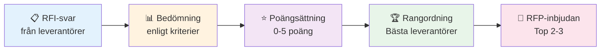

# 📊 Utvärderingskriterier - RFI/RFP
## Malmö stad | HVOF

!!! info "Bedömningsprocess"
    Dessa kriterier använder vi för att **objektivt utvärdera RFI-svar** från leverantörer och välja ut finalister för RFP-processen.

---

## 🎯 Utvärderingsprocessen



---

## ✅ Bedömningskriterier

### 1️⃣ Arkitektur & integration (25%)

| Aspekt | Beskrivning | Poäng |
|--------|-------------|--------|
| **API-kapabilitet** | Rest, HL7, moderna standarder | 5 poäng |
| **Integrationserfarenhet** | Proven track record | 5 poäng |
| **Datakvalitet** | Systemet säkerställer data-integritet | 5 poäng |
| **Skalbarhet** | Kan växa med organisation | 5 poäng |
| **Övergripande design** | Löser våra utmaningar | 5 poäng |

**Totalt**: max 25 poäng

### 2️⃣ Säkerhet & compliance (20%)

| Aspekt | Beskrivning | Poäng |
|--------|-------------|--------|
| **GDPR-efterlevnad** | Dokumenterad GDPR-strategi | 4 poäng |
| **Säkerhetscertifieringar** | ISO 27001, SOC 2, etc. | 4 poäng |
| **Datalagring** | Sverige/EU prioriteras | 4 poäng |
| **Autentisering** | Freja eID & SITHS-stöd | 4 poäng |
| **Audit & logging** | Fullt spårbar åtkomst | 4 poäng |

**Totalt**: max 20 poäng

### 3️⃣ Erfarenhet & referenser (20%)

| Aspekt | Beskrivning | Poäng |
|--------|-------------|--------|
| **Referenskunder** | Liknande kommun-/regionprojekt | 5 poäng |
| **Implementeringsspår** | Tydlig track record | 5 poäng |
| **Expertis** | Kunskap om svenska vårdsystem | 5 poäng |
| **Organisatorisk beredskap** | Kapacitet för projektet | 5 poäng |

**Totalt**: max 20 poäng

### 4️⃣ Datamigration & övergång (15%)

| Aspekt | Beskrivning | Poäng |
|--------|-------------|--------|
| **Migration från Lifecare** | Erfarenhet av denna övergång | 5 poäng |
| **Migrationsstrategi** | Tydlig plan & tidsplan | 5 poäng |
| **Datavalidering** | Säkerställer dataintegritet | 5 poäng |

**Totalt**: max 15 poäng

### 5️⃣ Support & framtid (10%)

| Aspekt | Beskrivning | Poäng |
|--------|-------------|--------|
| **Support-nivåer** | 24/7 eller likvärdig? | 3 poäng |
| **Produktroadmap** | Visar framtidsriktning | 4 poäng |
| **Långsiktig stabilitet** | Leverantörens hälsa? | 3 poäng |

**Totalt**: max 10 poäng

---

## 📈 Poängberäkning

```
TOTAL POÄNG = 
  (Arkitektur × 1.0) +           // max 25
  (Säkerhet × 1.0) +              // max 20
  (Erfarenhet × 1.0) +             // max 20
  (Migration × 1.0) +              // max 15
  (Support × 1.0)                  // max 10
  
= MAX 100 POÄNG
```

---

## 🏆 Bedömningsmall - Exempel

| Leverantör | Arkitektur | Säkerhet | Erfarenhet | Migration | Support | **TOTAL** |
|------------|-----------|----------|------------|-----------|---------|---------|
| **Systemhus A** | 24 | 19 | 18 | 14 | 9 | **84** |
| **Systemhus B** | 22 | 20 | 16 | 12 | 8 | **78** |
| **Systemhus C** | 20 | 18 | 14 | 11 | 7 | **70** |

---

## 🚫 Eliminera-kriterier (Must-Have)

Leverantörer som **inte** uppfyller dessa krav **elimineras omedelbar**:

| Kriterie | Krav | Status |
|----------|------|--------|
| ✅ **API-exponering** | Måste ha moderna API:er | Obligatorisk |
| ✅ **GDPR-stöd** | Måste följa GDPR | Obligatorisk |
| ✅ **Svenska hänsyn** | Bör förstå svenska vårdsystem | Starkt önskvärd |
| ✅ **Freja eID eller SITHS** | Minst en av dessa | Obligatorisk |
| ✅ **Referenskunder** | Minst 1 kommun/region | Obligatorisk |

!!! danger "Automatisk eliminering"
    Om leverantör missar ett Must-Have-kriterium → **inte vidare till RFP**

---

## 📋 RFI-bedömningsprocess steg-för-steg

### Steg 1: Mottagning
- Insamla RFI-svar från alla leverantörer
- Verifiera att svar är kompletta
- Notera eventuella saknade kriterier

### Steg 2: Bedömning
- Bedöm var och en enligt 5 kriterierna
- Anteckna motivering för poäng
- Markera eliminera-kriterier

### Steg 3: Diskussion
- Bedömningsgrupp diskuterar svar
- Konsensus om poängsättning
- Identifiera Top 2-3 leverantörer

### Steg 4: Beslut
- **Grön** (Top tier): Inbjudan till RFP
- **Gul** (Alternativ): Reserv-möjlighet
- **Röd** (Ej lämplig): Nej tack

### Steg 5: RFP-inbjudan
- Skicka RFP till Top 2-3
- Detaljerade kravspecifikationer
- Kostnadskalkyl-mall

---

## 💡 Bedömnings-vägledn

### Poängskala förklaring

| Poäng | Nivå | Beskrivning |
|-------|------|------------|
| **5** | 🟢 Utmärkt | Överträffar förväntningar, proven track record |
| **4** | 🟢 Mycket bra | Möter alla krav, bra svar |
| **3** | 🟡 Godtagbart | Möter grundläggande krav, acceptabelt |
| **2** | 🟠 Begränsat | Möter delvis krav, något oroande |
| **1** | 🔴 Svagt | Möter nätt och jämnt, många frågor |
| **0** | ⚫ Nej tack | Möter inte krav, kan elimineras |

---

## 📚 Relaterade dokument

| Dokument | Syfte |
|----------|-------|
| [RFI-material](rfi-material.md) | Systemlandskap & scope |
| [Frågor till leverantörer](supplier-questions.md) | Frågorna de svarar på |
| [Kravlista](requirements-list.md) | Detaljerade krav för RFP |

---

**Malmö stad | HVOF | 2024**
