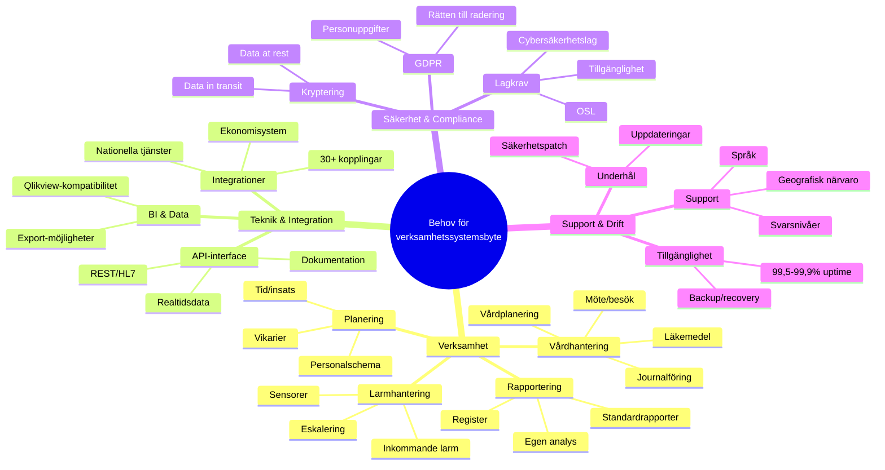

# Behov och förutsättningar för verksamhetssystemsbyte
## Malmö stad | Hälsa, Vård och Omsorg (HVOF)

!!! info "Lägg märke till detta"
    **Denna dokument beskriver BEHOV och FÖRUTSÄTTNINGAR** – inte krav eller specifikationer. Vi presenterar våra verksamhetsbehov på strategisk nivå så att leverantörer kan bedöma sin lämplighet.
    
    Detta är en del av **informationsinsamlingen (RFI)**, inte en bindande kravspecifikation.

---

## Snabböversikt över våra behov

---

## Våra behov - Funktionalitet

### Vårdhantering och journalföring

Malmö stads kärnverksamhet kräver robust stöd för:

| Behov | Beskrivning | Varför viktigt |
|-------|------------|-----------------|
| **Elektronisk patientjournal** | Komplett journal för alla brukare/patienter | Kärnverksamhet, juridisktkrav |
| **Strukturerad dokumentation** | Möjlighet att dokumentera både strukturerad och fri text | Effektivitet och datakvalitet |
| **Vårdplanering och uppföljning** | SIP/SVP-stöd, samordning mellan verksamheter | Lagkrav, samordning |
| **Möte- och besöksplanering** | Schemaläggning av insatser, möten, hembesök | Resurseffektivitet |
| **Läkemedelshantering** | Ordinering, delegering, elektronisk signering | Patientsäkerhet, GDPR |
| **Ärendehantering** | Från anmälan till insats till uppföljning | Strukturerad handläggning |
| **Remisshantering** | Skicka och ta emot remisser mellan enheter | Samordning i vården |

### Larmhantering och säkerhet

Vi behöver ett system som stödjer:

| Behov | Beskrivning | Varför viktigt |
|-------|------------|-----------------|
| **Inkommande larm** | Mottagning och dokumentation av larm | Säkerhet för brukare |
| **Larmskalor** | Support för svenska standarder (ex RETTS, MEWS) | Medicinskt korrekt |
| **Escalation och routing** | Automatisk eskalering till rätt personal/enhet | Snabb respons |
| **Larmhistorik** | Spårning av alla larm och åtgärder | Analys och kvalitet |
| **Sensorintegration** | Stöd för välfärdstekniska sensorer | Proaktiv säkerhet |

### Resursplanering och bemanning

Vi behöver ett system som stödjer:

| Behov | Beskrivning | Varför viktigt |
|-------|------------|-----------------|
| **Personalschema** | Planering av arbetstider och vikarier | Arbetsmiljö och bemanning |
| **Tid- och insatsuppföljning** | Dokumentera utförda insatser och tider | Debitering och kvalitet |
| **Resursoptimering** | Matcha behov med tillgänglig personal | Kostnadseffektivitet |
| **Sjukfrånvaro och vikariehantering** | Hantera frånvaro och vikariebehov | Kontinuitet i vården |

### Rapportering och styrning

Vi behöver ett system som stödjer:

| Behov | Beskrivning | Varför viktigt |
|-------|------------|-----------------|
| **Standardrapporter** | Fördefinierade rapporter för verksamhetsledning | Snabb överblick |
| **Anpassningsbar rapportering** | Möjlighet att bygga egna rapporter | Specifika behov |
| **Kvalitetsregister** | Export till nationella register (ex Senior Alert) | Nationella rapporteringskrav |
| **BI och analys** | Visuella dashboards och trendanalys | Datadriven styrning |
| **Registeröverrapportering** | Skicka data till Socialstyrelsen och andra myndigheter | Lagkrav |

---

## Pågående systembyte som påverkar denna process

Malmö stad genomför flera systembyten parallellt som påverkar arkitektur och integration:

### MCSS - Digital signering för HSL-uppgifter

| Aspekt | Status | Integration med nytt system |
|--------|--------|----------------------------|
| **Vad är det** | Digitalt signeringssystem för läkemedel och delegerade HSL-uppgifter | Måste stödja SITHS och Freja eID |
| **Leverantör** | [Leverantör] | Behöver API-koppling eller integration |
| **Tidsplan** | Implementeras Q1-Q2 2025 | Nya systemet måste samverka |
| **Konsekvens för RFI** | Nytt system måste ha stöd för digital signering eller integration med MCSS | Krav på e-signering |

### Ekonomisystem - Byte av redovisningsystem

| Aspekt | Status | Integration med nytt system |
|--------|--------|----------------------------|
| **Vad är det** | Nytt ekonomi- och redovisningssystem för HVOF | Måste kunna skicka kostnadsdata |
| **Nuvarande system** | Ekot/Raindance | Gamla systemet som ersätts |
| **Tidsplan** | Implementeras Q2-Q3 2025 | Parallell implementering med verksamhetssystem |
| **Konsekvens för RFI** | Nytt verksamhetssystem måste kunna integrera med nytt ekonomisystem | Krav på ekonomiintegration |

### Infrastruktur och molnmigration

| Aspekt | Status | Integration med nytt system |
|--------|--------|----------------------------|
| **Vad är det** | Migration från On-premise till Azure (Microsoft-molnet) | Molnförhållandeformad arkitektur |
| **Strategi** | Malmö stad migrerar hela IT-miljön | Nytt system bör vara cloud-native |
| **Tidsplan** | Pågår kontinuerligt Q4 2024-Q3 2025 | Nya systemet ska implementeras i molnet |
| **Konsekvens för RFI** | Vi förväntar att lösningen är eller kan vara molnbaserad | Molnklar arkitektur (prefereras) |

### Integrationsplattform och API-strategi

| Aspekt | Status | Integration med nytt system |
|--------|--------|----------------------------|
| **Vad är det** | Ny API-plattform och integrationsbuss (iPaaS) för standardiserad integration | Centraliserad integrations-arkitektur |
| **Syfte** | Minska punkt-till-punkt-integrationer, öka flexibilitet | Alle system ska exponera API:er |
| **Tidsplan** | Pilotfas Q1-Q2 2025, full lansering Q3 2025 | Nytt system bör integrera via denna plattform |
| **Konsekvens för RFI** | Nytt system måste kunna exponera API:er för integrationsplattformen | API-krav |

### Övriga påverkande projekt

| Projekt | Status | Påverkan |
|---------|--------|----------|
| **E-tjänster (Open-plattformen)** | Byte och modernisering | Nytt system måste kunna skicka data till webportalen |
| **Personal- och HR-system** | Byte från nuvarande HR-system | Måste integrera med ny HROC eller motsvarant |
| **Data- och säkerhet** | Ökade krav på GDPR och datasäkerhet | Höga säkerhetskrav på nytt system |
| **Välfärdsteknik (CMP, Sensio, Viser)** | Pågående rollout av sensorer och välfärdsteknik | Nytt system måste integrera med välfärdstekniska sensorer |

---

## Icke-funktionella behov - Systemkvalité

### Prestanda

Vi behöver ett system som:

| Behov | Målvärde | Motivering |
|-------|----------|-----------|
| **Svar-tid för användarinteraktioner** | Under 2 sekunder för normala operationer | Användarupplevelse och produktivitet |
| **Systemtillgänglighet** | Minst 99,5 % per månad (maximalt 3,6 timmar nedtid) | Verksamhetskritisk tjänst |
| **Stöd för samtidiga användare** | Minst 500 användare samtidigt | Baserat på nuvarande verksamhet |
| **Datalagring** | Minst 5-10 TB | Historisk data från 2019+ |

### Säkerhet och dataskydd

Vi behöver ett system som:

| Behov | Beskrivning | Standard |
|-------|------------|----------|
| **GDPR-efterlevnad** | Fullt stöd för dataskyddsförordningen | EU-lag |
| **Autentisering** | Support för Freja eID och SITHS | Nationella standarder |
| **Kryptering i transit** | TLS 1.2 eller senare för all kommunikation | Säkerhetsteknik |
| **Kryptering i vila** | Känslig hälsodata krypterad vid lagring | Säkerhetsteknik |
| **Granskningsloggar** | Allt loggat, minst 2 år lagring | Revision och juridisk spårning |
| **Åtkomstkontroll** | Rollbaserad åtkomstkontroll (RBAC) | Begränsa åtkomst |
| **Datacentersplats** | Föredraget: Sverige eller EU | Datahemvist |
| **Certifieringar** | ISO 27001 eller motsvarande rekommenderas | Säkerhetscertifiering |

### Tillgänglighet (Accessibility)

Vi behöver ett system som:

| Behov | Beskrivning | Standard |
|-------|------------|----------|
| **WCAG 2.1 AA-nivå** | Webbgränssnitt måste följa tillgänglighetsstandarden | Svensk och EU-lag |
| **Skärmläsar-kompatibilitet** | Kompatibelt med JAWS, NVDA och webbläsarers inbyggda läsare | Tillgänglighet |

### Datakvalité

Vi behöver ett system som:

| Behov | Beskrivning | Motivering |
|-------|-----------|-----------|
| **Data-integritet** | Ingen dataförlust under normal drift | Kritisk för journalföring |
| **Backup och recovery** | Recovery Point Objective < 1 timme, Recovery Time Objective < 4 timmar | Affärskontinuitet |
| **Datakvalitetskontroller** | Automatisk validering av inmatade data | Rätt data i systemet |

---

## Integrationsbehov

### Kritiska integrationer

Vi behöver att nytt system kan integrera med:

| System | Integrationstyp | Behov |
|--------|-----------------|-------|
| **NPÖ** (Nationella patientöversikten) | HL7 FHIR API | Läsa och skriva patientinformation |
| **Pascal** | API eller direkt connection | Läkemedelsdata |
| **MCSS** | API / SSO-integration | Digital signering av HSL-uppgifter |
| **Phoniro Care** | API eller direkt anslutning | Tid- och insatsuppföljning |
| **Interview/ISM** | API / CTI | Larmcentral och ärendehantering |
| **Senior Alert** | API / export | Kvalitetsregister |
| **Mina Planer** | API eller dokument | Samordnad vårdplanering |
| **Integrationsplattformen (iPaaS)** | REST API | Centraliserad integration |

---

## Datamigration

Vi behöver ett system som kan:

| Domän | Volym | Migreringsbehov |
|-------|-------|-----------------|
| **Vårddata och journalhistorik** | Ca 100 000+ journalposter | Från Lifecare, historik från 2019+ |
| **Tid- och insatsregistreringar** | Ca 1 miljon registreringar/år | Från Phoniro Care |
| **Läkemedelsordinationer** | Ca 20 000 aktiva medicineringar | Från Pascal, strukturen måste bevaras |
| **Kvalitetsregistersdata** | Register och rapporter | Från Senior Alert |
| **Personal- och organisationsdata** | Ca 350 anställda | Från HR-system |

---

## Implementering och övergång

Vi behöver:

| Behov | Beskrivning | Tidsram |
|-------|------------|---------|
| **Konfiguration och anpassning** | Anpassning till HVOF:s processer och terminologi | 4-6 veckor |
| **Datamigrationsstrategi** | Plan för migrering från Lifecare och övriga system | Pilot + full |
| **Testning och UAT** | Användartestning och acceptanstestning | 3-4 veckor |
| **Användarutbildning** | Utbildning för ca 200-300 användare | Innan go-live |
| **Go-live och stabilisering** | Övergång till nytt system | 1-2 veckor intensiv support |
| **Post-go-live support** | Skräddarsydd support efter övergång | 4 veckor efter go-live |

---

## Support- och driftbehov

Vi behöver leverantören att tillhandahålla:

| Behov | Beskrivning |
|-------|------------|
| **Support-timmar** | Minst 7-22 vardagar, helg 9-17 helst |
| **Incidentresponshastighet** | < 30 minuter för kritiska fel |
| **Incidentlösningshastighet** | 95 % löst inom 24 timmar |
| **Systemunderhål** | Planerat max 4 timmar per månad |
| **Hotline och escalation** | Tydlig väg för snabb kontakt |
| **Teknisk dokumentation** | Uppdaterad och tillgänglig |
| **Användarhandbök** | Svenska, uppdaterad efter varje uppdatering |

---

## Slutsats och nästa steg

Dessa behov utgör grunden för vår informationsinsamling (RFI). Vi söker leverantörer som:

1. Kan möta eller överträffa dessa behov
2. Har relevant erfarenhet från kommun-/regionprojekt
3. Kan implementera systemet inom rimlig tid
4. Kan integrera med vårt framtida systemlandskap
5. Kan tillhandahålla långsiktig support

Efter RFI-insamlingen kommer vi att välja 2-3 leverantörer för en Request for Proposal (RFP) med detaljerade kravspecifikationer.

---

**Malmö stad | Hälsa, Vård och Omsorg (HVOF) | Senast uppdaterad: 2024-12-11**
