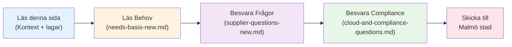
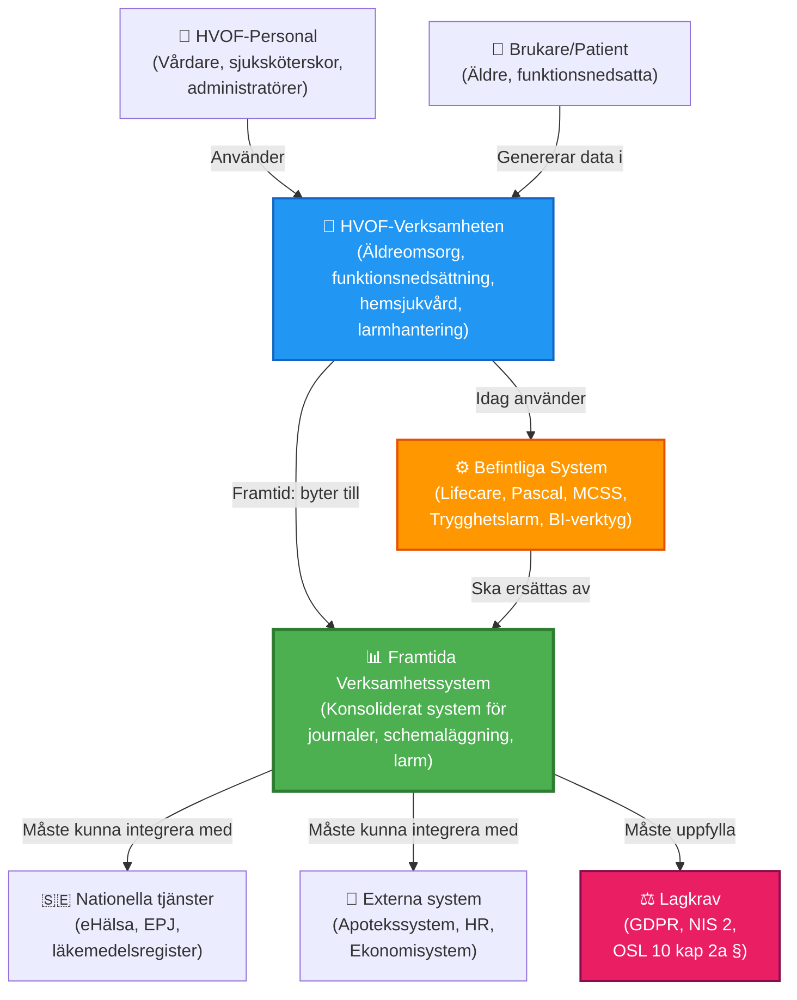
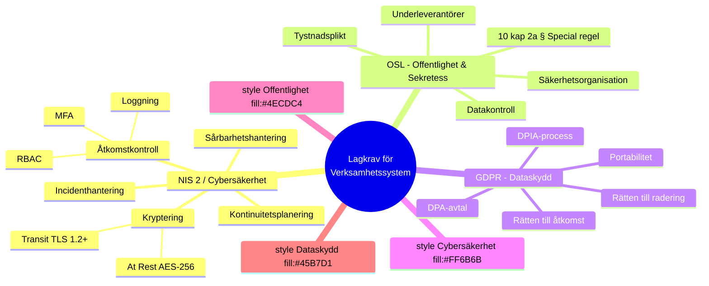

# Organisatorisk kontext och lagkrav för verksamhetssystemsbyte
## Malmö stad | Hälsa, Vård och Omsorg (HVOF)

!!! info "Vad ska du läsa här?"
    **För att förstå Malmö stads situation:**
    - Organisationsstorlek och tjänster (5 min)
    - Aktuell systemlandskap och utmaningar (5 min)
    - Vilka lagar som påverkar systemet (10 min)
    - IT-tekniska krav (5 min)
    
    **Total läsningstid**: Ca 25 minuter

    **Du kan gå direkt till**: 
    - [Molntjänster & compliance-frågor](cloud-and-compliance-questions.md) – för säkerhet och juridik
    - [Behov och förutsättningar](needs-basis-new.md) – för funktionellt arbete

---

## Snabbguide för leverantörer

---

## Malmö stad - HVOF organisatorisk struktur

### Organisationsöversikt

Hälsa, Vård och Omsorg (HVOF) är en förvaltning inom Malmö stad som ansvarar för äldreomsorg, funktionsnedsättning och vård.

| Aspekt | Beskrivning |
|--------|------------|
| **Organisationsenhet** | Hälsa, Vård och Omsorg (HVOF) |
| **Moderorganisation** | Malmö stad |
| **Personalstyrka** | Ca 350 anställda |
| **Brukarkrets** | Ca 10 000 brukare och patienter |
| **Geografisk område** | Malmö stad (Sverige) |
| **Juridisk ram** | Svensk lag – alla tillämplig regelverk |

### Tjänster och verksamhetsområden

HVOF tillhandahåller flera kärnverksamheter:

| Tjänst | Beskrivning | Målgrupp | Systemkrav |
|--------|------------|----------|-----------|
| **Äldreomsorg** | Hemtjänst, särskilt boende, dagverksamhet | Äldre 65+ | Journalföring, schemalägning, rapportering |
| **Funktionsnedsättning** | Stöd och service enligt LSS | Alla åldrar | Ärendehantering, vårdplanering |
| **Sjukvård (HSL)** | Hemsjukvård, rehabilitering | Äldre och funktionsnedsatta | Medicinska journaler, ordination |
| **Trygghetslarm** | Tillgänglig 24/7 | Äldre och utsatta | Realtidslarmhantering |
| **Dagverksamhet** | Aktiviteter och sysselsättning | Äldre | Närvaro och aktivitetsregistrering |

---

## Nuvarande systemlandskap och utmaningar

### Befintliga system - 57 system i drift

Malmö stad HVOF använder idag ett komplext systemlandskap med 57 system:

| Kategori | Antal | Kritikalitet | Utmaning |
|----------|-------|--------------|----------|
| **Centrala verksamhetssystem** | 8 | KRITISK | Många punkt-till-punkt-integrationer |
| **Läkemedel och ordinationer** | 5 | KRITISK | MCSS, Pascal, många manuella moment |
| **Larmhantering och välfärdsteknik** | 12 | KRITISK | Många leverantörer, fragmenterad arkitektur |
| **HR och bemanning** | 4 | HÖGT | Spridda system, dubbel dataintring |
| **Ekonomi och fakturering** | 3 | HÖGT | Gamla system, många integrationer |
| **BI och rapportering** | 5 | MEDEL | Begränsade möjligheter för analys |
| **Infrastruktur och molntjänster** | 8 | HÖGT | Mix av on-premise och molnlösningar |
| **Övriga stödsystem** | 9 | LÅGT | Redundanta funktioner |

### Systemarkitektur - C4 Context-diagram

**Läs arkitekturen uppifrån och ner:**

1. **HVOF-Personal & Brukare** använder HVOF-verksamheten
2. **HVOF-Verksamheten** använder idag **57 befintliga system** (fragmenterad) 
3. **Framtida system** ska konsolidera dessa och integrera med nationella tjänster
4. **Lagkrav** (GDPR, NIS 2, OSL) påverkar alla val och implementering

---

### Identifierade smärtpunkter

Vi har identifierat följande kritiska utmaningar i nuvarande miljö:

#### 1. Fragmenterad systemarkitektur
- **Problem**: 57 system som inte är integrerade eller bara delvis integrerade
- **Konsekvens**: Dubbelarbete, datainkonsistens, felkällor
- **Påverkan på användare**: 200+ dagliga användare spenderar ca 20% av tiden på manuell dataintring mellan system
- **Påverkan på patientsäkerhet**: Risk för felaktig läkemedelsordinering och missade larmsignaler

#### 2. Många integrationer med höga underhållskostnader
- **Problem**: Ca 30 huvudintegrationer bestående av 170+ tekniska punkt-till-punkt-kopplingar
- **Konsekvens**: Höga driftskostnader, svår att uppdatera system oberoende
- **Exempel**: Läkemedelsdata måste manuellt eller automatiskt synkas mellan Lifecare, Pascal, MCSS, apotekssystem
- **Kostnadsimpakt**: Uppskattat ca 15-20 % av IT-budgeten går till integrationskostnader

#### 3. Säkerhet och dataskydd inte optimalt
- **Problem**: Många lösenord, fragmenterad åtkomstkontroll, ingen centraliserad loggning
- **Konsekvens**: GDPR-risker, svårt att granska vem som läst känslig data
- **Exempel**: Ca 50 % av användare använder samma lösenord över flera system
- **Regulatorisk risk**: OSL och GDPR-överträdelsesrisker

#### 4. Larmhantering fragmenterad och ej tillräckligt robust
- **Problem**: Larm från välfärdstekniska sensorer, trygghetslarm och patientövervakning kommer in genom olika kanaler
- **Konsekvens**: Möjlighet för missade larm eller felaktig routing
- **SLA-brister**: Idag uppnår vi endast 97,5% tillgänglighet för larmsystemet (mål: 99,9%)
- **Klinisk risk**: Direktpåverkan på patienters säkerhet

#### 5. Data från Lifecare-Procapita är svårt att extrahera och migrera
- **Problem**: Proprietary dataformat, komplex datamodell, många relationer
- **Konsekvens**: Migrationskostnader och risker vid systembyte
- **Datamängd**: Ca 100 000 patientjournaler, 2 miljoner tidsregistreringar, 20 000 aktiva medicineringar
- **Risk**: Potentiell dataförlust eller inkorrekt mappning

#### 6. Bristande verksamhetsanalytik
- **Problem**: Data är spridd över många system, svårt att få helhetsbild
- **Konsekvens**: Svårt att fatta datadriven verksamhetsbeslut
- **Exempel**: Kan inte enkelt se hur vårdtyngd korrelerar med personalbehov
- **Påverkan**: Suboptimal resursplanering

#### 7. Långsam tid till ny funktionalitet
- **Problem**: Många system måste uppdateras, många integrationer måste testas
- **Konsekvens**: Vi kan inte implementera nya nationella krav eller best practices snabbt
- **Exempel**: Det tog 6 månader att implementera stöd för Freja eID-inloggning

---

## Lagstadgade krav som påverkar verksamhetssystemet

### Snabböversikt: Tre lagstiftningar - En arkitektur

**Lagsammanfattning för leverantörer:**

| Lag | Verkningsområde | Huvudkrav | Din roll |
|-----|-----------------|-----------|----------|
| **NIS 2** | Cybersäkerhet, kritisk infrastruktur | Säkerhet, backup, incidenthantering | Dokumentera säkerhetssystem |
| **OSL 10 kap 2a §** | Sekretessbelagd data (journaler) | Data krypterad, Malmö stad har kontroll | Agera rent databearbetare |
| **GDPR** | All personuppgiftsbehandling | Rättigheter för brukare, DPA-avtal | Garantera registerrättigheter |

---

### 1. Cybersäkerhetslagen (NIS 2)

#### Bakgrund
Malmö stad kommer att omfattas av Cybersäkerhetslagen som träder i kraft under 2025 genom införandet av NIS 2-direktivet i svensk rätt. Som en verksamhetsutövare inom hälso- och sjukvård är vi klassificerad som **kritisk verksamhet** och ställs därför mycket höga säkerhetskrav.

#### Lagstadgade krav
Verksamhetsutövare som omfattas av Cybersäkerhetslagen ska vidta åtgärder för att skydda:
- Nätverk och informationssystem
- Systemens fysiska miljö
- Mot incidenter och cyberattacker

Åtgärderna ska utgå från ett **allriskperspektiv** och en **riskanalys** och vara **proportionella** i förhållande till identifierade risker.

#### Obligatoriska riskhanteringsåtgärder enligt Cybersäkerhetslagen

| Åtgärd | Beskrivning | Tillämpning på verksamhetssystem |
|--------|------------|--------------------------------|
| **Incidenthantering** | Systemet för hantering av säkerhetshändelser | Verksamhetssystemet måste kunna logga alla åtkomster och ändringar |
| **Kontinuitetshantering** | Beredskap för störningar och drift-avbrott | Systemet måste ha backup, disaster recovery med RTO < 4h, RPO < 1h |
| **Säkerhet i leveranskedjan** | Kontroll av underleverantörer och tredjeparter | Vi behöver rapporter från systemleverantören om deras säkerhet |
| **Säkerhet vid förvärv och underhål** | Säker uppdatering och patch-hantering | Systemet måste ha dokumenterade uppdateringsprocesser |
| **Sårbarhetshantering** | Identifiering och hantering av säkerhetshål | Leverantören måste rapportera sårbarheter snabbt |
| **Kryptografi-strategi** | Användning av kryptering och kryptografiska algoritmer | Data måste krypteras både i transit (TLS 1.2+) och at rest |
| **Personalsäkerhet** | Screening och utbildning av personal | Systemleverantörens personal måste genomgå säkerhetsvett |
| **Åtkomstkontroll** | Begränsning av vem som får åtkomst | Rollbaserad åtkomst (RBAC), multi-factor authentication |
| **Autentisering** | Starka autentiseringsmetoder | Freja eID, SITHS, inte endast lösenord |
| **Säkrad kommunikation** | Skyddad kommunikation mellan komponenter | All kommunikation måste vara krypterad |

#### Malmö stads förväntningar från leverantörer

Vi förväntar oss dokumenterat bevis på att leverantören uppfyller dessa krav:

| Bevistyp | Beskrivning | Format |
|----------|------------|--------|
| **SOC 2 Type II rapport** | Rapport från oberoende revisor om systemets säkerhet och tillgänglighet | PDF-rapport, minimum 6 månaders data |
| **ISO 27001-certifiering** | Internationell säkerhetscertifiering för informationssäkerhet | Giltigt intyg, tillsammans med Statement of Applicability |
| **Internrevisionsrapporter** | Leverantörens egna säkerhetsgranskning | Från senaste 12 månaderna |
| **Informationssäkerhetspolicy** | Dokumenterat säkerhetspolicy | Offentlig eller under NDA |
| **Säkerhetsorganisation** | Beskrivning av leverantörens säkerhetsteam och ansvar | Namn, roller, kontaktuppgifter |
| **Kontinuitetsplaner** | Plan för kontinuitet vid driftstörningar | Visar RTO/RPO och testhäfte |
| **Säkerhetsvettning av personal** | Dokumentation att personal genomgått säkerhetsvetting | Attestkopi |
| **Avtalsvillkor** | Leverantörens standard-SLA och säkerhetskrav | För granskning |

---

### 2. Offentlighet- och Sekretesslagen (OSL)

#### Bakgrund
Malmö stad lyder under Offentlighet- och Sekretesslagen (OSL). All information som HVOF samlar in är potentiellt sekretessbelagd enligt OSL, speciellt när det gäller:
- **Hälsodata** (alla patientjournaler, medicineringar, diagnostik)
- **Personuppgifter** (personnummer, adresser, kontaktuppgifter)
- **Känslig information** (sexuell läggning, religiös övertygelse, unionsfacklig anslutning)

#### Lagstadgad ram: 10 kap. 2 a § OSL
Denna paragraf tillåter att sekretessbelagd information kan lämnas till en leverantör **endast om leverantören fungerar som en rent teknisk databearbetare utan eget inflytande över data**.

**Ordlyd**: "Sekretess hindrar inte att en uppgift lämnas till en enskild eller till en annan myndighet som för den utlämnande myndighetens räkning har i uppdrag att endast tekniskt bearbeta eller tekniskt lagra uppgiften, om det med hänsyn till omständigheterna inte är olämpligt att uppgiften lämnas ut."

#### Kritiska frågor leverantörer måste besvara

HVOF måste få svar på följande för att kunna bedöma OSL-efterlevnad:

| Fråga | Varför viktigt | Motsvar |
|-------|----------------|--------|
| **Åtkomst till data** | Vi måste veta vem som kan läsa känslig data | Underleverantörer, moderbolag, andra kunder |
| **Form av data** | Om data är krypterad kan vi tillämpa 10 kap 2a § OSL | Klartext? Krypterad? Anonymiserad? |
| **Tystnadsplikt** | Personal måste vara bunden av sekretess | Lagstadgad eller avtalsreglerad? |
| **Säkerhetsmål** | Måste kunna dokumentera säkerhetsåtgärder | Vad gör leverantören för att skydda data? |
| **Datalokalisereing** | Risk för att data lagras tillsammans med andra kunders data | Var lagras data fysiskt? |
| **Riskanalys** | Vi måste kunna analysera säkerhetrisker | Kan data läcka till andra kunder? |

#### Malmö stads säkerhetskrav enligt OSL

| Krav | Beskrivning |
|------|------------|
| **Data i vila (at rest)** | Alla patientjournaler och personuppgifter måste krypteras så att Malmö stads nyckel är unik och leverantören inte kan dekryptera data utan vår nyckel |
| **Data i transit** | All datakommunikation mellan Malmö stads system och leverantörens system måste krypteras (TLS 1.2+) |
| **Åtkomstkontroll** | Endast auktoriserad personal ska kunna läsa känslig data; åtkomsten måste loggas |
| **Dataägarskap** | Malmö stad behåller all äganderätt över data; leverantören är endast en förvaringskassör |
| **Underleverantörer** | Alla underleverantörer måste uppfylla samma säkerhetskrav och tystnadsplikt |

---

### 3. Dataskyddsförordningen (GDPR)

#### Bakgrund
Malmö stad är **personuppgiftsansvarig** enligt GDPR för all personuppgiftsbehandling inom HVOF. En ny systemleverantör skulle bli **personuppgiftsbiträde** och måste följa GDPR-krav.

#### Kritiska GDPR-områden för verksamhetssystem

| Område | Krav | Påverkan på systemet |
|--------|------|---------------------|
| **Rätten till åtkomst** | Brukare kan begära att se all data om dem | Systemet måste kunna exportera all persondata |
| **Rätten till radering** | Brukare kan begära radering av data (inom vissa gränser) | Systemet måste kunna radera journaler och personuppgifter |
| **Rätten till rättelse** | Brukare kan begära att felaktig data korrigeras | Systemet måste kunna uppdatera data, läkarvårdat dataintegriteten |
| **Portabilitet** | Data måste kunna exporteras i maskinläsbart format | Systemet måste kunna exportera till andra format |
| **Lagringsgräns** | Data ska inte lagras längre än nödvändigt | Systemet måste kunna arkivera gamla data |
| **Integritetskonsekvensbedömning** | Vi måste utföra en analys av dataskydd innan implementering | Vi måste kunna göra DPIA med systemleverantören |

#### Erforderliga garantier från leverantörer
- Datbehandlaravtal (DPA) enligt GDPR
- Företräde för att data lagras i Sverige eller EU
- Möjlighet för Malmö stad att göra granskning av leverantörens säkerhet
- Bindande åtaganden om kryptering, åtkomstkontroll och loggning

---

## IT-tekniska krav

### Kryptering av data

#### Lagkrav
OSL (propositionen 2022/23 sid 7) och Cybersäkerhetslagen kräver att data krypteras både i transit och at rest.

#### Malmö stads krav

| Scenario | Krav | Förklaring |
|----------|------|-----------|
| **Data i transit** | TLS 1.2 minimum, helst TLS 1.3 | All kommunikation mellan HVOF och systemet |
| **Data at rest** | AES-256 eller motsvarande | Patientjournaler, medicineringar, personuppgifter |
| **Nyckelhantering** | Malmö stad kontrollerar eller delar nyckeln | Vi kan dekryptera utan leverantörens hjälp (klausul enligt OSL) |
| **Algoritmer** | Moderna, NIST-godkända algoritmer | Inte äldre eller svaga algoritmer |
| **Krypteringshastighet** | Ingen märkbar prestandapåverkan | Systemet ska fungera normalt även med kryptering |

#### Teknisk fråga till leverantörer
**"Tillhandahåller ni möjligheten för Malmö stad att tillämpa kryptering på ett sådant sätt att ni saknar teknisk kapacitet att forcera/dekryptera krypteringen?"**

Detta säkerställer att vi uppfyller OSL:s krav på datakontroll.

---

### Integrationer

#### Nuvarande integrationsmiljö
Malmö stad har idag:
- **Ca 30 huvudintegrationer** in till och från ekonomisystemet
- **Ca 170+ tekniska integrationspunkter** sammantaget
- **Många punkt-till-punkt-kopplingar** mellan system

#### Frågor till leverantörer om integrationer

| Fråga | Varför viktigt |
|-------|-----------------|
| **Hur ser ni på antalet integrationer?** | Vi behöver veta om leverantören kan hantera vår komplexitet |
| **Finns det en kostnadsmodell för integrationer?** | Vi behöver förstå totalkostnaden |
| **Finns begränsningar i antal, prestanda eller tidpunkter?** | Vi måste kunna integrera kritiska system som läkemedel, larm |
| **Gäller samma prissättning för on-prem som SaaS?** | Jämförbara kostnader för både leveransmodeller |

#### Mahmö stads integrationskrav

| Krav | Beskrivning |
|------|------------|
| **API-först** | Systemet måste exponera moderna REST/HL7 API:er, inte bara batch-kopplingar |
| **Realtidsdata** | Integrationerna måste kunna överföra data i nära realtid (max 1 timme fördröjning) |
| **Felhantering** | Systemet måste kunna hantera integrationskrav och rapportera fel automatiskt |
| **Loggning** | Alla integrationer måste loggas för revision och felsökning |
| **Dokumentation** | Leverantören måste dokumentera alla API:er och integrationsmöjligheter |

---

### Utdataplattform och BI-åtkomst

#### Definition
En **utdataplattform** är en funktion där Malmö stad kan få åtkomst till data från systemet för rapportering och analys.

#### Malmö stads krav

| Fråga | Beskrivning |
|-------|------------|
| **Finns utdataplattform?** | Vi behöver möjlighet att göra egna rapporter och analyser |
| **Format för datakonsumtion** | API? Export? Databaskoppling? |
| **Kostnader för SaaS** | Ingår i licens eller extra avgift? |
| **Datakvalititet** | Är data realtid, daglig uppdatering, eller mer sällan? |
| **On-prem vs SaaS** | Samma tillgång för on-premise-lösning? |

#### Malmö stad använder idag
- **Qlikview** för BI och rapportering
- **Excel och CSV-export** för ad hoc-analyser
- **SQL-frågor** direkt mot databaser (för vissa system)

Vi förväntar oss att nya systemet kan stödja minst en av dessa metoder för datakonsumtion.

---

## Sammanfattning av påverkan på verksamhetssystemet

### Vad detta betyder för ett nytt system

| Område | Påverkan | Prioritet |
|--------|----------|-----------|
| **Säkerhet** | Systemet måste ha avancerad säkerhet enligt Cybersäkerhetslagen | KRITISK |
| **Compliance** | Systemet måste kunna uppfylla OSL, GDPR och andra lagar | KRITISK |
| **Integration** | Systemet måste kunna integrera med 30+ andra system | KRITISK |
| **Kryptering** | All data måste krypteras både in transit och at rest | KRITISK |
| **Analys** | Vi måste kunna få åtkomst till data för rapportering | HÖGT |
| **Performance** | Systemet måste hantera 200+ dagliga användare utan prestandaproblem | HÖGT |
| **Tillgänglighet** | Systemet måste ha 99,9% uptime för larmfunktioner | KRITISK |

---

## Nästa steg

1. Leverantörer läser denna sida för att förstå Malmö stads kontext
2. Vi ställer detaljerade frågor relaterat till dessa lagkrav i [Frågor till leverantörer](supplier-questions-new.md)
3. Leverantörer svarar med dokumenterat bevis på efterlevnad
4. Vi bedömer svar enligt lagstadgade krav och verksamhetsbehov

---

**Malmö stad | Hälsa, Vård och Omsorg (HVOF) | Senast uppdaterad: 2024-12-11**
