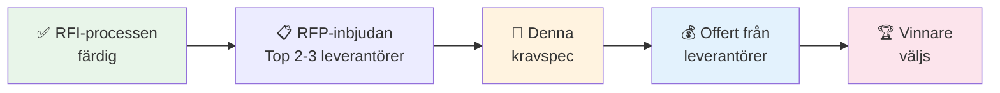

# 📋 Kravspecifikation - RFP-fas
## Malmö stad | HVOF

!!! warning "Observera: Detta är för RFP-fasen"
    **Denna dokument är för leverantörer som VALTS UT** i RFI-processen.
    
    För allmän RFI-information, se [RFI-material](rfi-material.md) och [Leverantörsfrågor](supplier-questions.md).

---

## 🎯 Syftet med denna kravspecifikation



---

## 📊 Kravan - Kategoriiserade

### 1️⃣ FUNKTIONELLA KRAV (Systemet måste göra detta)

#### A. Vårdhantering

| # | Krav | Prioritet | Beskrivning |
|---|------|-----------|------------|
| F-1 | **Patientjournal** | 🔴 KRITISK | Komplett elektronisk journal för alla patienter/brukare |
| F-2 | **Möte/besöksplanering** | 🔴 KRITISK | Boka och schemalägga möten, besök, hemtjänst |
| F-3 | **Läkemedel & ordinationer** | 🔴 KRITISK | Recepthantering, ordination, lagerspårning |
| F-4 | **Dokumentation** | 🔴 KRITISK | Strukturerad klinisk dokumentation (strukturerad/fri text) |
| F-5 | **Remiss & samordning** | 🟡 MEDEL | Hantera remisser mellan verksamheter |

#### B. Larmhantering

| # | Krav | Prioritet | Beskrivning |
|---|------|-----------|------------|
| F-6 | **Larmöverföring** | 🔴 KRITISK | Automatisk larmöverföring till rätt enhet |
| F-7 | **Larmskalor** | 🔴 KRITISK | Stödja svenska larmskalor (ex: RETTS, Modified Early Warning Score) |
| F-8 | **Notifieringar** | 🟡 MEDEL | Push-notifieringar till bärbara enheter |

#### C. Rapportering & BI

| # | Krav | Prioritet | Beskrivning |
|---|------|-----------|------------|
| F-9 | **Standardrapporter** | 🟡 MEDEL | Idag: patienter, bemanning, läkemedel |
| F-10 | **BI-plattform** | 🟡 MEDEL | Möjlighet att bygga egna rapporter |
| F-11 | **Dashboards** | 🟢 LÅGT | Visualisering av KPI:er |

#### D. Administrering

| # | Krav | Prioritet | Beskrivning |
|---|------|-----------|------------|
| F-12 | **Användarhantering** | 🔴 KRITISK | Rollbaserad åtkomstkontroll (RBAC) |
| F-13 | **Strukturdata** | 🟡 MEDEL | Organisationsstruktur, enheter, kostnadsställen |
| F-14 | **Arbetsschema** | 🟡 MEDEL | Personalschema & bemanning |

---

### 2️⃣ ICKE-FUNKTIONELLA KRAV (Systemet måste VARA så här)

#### A. Prestanda

| # | Krav | Målvärde | Prioritet |
|---|------|----------|-----------|
| NF-1 | **Svar-tid** | < 2 sec | 🔴 KRITISK |
| NF-2 | **Tillgänglighet** | 99.5% | 🔴 KRITISK |
| NF-3 | **Concurrent users** | Min 500 samtidigt | 🟡 MEDEL |
| NF-4 | **Datalagringskapacitet** | Min 5 TB | 🟡 MEDEL |

#### B. Säkerhet

| # | Krav | Beskrivning | Prioritet |
|---|------|------------|-----------|
| NF-5 | **GDPR-compliance** | Dataskydd-förordningen fullt implementerad | 🔴 KRITISK |
| NF-6 | **Kryptering i transit** | TLS 1.2+ för all datakommunikation | 🔴 KRITISK |
| NF-7 | **Kryptering i vila** | Känslig data krypterad vid lagring | 🔴 KRITISK |
| NF-8 | **Autentisering** | Stöd för Freja eID + SITHS | 🔴 KRITISK |
| NF-9 | **Audit logging** | Allt loggat, minst 2 år lagring | 🟡 MEDEL |
| NF-10 | **Penetrationstest** | Årligt, resultat delat med Malmö | 🟡 MEDEL |

#### C. Tillgänglighet (Accessibility)

| # | Krav | Beskrivning | Prioritet |
|---|------|------------|-----------|
| NF-11 | **WCAG 2.1 AA** | Webbstandard för tillgänglighet | 🟡 MEDEL |
| NF-12 | **Skärmläsar-stöd** | Kompatibelt med JAWS, NVDA | 🟡 MEDEL |

#### D. Datakvalitet

| # | Krav | Beskrivning | Prioritet |
|---|------|------------|-----------|
| NF-13 | **Data-integritet** | Ingen dataförlust under drift | 🔴 KRITISK |
| NF-14 | **Backup & recovery** | RPO < 1h, RTO < 4h | 🔴 KRITISK |
| NF-15 | **Validering** | Automatisk datakvalitetskontroll | 🟡 MEDEL |

---

### 3️⃣ INTEGRATION-KRAV (Kopplingar till andra system)

#### Kritiska integrationer

| # | System | Riktning | Krav | Prioritet |
|---|--------|----------|------|-----------|
| I-1 | **LIS** | ← | Läb-resultat → Journalen | 🔴 KRITISK |
| I-2 | **Apotek/eApoteket** | ↔ | E-recept integration | 🔴 KRITISK |
| I-3 | **Nationell läkemedelslista** | ← | FMPA-data | 🔴 KRITISK |
| I-4 | **1177** | → | Patientportalen | 🟡 MEDEL |
| I-5 | **Elväxjö** | ↔ | Journalöverföring mellan verksamheter | 🟡 MEDEL |
| I-6 | **AD/Entra** | ↔ | Användarhantering | 🟢 LÅGT |
| I-7 | **Nationella tillståndet** | → | Rapportering till Socialstyrelsen | 🟡 MEDEL |

---

### 4️⃣ DATAMIGRATION-KRAV

#### Från Lifecare-Procapita

| # | DatadomÄn | Volym | Krav | Prioritet |
|---|-----------|-------|------|-----------|
| M-1 | **Patienter/brukare** | 180k | 100% migration | 🔴 KRITISK |
| M-2 | **Journalanteckningar** | ~8M | Historik från 2019 | 🔴 KRITISK |
| M-3 | **Läkemedelsdata** | ~500k | Kompletta ordinationer | 🔴 KRITISK |
| M-4 | **Möten/besök** | ~2M | Fullständig historik | 🟡 MEDEL |
| M-5 | **Användardata** | ~800 | Personal, roller, rättigheter | 🔴 KRITISK |

**Migrationsstrategi**: Big Bang (över en helg) eller parallell körning (2 veckor)?

---

### 5️⃣ SUPPORT & DRIFT-KRAV

#### Support-nivåer

| # | Krav | Beskrivning | Prioritet |
|---|------|------------|-----------|
| S-1 | **Support-timmar** | Minst 7-22 vardagar, helg 9-17 | 🔴 KRITISK |
| S-2 | **Incidentsvar** | Svartid < 30 min (kritisk) | 🔴 KRITISK |
| S-3 | **Incidentlösning** | 95% löst inom 24 timmar | 🟡 MEDEL |
| S-4 | **Hotline-nummer** | Direkt kontakt | 🟡 MEDEL |

#### Driftöverenskommelse (SLA)

| # | Metrik | Målvärde | Konsekvens om missad |
|---|--------|----------|---------------------|
| SLA-1 | **Systemets tillgänglighet** | 99.5% per månad | Rabatt 5% |
| SLA-2 | **Svar-tid för criticals** | < 30 minuter | Rabatt 3% |
| SLA-3 | **Planerat underhål** | Max 4h/månad | Rabatt 2% |

---

### 6️⃣ IMPLEMENTERING-KRAV

#### Tidsplan

| Fas | Aktivitet | Varaktighet | Start | Slut |
|-----|-----------|-------------|-------|------|
| 1 | Konfiguration & setup | 4 veckor | Q3 2024 | Q3 2024 |
| 2 | Datamigration (pilot) | 2 veckor | Q3 2024 | Q3 2024 |
| 3 | UAT & testning | 3 veckor | Q4 2024 | Q4 2024 |
| 4 | Go-live | 1 vecka | Q4 2024 | Q4 2024 |
| 5 | Post-go-live support | 4 veckor | Q4 2024 | Q1 2025 |

#### Resurser

| Roll | Antal | Beskrivning |
|-----|-------|------------|
| **Projektledare** | 1 | Från leverantör |
| **Teknisk arkitekt** | 1 | Systemkonfiguration |
| **Datamigration-expert** | 2 | Lifecare-kännedom viktig |
| **Testledare** | 1 | UAT-samordning |
| **Support/Trainer** | 2 | Användarutbildning |

---

## 📋 Leverantörs Offert-mall

Leverantören måste besvara följande i sin offert:

### Pricing

| Kategori | År 1 | År 2 | År 3 | Beskrivning |
|----------|------|------|------|------------|
| **Licensier** | XXX kr | XXX kr | XXX kr | Per användar eller paket? |
| **Implementation** | XXX kr | - | - | Engångsomkostnad |
| **Support & drift** | XXX kr | XXX kr | XXX kr | Månadsavgift |
| **Datamigration** | XXX kr | - | - | Engångsomkostnad |
| **Infrastruktur (molnet)** | XXX kr | XXX kr | XXX kr | Azure/AWS/On-prem? |
| **TOTALT År 1** | **XXX kr** |  |  | Totalt första året |

### Kravuppfyllelse

| Krav-ID | Krav | Status | Motivering |
|---------|------|--------|-----------|
| F-1 | Patientjournal | ☐ Uppfylls | Beskriv hur |
| F-2 | Möte/besöksplanering | ☐ Uppfylls | Beskriv hur |
| ... | ... | ... | ... |

---

## ✅ Kravhantering-process

```
1. Vi skickar denna spec → Leverantör
         ↓
2. Leverantör fyller i offert-mallen → Vi mottar
         ↓
3. Vi granskar kravuppfyllelse → Scoring enligt utvärderingskriterier
         ↓
4. Vi förhandlar (vid behov) → Finslipande av offert
         ↓
5. Vi undertecknar kontrakt → Go för implementation
```

---

## 📞 Frågor & Clarifications

| Fråga | Svar |
|-------|------|
| Kan vi förhandla om någon funktionalitet? | Ja, men F-1, F-2, F-3 är icke förhandlingsbara |
| Vad gäller för on-prem vs molnlösning? | Molnet (Azure/AWS) är föredraget, on-prem diskuteras |
| Kan vi få en proof-of-concept (PoC)? | Ja, kort PoC (1-2 dagar) är möjlig |
| Vilken support-nivå rekommenderar ni? | Minst Tier 1+2, Tier 3 från leverantör |

---

## 📚 Relaterade dokument

| Dokument | Länk | Syfte |
|----------|------|-------|
| RFI-material | [rfi-material.md](rfi-material.md) | Bakgrund & scope för RFI |
| Leverantörsfrågor | [supplier-questions.md](supplier-questions.md) | RFI-frågorna |
| Utvärderingskriterier | [evaluation-criteria.md](evaluation-criteria.md) | Hur vi bedömer offert |

---

**Malmö stad | HVOF | 2024**

*Sista uppdaterad: 2024-01-XX*
