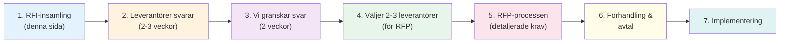
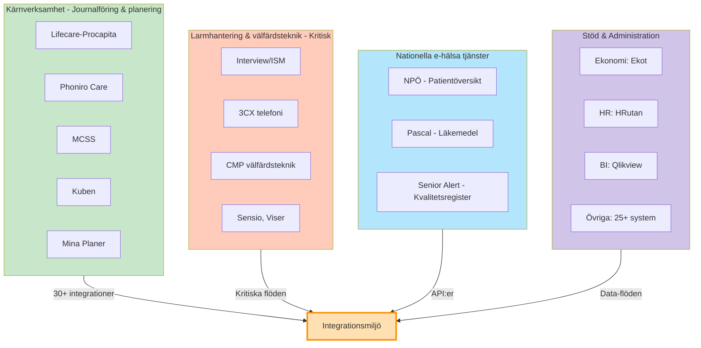

# RFI-material - Verksamhetssystemsbyte
## Malmö stad | Hälsa, Vård och Omsorg (HVOF)

!!! info "Vad är detta dokument?"
    Detta är en **Request for Information (RFI)** – en informationsinsamling för att förstå leverantörers lösningar, kapabilitet och erfarenhet. 
    
    **Detta är INTE**: En kravspecifikation, en bindande upphandling eller ett juridiskt kontrakt.
    
    **Nästa steg**: Efter denna RFI väljer vi 2-3 leverantörer för en **Request for Proposal (RFP)** med detaljerade behov och kostnadskalkyl.

---

## Snabbstart för leverantörer

Börja här:
1. [Läs våra organisatoriska förutsättningar](organizational-context.md) (5 min)
2. [Se vår vision och målbild](vision-og-malbildsverk.md) (10 min) ← **Nytt! Strategisk kontext**
3. [Se våra behov och prioriteringar](needs-basis-new.md) (10 min)
4. [Besvara vår frågekatalog](supplier-questions-new.md) (60-90 min)
5. [Fokusera på lagkrav och säkerhet](cloud-and-compliance-questions.md) (45 min)

---

## RFI-processen - Från början till slut

---

## Insamlingens principer

Vi genomför denna RFI enligt följande riktlinjer:

| Princip | Beskrivning |
|---------|-------------|
| **Informationsinsamling** | Vi vill förstå leverantörers lösningar och möjligheter att möta våra verksamhetsbehov |
| **Öppen dialog** | Leverantörer uppmuntras att föreslå alternativa lösningsansatser och identifiera möjligheter |
| **Icke-bindande** | Inget i detta dokument är juridiskt bindande |
| **Strategisk nivå** | Vi fokuserar på strategiska överväganden och möjligheter, inte detaljerade specifikationer |
| **Erfarenhetsbaserad** | Vi förväntar oss konkreta exempel från liknande verksamheter |

!!! note "Efterföljande process"
    Efter denna RFI-insamling kommer Malmö stad att välja 2-3 leverantörer för en **Request for Proposal (RFP)** med detaljerade behov, kravspecifikationer och kostnadskalkyl.

---

## Malmö stad - HVOF i korthet

| Element | Beskrivning |
|---------|-------------|
| **Organisation** | Hälsa, Vård och Omsorg (HVOF), Malmö stad |
| **Målgrupper** | Äldre (äldreomsorg), funktionsnedsatta, somatisk sjukdom |
| **Omfattning** | Ca 350 anställda, ca 10 000 brukare, 57 befintliga system |
| **Tjänster** | Hemtjänst, äldreboende, dagverksamhet, larmtjänster, rehabilitering |
| **Geografisk omfattning** | Malmö stad (Sverige) |
| **Budgetram** | Specificeras vid efterföljande RFP |

---

## Systemlandskap idag

Malmö stad HVOF använder idag **57 system** organiserade i fem kategorier:

| Kategori | Antal | Kritikalitet | Exempel |
|----------|-------|--------------|---------|
| **Kärnverksamhet** | 8 | KRITISK | Lifecare-Procapita, Phoniro Care, MCSS, Kuben |
| **Larmhantering & välfärdsteknik** | 12 | KRITISK | Interview/ISM, 3CX, CMP, Sensio, Viser |
| **Nationella e-hälsa-tjänster** | 3 | HÖGT | NPÖ, Pascal, Senior Alert |
| **Stödsystem** (ekonomi, HR, BI) | 34 | MEDEL | Ekot, HRutan, Qlikview, och många andra |
| **TOTALT** | **57** | | Ca 30 huvudintegrationer (170+ tekniska) |

---

## Fokusområden för denna informationsinsamling

| Område | Betydelse | Exempel |
|--------|-----------|---------|
| **Vårdhantering** | Kärnverksamhet för äldreomsorg och omsorg | Journalföring, vårdplanering, uppföljning |
| **Larmhantering** | Livskritisk tjänst för säkerhet och snabba insatser | Sensorlarm, personlarm, kameralarm |
| **Planering och resursering** | Effektiv personalstyring och resursallokering | Tidsplanering, vikarier, schemaläggning |
| **Styrning och kvalitet** | Verksamhetsöversikt och uppföljning | Rapporter, indikatorer, registeröverrapportering |
| **Integration** | Många befintliga system måste samarbeta | API-flöden, datasäkerhet, realtidsdata |
| **Säkerhet och compliance** | GDPR, hälsodata, lagkrav | Autentisering, kryptering, granskningsloggar |

---

## Kärnsystem - Lifecare-Procapita

**Nuläge**: Denna informationsinsamling är inriktad på att utvärdera möjligheten att ersätta eller integrera bättre med Lifecare-Procapita.

| Aspekt | Status |
|--------|--------|
| **Leverantör** | Tietoevry Care |
| **Systemtyp** | Verksamhetssystem för SoL, LSS, HSL (äldreomsorg och socialtjänst) |
| **Huvudfunktioner** | Journalföring, ärendehantering, vårdplanering, tidsuppföljning |
| **Organisatorisk ägare** | Malmö stad |
| **Licensieringsmodell** | Specificeras vid RFP |
| **Aktiva dagliga användare** | Ca 200 användare |
| **Systemkritikalitet** | KRITISK - ingen nedtid tillåten |

---

## Kritiska integrationsytor

En lyckad systembyte kräver robust stöd för följande åtta nyckelintegrationer:

| Nr | Domän | System | Integrationstyp | Prioritet |
|---|-------|--------|-----------------|-----------|
| 1 | Nationella e-hälsa | NPÖ | HL7 FHIR / API | Måste ha |
| 2 | Läkemedelshantering | Pascal | API / SSO | Måste ha |
| 3 | Kvalitetsregister | Senior Alert | Export / API | Bör ha |
| 4 | Samordnad vårdplan | Mina Planer | API / dokument | Bör ha |
| 5 | Tid- och insatsuppföljning | Phoniro Care | API / databas | Bör ha |
| 6 | Digital signering | MCSS | API / SSO | Måste ha |
| 7 | Välfärdsteknik | CMP, Sensio, Viser | API / event-driven | Bör ha |
| 8 | Larmcentral | Interview/ISM, 3CX | API / CTI | Måste ha |

!!! info "Integrationsstrategi"
    Vi förväntar oss att nya system kan integreras med dessa genom standardiserade API:er (REST, HL7 FHIR). Batch-integrationer och FTP-överföringar är inte önskvärda för denna verksamhet.

---

## 🔴 Nuvarande smärtpunkter

Identifierade utmaningar som denna informationsinsamling avser att lösa:

| Nr | Problem | Påverkan | Önskad lösning |
|---|---------|----------|-----------------|
| 1 | Dubbelarbete mellan system | Tid förlorad, fel, inkonsistens | Synkroniserade master-slav relationer |
| 2 | Många välfärdsleverantörer | Fragmenterat systemlandskap, många integrationer | Standardiserad event-arkitektur |
| 3 | Blandade integrationstyper | Komplex drift och underhål | Standardiserade REST/HL7-API:er |
| 4 | Höga integrationskostnader | Hög integrationskostnad till nationella tjänster | Enkel koppling till e-hälsa-ekosystemet |
| 5 | Fragmenterad rapportering | Svårt att få ett helhetsöverblick | Enhetlig rapporteringsplattform |
| 6 | Många inloggningar | Säkerhetsbrist och användarfrustration | Single Sign-On via Freja eID / SITHS |

!!! note "Vi vill höra från er"
    Beskriv i era svar hur er lösning kan minska eller eliminera dessa identifierade utmaningar.

---

## Scope för denna informationsinsamling - vi vill veta

| Område | Fråga | Svarformat |
|--------|-------|------------|
| **Arkitektur** | Hur fungerar er lösning? Vilka komponenter ingår? | Övergripande arkitekturdiagram |
| **Integrationer** | Vilka API:er erbjuder ni? HL7-stöd? | Lista med dokumentreferenser |
| **Erfarenhet** | Har ni genomfört liknande projekt i kommun eller region? | 2-3 referenskunder med kontaktuppgifter |
| **Datamigration** | Hur skulle data migreras från Lifecare-Procapita? | Högnivå-beskrivning av migreringsprocess |
| **Drift och säkerhet** | Var lagras data? Vilka certifieringar och överenskommelser? | GDPR, ISO, datacentersplats |
| **Implementeringstidsplan** | Ungefärlig implementeringstid för denna miljö? | Antal veckor/månader |
| **Kostnadsestimering** | Kan ni ge en indicativ kostnadsnivå? | Orderingamitud (frivilligt) |

!!! info "Fokus på informationsinsamling"
    Detta är en **informationsinsamling, ingen bindande förfrågan**. Vi vill förstå er lösning på strategisk nivå och bedöma möjligheten för Malmö stad.

---

## Datamigration - kritiska domäner

| Domän | Volym | Kritikalitet | Utmaning |
|-------|-------|--------------|----------|
| Vårddata och journalhistorik | Ca 100 000+ journalposter | Kritisk | Historik, HL7-konvertering |
| Tid- och insatsregistreringar | Ca 1 miljon registreringar per år | Kritisk | Integration med Phoniro Care |
| Läkemedelsdata och medicineringar | Ca 20 000 aktuella medicineringar | Högt | Bevara Pascal-struktur |
| Kvalitetsregistersdata | Register och rapporter | Högt | Senior Alert-mapping |
| Personal- och HR-data | Ca 350 anställda | Medel | Från separat HR-system (HRutan) |

!!! note "Migreringstid"
    Vi uppskattar att datamigration kan ta 3-6 månader beroende på komplexitet och integrationskrav.

---

## Kritiska processflöden

Vi behöver robust stöd för följande kärnprocesser:

| Process | Viktiga steg | Systemkrav |
|---------|-------------|------------|
| **Handläggning** | Ärendeskapande, beslut, dokumentation, uppföljning | Strukturerad och revisionsbar |
| **Vårdplanering** | Bedömning, planering, genomförande, uppföljning | SIP-kompatibel och samordnad |
| **Larmhantering** | Larmöversättning, eskalering, åtgärd, dokumentation, uppföljning | Realtid, tillgänglighet 99.9% |
| **Resursplanering** | Behov, schemaläggning, rapportering, fakturering | Integrerad med Kuben |
| **Åtkomstkontroll och säkerhet** | Rollbaserad, spårbar, GDPR-loggad åtkomst | SSO och rollbaserad åtkomstkontroll |

!!! note "Processcentrerad design"
    Det nya systemet måste underlätta dessa flöden, inte komplicera eller hindra dem.

---

## Nyckelfrågor vi kommer att ställa

Se detaljerade frågor här: **[Frågor till leverantörer](supplier-questions.md)**

Vi kommer att ställa följande nycelfrågor:

1. **Arkitektur och teknik**: Beskriv er lösningsarkitektur och integrationsmönster
2. **Referenskunders erfarenhet**: Två referenser från kommun- eller regionprojekt?
3. **Datamigration**: Hur hanterar ni datamigration från Lifecare-Procapita?
4. **Standarder och API:er**: Vilka API:er och HL7-stöd erbjuds? Certifieringar?
5. **Säkerhet och compliance**: GDPR-efterlevnad, datalagring, SSO-stöd?
6. **Implementeringstidsplan**: Ungefärlig tid för denna miljö?
7. **Drift och support**: Vilken support erbjuds och under vilka timmar?
8. **Kostnadsuppskattning**: Indicativ estimat för kostnader?

---

## Relaterade dokument

| Dokument | Syfte |
|----------|-------|
| [Frågor till leverantörer](supplier-questions.md) | Detaljerade frågor för informationsinsamlingsvar |
| [Systemlandskap - RFI](../systems/system-landscape-rfi.md) | Visuell och detaljerad systemöversikt |
| [Systemkatalog](../systems/systemkatalog.md) | Fullständig beskrivning av varje system |
| [Integrationer](../systems/integrations.md) | Övergripande integrationsflöden |
| [Identifierade utmaningar](../analyses/pain-points.md) | Nuvarande verksamhetsutmaningar |

---

## Kontakt och tidslinje

| Fråga | Information |
|-------|------------|
| **Kontaktperson för frågor** | Se [Kontaktuppgifter](../about/contact.md) |
| **Svarsfrist** | Specificeras separat |
| **Format för leverans av svar** | Specificeras separat (PDF/digital) |
| **Nästa steg i processen** | Malmö stad väljer 2-3 leverantörer för Request for Proposal |

---

## Versionshistorik

| Version | Datum | Ändring |
|---------|-------|---------|
| 1.0 | 2024-12-11 | RFI-material för systembyteprocess |

---

**Malmö stad | Hälsa, Vård och Omsorg (HVOF) | Senast uppdaterad: 2024-12-11**
