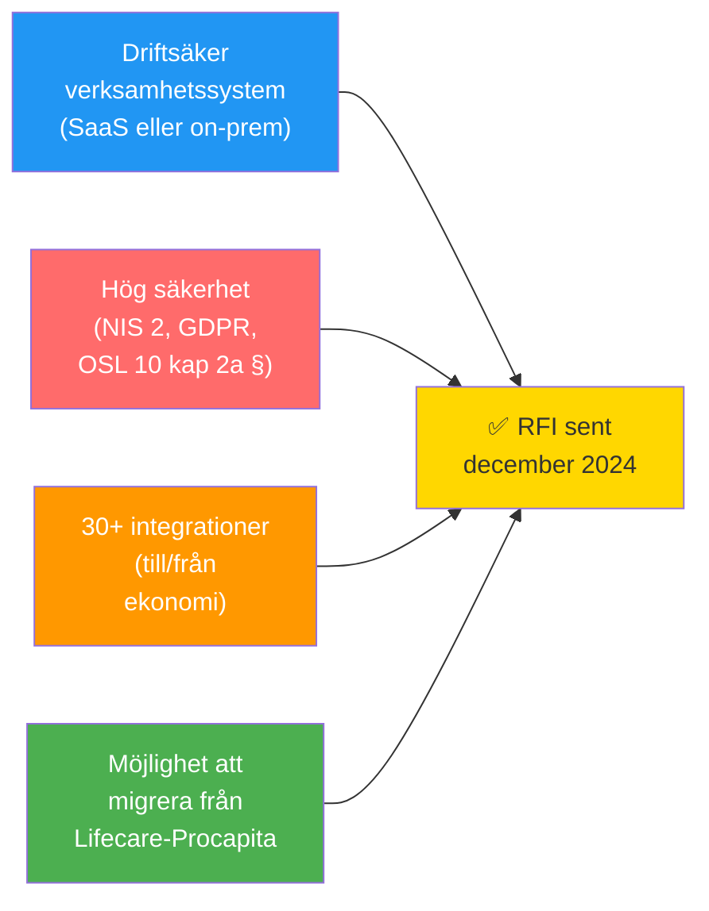
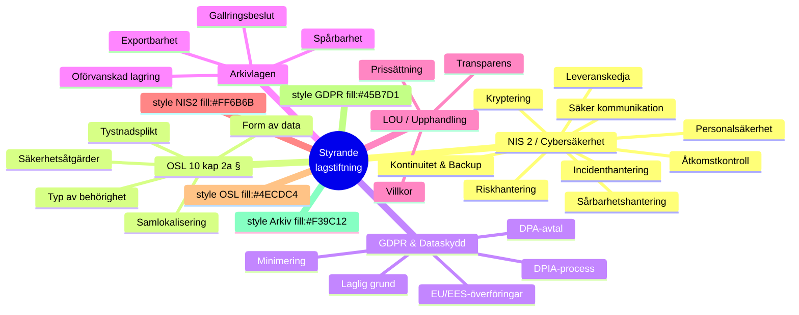
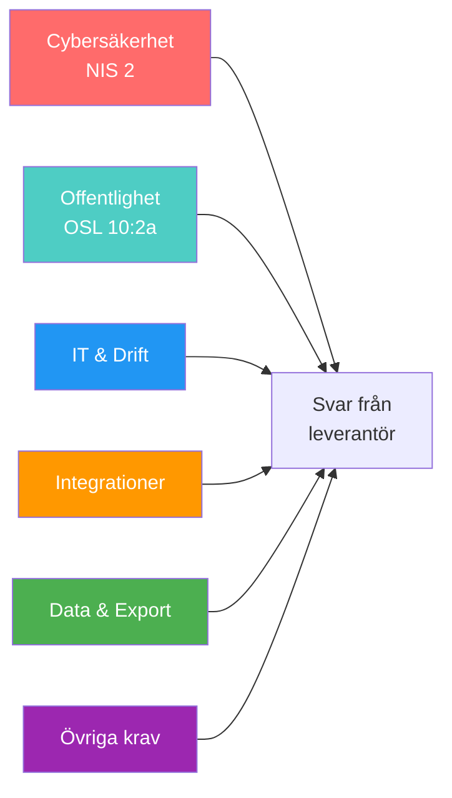
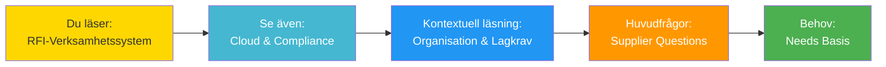

# RFI - Verksamhetssystem för omsorg
## Malmö stad | Hälsa, Vård och Omsorg (HVOF)

!!! info "Denna sida är REFERENS från tidigare arbete"
    **Notering:** Detta dokument representerar ett tidigare RFI-material. Se **[RFI-dokumentation](rfi-material-new.md)** för aktuell informationsinsamling.
    
    För fullständig kontext, läs i ordning:
    1. [RFI-dokumentation](rfi-material-new.md) – Översikt
    2. [Organisation och lagkrav](organizational-context.md) – Malmö stad & juridik
    3. [Behov och förutsättningar](needs-basis-new.md) – Vad behöver vi?
    4. [Frågor till leverantörer](supplier-questions-new.md) – Huvudfrågor
    5. [Cloud & Compliance](cloud-and-compliance-questions.md) – Lagkrav-fokus

---

## Snabbstart - Vad vill Malmö stad ha?

---

## Syfte och instruktioner
- Syftet är att bedöma marknadens förmåga att möta Malmö stads behov inom omsorgsverksamhet.
- Svar ska vara skriftliga, kortfattade och underbyggda med efterfrågad dokumentation.
- Ange kontaktperson och giltighetstid för lämnade uppgifter.

## Om Malmö stad och omfattning
- Omsorgsförvaltning med krav på hög driftsäkerhet, spårbarhet och efterlevnad av svensk rätt.
- Lösningen kan levereras som SaaS eller on-prem; ange vilket och beskriv driftsmodell, dataresidens och driftspartner.

## Lag- och regelverk (styrande för kravställning)

### Sammanfattning: Fyra lagstiftningar - En systemarkitektur

#### Fyra lagstiftningar - Enkla förklaringar

| Lag | Vem är ansvarig? | Huvudkrav | För systemleverantörer |
|-----|------------------|-----------|------------------------|
| **NIS 2** | Malmö stad (som kritisk verksamhet) | Säkerhet, backup, incidenthantering | Dokumentera säkerhet, SOC 2, testa disaster recovery |
| **OSL 10 kap 2a §** | Malmö stad (dataägare) | Data måste krypteras, vi kontrollerar nyckel | Agera rent databearbetare, tillåt kundstyrd kryptering |
| **GDPR** | Malmö stad (personuppgiftsansvarig) | Registerrättigheter för brukare | Skriv DPA, tillåt DPIA, dokumentera behandling |
| **Arkivlagen** | Malmö stad (arkivplacer) | Spårbarhet, bevarandebeslut | Exportera data utan förvrängning, följ gallring |

---

## Lag- och regelverk (referens)

## Efterfrågade bevis och styrande dokument
- Aktuella SOC-rapporter och annan tredjepartsrapportering.
- Internrevisionsrapporter för informationssäkerhet.
- Certifikat (t.ex. ISO/IEC 27001 med SoA) och relevanta styrdokument (infosäkerhetspolicy, rutiner).
- Säkerhetsorganisation och roller.
- Kontinuitets- och återställningsplaner för aktuell tjänst.
- Underlag som visar säkerhetsutbildning för personal med åtkomst till Malmö stads information.
- Gällande villkor för aktuell tjänst.

---

## Frågor till leverantörer - Sammanfattning

**Se även:** [Cloud & Compliance-frågor](cloud-and-compliance-questions.md) för detaljerad genomgång av lagkrav.

---

## Frågor till leverantör - Cybersäkerhetslagen (NIS2)

1. **Riskhantering** – Beskriv riskhanteringsprocessen (allriskperspektiv, proportionalitet) och hur åtgärder prioriteras.
2. **Incidenthantering** – Beskriv incidenthantering (detektion, eskalering, rapporteringstid, övningar) och RTO/RPO.
3. **Kontinuitet & Backup** – Beskriv kontinuitets- och återställningsförmåga (backupstrategi, georedundans).
4. **Leveranskedja** – Leveranskedjesäkerhet: krav på underleverantörer, uppföljning och revision.
5. **Sårbarhetshantering** – Säker utveckling och sårbarhetshantering: SDLC, patchning, hantering av sårbarhetsinformation.
6. **Kryptering** – Kryptostrategi: algoritmer, nyckelhantering, HSM, kundstyrd kryptering.
7. **Personalsäkerhet** – Personalsäkerhet: bakgrundskontroller, säkerhetsutbildning, åtkomstavslut.
8. **Åtkomstkontroll** – Åtkomstkontroll: principer för minst-behörighet, MFA, loggning och spårbarhet.
9. **Säker kommunikation** – Säker kommunikation och autentisering: protokoll, nätverkssegmentering, API-skydd.

## Frågor till leverantör - Offentlighet och sekretess (OSL 10:2 a)

1. **Åtkomst till data** – Kommer leverantör, underleverantörer eller moderbolag ha åtkomst till Malmö stads uppgifter? Hur och varför? I vilken form (klartext, krypterad, anonymiserad)?
2. **Tystnadsplikt** – Omfattas personal av lagstadgad eller avtalsreglerad tystnadsplikt? Ange lagrum eller avtalsstöd.
3. **Säkerhetsåtgärder** – Beskriv alla säkerhetsåtgärder för att skydda sekretessbelagda uppgifter (tekniska, organisatoriska, fysisk säkerhet).
4. **Samlokalisering** – Kommer Malmö stads uppgifter samlokaliseras med andra kunders? Identifiera och analysera särskilda risker.

## Frågor till leverantör - IT och drift

1. **Kryptering** – Kan Malmö stad tillämpa egen nyckel/kundstyrd kryptering som leverantören inte kan forcera? (referens: OSL prop. 2022/23 s.7)
2. **Driftsmodell och dataresidens** – Dataplacering (land/region), dataklasser, underleverantörer och jurisdiktioner.
3. **Loggning och spårbarhet** – Retention, åtkomst till loggar, exportformat.
4. **SLA och support** – Tillgänglighet, svarstider, åtgärdstider, servicefönster.

## Frågor till leverantör - Integrationer

1. **Arkitektur & mönster** – Hur ser ni på ca 30 huvudintegrationer (~170 tekniska integrationer) till/från ekonomisystemet? Beskriv arkitektur och mönster (API, webhook, fil, event).
2. **Kostnadsmodell** – Kostnadsmodell eller avgifter kopplade till integrationer? Ange prisprinciper och eventuella begränsningar (antal, prestanda, tidpunkter).
3. **Begränsningar** – Finns begränsningar i antal samtidiga anslutningar, throughput eller schemaläggning?
4. **On-prem jämfört med SaaS** – Om ni levererar on-prem: tillämpas samma kostnadsmodell/begränsningar som för SaaS?

## Frågor till leverantör - Utdataplattform och dataåtkomst

1. **Datakonsumtion** – Om utdataplattform finns: hur kan Malmö stad konsumera data (API, OData, JDBC, fil, event)?
2. **Kostnader för SaaS** – Kostnadsmodell för åtkomst i SaaS? Eventuella begränsningar eller licens per användning/volym.
3. **Dataaktualitet** – Aktualitet på data (realtid, near real-time, batch, schema).
4. **Export vid avtalsutträde** – Export- och dataportabilitet vid avtalsutträde.
5. **On-prem jämfört med SaaS** – Om on-prem: gäller samma kostnadsmodell/begränsningar som för SaaS?

## Övriga krav och förtydliganden

1. **Personuppgifter och DPIA** – Ange om behandling kräver DPIA och föreslagen riskreduktion.
2. **Underleverantörer** – Lista samtliga, roller och lokalisation; beskriv exit och ersättningsrutiner.
3. **Exit och dataåterlämning** – Tidsramar, format, kostnad och stöd vid migrering.
4. **Test- och acceptansmiljö** – Tillgång, dataskydd i test, maskning/anonymisering.
5. **Förändringshantering** – Releasefrekvens, versionspolicy, hur kunden informeras och kan godkänna.
6. **Tillgänglighet och UX** – Uppfyllelse av WCAG 2.1 AA och stöd för svenska språket/terminologi.

---

## Relaterade dokument och nästa steg

### Läsordning för leverantörer:

| Steg | Dokument | Fokus | Läsningstid |
|------|----------|-------|------------|
| 1 | [RFI-dokumentation](rfi-material-new.md) | Processöversikt, systemlandskap | 10 min |
| 2 | [Organisation och lagkrav](organizational-context.md) | Malmö stad, nuläge, lagkrav | 20 min |
| 3 | [Behov och förutsättningar](needs-basis-new.md) | Funktionella och tekniska behov | 15 min |
| 4 | **RFI-Verksamhetssystem** (denna sida) | Referensöversikt, frågekatalog | 15 min |
| 5 | [Frågor till leverantörer](supplier-questions-new.md) | 9 huvudfrågor | 60-90 min |
| 6 | [Cloud & Compliance](cloud-and-compliance-questions.md) | Lagkrav och certifieringar | 40 min |

**Total läsningstid för leverantör:** Ca 2,5-3 timmar

---

**Malmö stad | Hälsa, Vård och Omsorg (HVOF) | Senast uppdaterad: 2024-12-11**

