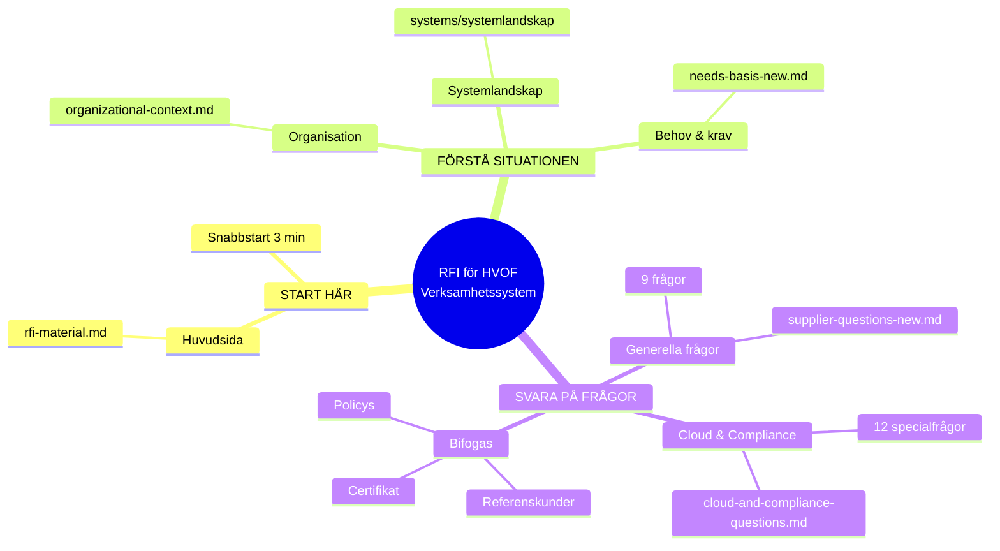

# Frågor till leverantörer - Informationsinsamling
## Malmö stad | Hälsa, Vård och Omsorg (HVOF)

!!! info "RFI-format - Detta är en informationsinsamling"
    Vi stökar för förståelse, inte bindande svar. Svaren hjälper oss att bedöma er lösnings lämplighet för en framtida **Request for Proposal (RFP)**.
    
    **Tidsbudget för svarberedning**: 60-90 minuter för alla frågor

---

## Frågeguide - Välj din fokusarea

Svara på alla 9 frågor, men prioritera efter din affär:

!!! note "För affärsled / försäljning"
    Börja med: Fråga 2 (Erfarenhet) → Fråga 9 (Tidsplan)

!!! note "För teknisk arkitektur"
    Börja med: Fråga 1 (Arkitektur) → Fråga 6 (Prestanda)

!!! note "För säkerhet & compliance"
    Börja med: [Cloud & Compliance-frågor](cloud-and-compliance-questions.md)

---

## Frågeöversikt

| Fråga | Fokus | Tidsåtgång | Exempel |
|-------|-------|-----------|--------|
| **1** | Arkitektur & integration | 10 min | API-typer, komponenter |
| **2** | Erfarenhet & referenser | 15 min | Kommun-projekt, liknande scope |
| **3** | Datamigration | 10 min | Lifecare-Procapita migrering |
| **4** | Autentisering & åtkomst | 5 min | Freja eID, SITHS |
| **5** | Säkerhet & dataskydd | 15 min | GDPR, ISO 27001 |
| **6** | Prestanda & skalbarhet | 5 min | Concurrent users, SLA |
| **7** | Rapportering & BI | 10 min | API:er, format, realtid |
| **8** | Support & underhål | 10 min | Supportnivåer, roadmap |
| **9** | Implementeringstid | 15 min | Tidsplan, resurser |

**Plustillval**: [Cloud & Compliance-frågor](cloud-and-compliance-questions.md) (45 min) – obligatorisk för SaaS/molnlösningar

---

## Svarformat och instruktioner

Svara övergripande och fokuserat:

| Aspekt | Instruktion |
|--------|-----------|
| **Språk** | Svenska eller engelska |
| **Format** | PDF eller Word |
| **Längd per fråga** | 1-3 sidor (2-5 stycken text) |
| **Struktur** | Fråga → Svar → Exempel/referens |
| **Bilagor** | Arkitektur-diagram, länkar, certifikat |
| **Kontakt** | Namn, e-post, telefon till er kontaktperson |

---

## Fråga 1: Arkitektur och integration

**Bakgrund**: HVOF har ett komplext systemlandskap med 57 system. Vi förväntar oss att ett nytt system kan integreras genom standardiserade API:er.

**Vi vill veta**:

1. Beskriv er lösningsarkitektur - vilka komponenter och integrationspunkter ingår?
2. Vilka API:er exponerar systemet? (REST, SOAP, GraphQL, gRPC?)
3. Stödjer systemet HL7 FHIR-standard för vårddata?
4. Hur säkerställer ni datakvalité vid integrationspunkter?
5. Kan vi övervaka integrationer i realtid?
6. Vilka säkerhetsstandarder använder ni för API-kommunikation? (OAuth2, mTLS, etc.)

---

## Fråga 2: Erfarenhet från liknande projekt

**Bakgrund**: Vi behöver förtroende för att detta projekt kan genomföras framgångsrikt med beprövad erfarenhet.

**Vi vill veta**:

1. Ge minst två referenskunder från kommun eller region där ni implementerat liknande system
2. Vilket system användes tidigare? (Lifecare-Procapita eller annat?)
3. Hur långt tog implementeringen?
4. Vilka var de största utmaningarna och hur löste ni dem?
5. Kan vi kontakta referenskunderna direkt?
6. Vilka lärdomar tar ni med från dessa projekt?

---

## Fråga 3: Datamigration från Lifecare-Procapita

**Bakgrund**: Vi måste migrera cirka 100 000+ journalposter, tids- och insatsdata och övrig strukturerad information från Lifecare-Procapita.

**Vi vill veta**:

1. Har ni erfarenhet av att migrera från Lifecare-Procapita?
2. Vilka datatyper kan systemet ta emot? (Journaler, vårddokument, tidsstämplar, relationer?)
3. Hur hanterar ni historiska data och ändringsloggar?
4. Kan ni bevara systemrelationer och kopplingar mellan data?
5. Vilken validering och datakvalitetskontroll gör ni under migration?
6. Ungefärlig tid för datamigration för vår datamängd?

---

## Fråga 4: Autentisering och åtkomstkontroll

**Bakgrund**: Vi använder Freja eID och SITHS för autentisering av användare och sjukvårdspersonal.

**Vi vill veta**:

1. Stödjer systemet Freja eID-inloggning via SSO?
2. Stödjer systemet SITHS för sjukvårdspersonal?
3. Hur hanterar systemet rollbaserad åtkomst (RBAC)?
4. Vilka andra autentiseringsmetoder stödjer ni? (LDAP, SAML, OAuth2?)
5. Hur loggar och granskar ni åtkomstförsök? (GDPR-spårning)

---

## Fråga 5: Säkerhet, dataskydd och regelefterlevnad

**Bakgrund**: Vi hanterar känslig hälso- och personaldata. GDPR-efterlevnad, patientintegritet och datasäkerhet är kritiska.

**Vi vill veta**:

1. Vilka säkerhetscertifieringar har systemet? (ISO 27001, SOC 2, annat?)
2. Var lagras data geografiskt? (Föredraget: Sverige eller EU)
3. Vilka backup- och disaster recovery-procedurer är etablerade?
4. Hur implementerar ni rätten till radering enligt GDPR?
5. Finns databehandlaravtal (DPA) tillgängliga för svenska kommuner?
6. Vilken kryptering använder systemet? (I transit och at rest)
7. Hur ofta genomför ni säkerhetsgranskning/penetrationstester?
8. Vilken process finns för rapportering av säkerhetshändelser?

---

## Fråga 6: Prestanda och skalbarhet

**Bakgrund**: Systemet måste stödja cirka 350 anställda och cirka 10 000 brukare, med flera samtidiga användare under toppbelastning.

**Vi vill veta**:

1. Hur många samtidiga användare kan systemet hantera?
2. Vad är genomsnittlig svarstid för normala operationer?
3. Vad är systemets maximala belastningskapacitet?
4. Vilken tillgänglighet (SLA) erbjuder ni? (99,5%, 99,9%, 99,99%?)
5. Hur hanterar ni databasskalning vid växande användarantal?
6. Vilken redundans och failover-strategi har systemet? (Multi-region? Hot standby?)

---

## Fråga 7: Rapportering, affärsanalys och data

**Bakgrund**: Vi behöver verksamhetsöversikt, statistik och möjlighet att koppla till nationella register.

**Vi vill veta**:

1. Vilka rapporter kan systemet generera från starten?
2. Kan vi bygga egna rapporter? (Vilka verktyg och möjligheter?)
3. Hur exponerar systemet data för BI-system? (Vi använder idag Qlikview/Qlik)
4. Stödjer systemet dataexport? (CSV, Excel, API?)
5. Vilka verksamhetstal kan vi följa i realtid?
6. Kan systemet integrera med nationella register för Socialstyrelsens rapportering?

---

## Fråga 8: Support, underhål och fortsatt utveckling

**Bakgrund**: Systemet måste underhållas under många år med regelbundna uppdateringar, säkerhetsuppdateringar och ny funktionalitet.

**Vi vill veta**:

1. Vilken supportnivå erbjuder ni? (24/7? Kontorstid?)
2. Vad är svarsnivåerna för kritiska problem? (1 timme? 4 timmar?)
3. Hur ofta uppdateras systemet? (Varje månad? Varje kvartal?)
4. Vilka nya funktioner är på er produktroadmap för nästa 2 år?
5. Hur garanterar ni backward-kompatibilitet vid systemuppdateringar?
6. Kan vi påverka er produktutveckling? (Feature requests och prioritering?)
7. Vilken produktsupport garanteras långsiktigt? (Till 2030? 2035?)

---

## Fråga 9: Implementeringstidsplan och projektöversikt

**Bakgrund**: Vi behöver ungefärlig tidsplan för att planera internt.

**Vi vill veta**:

1. Vilken totaltid uppskattar ni för implementering? (Från avtal till go-live)
2. Hur många resurser krävs från vår sida? (Antal personer och tidsomfattning)
3. Vilka huvudmilstolpar föreslår ni för projektet?
4. Vilken tid krävs för datamigration och testning?
5. Kan ni implementera enligt denna tidsplan parallellt med andra systembyte?
6. Vilka risker identifierar ni och hur mitigerar ni dem?
- Kan vi göra en **pilot/test** innan full rollout?
- Vilka **risker** ser ni, och hur undviker vi dem?
- Vilken **parallell drifttid** behövs? (Veckor? Månader?)

---

## Svarformat - Obligatorisk information

Vi förväntar att er RFI-svar innehåller följande information:

| Element | Instruktion |
|---------|-----------|
| **Leverantörsnamn** | Organisationens officiella namn |
| **Kontaktperson** | Namn, e-postadress, telefon för uppföljning |
| **Svarsdatum** | Datum då svaret skickas |
| **Produktnamn och version** | Systemets officiella beteckning |
| **Följsamhetsstatus** | RFI-kompatibel (Ja / Nej / Delvis) |

**Instruktioner för svar per fråga**:
- Maximalt 2-5 stycken per fråga
- Använd tabeller och listor för tydlighet
- Bifoga gärna exempel, skärmdumpar och dokumentreferenser
- Ange källan eller referensen för varje påstående

---

## Nästa steg - Leverantörs processo

```mermaid
graph LR
    A["📨 Du läser denna<br/>informationsinsamling"] --> B["📋 Du samlar svar<br/>på 9 frågor"]
    B --> C["☑️ Du lägger till<br/>Cloud-Compliance"]
    C --> D["📎 Du bifogar<br/>dokumentation"]
    D --> E["✉️ Du skickar svar<br/>till Malmö stad"]
    E --> F["⏳ Vi granskar<br/>1-2 veckor"]
    F --> G["📞 Vi kontaktar<br/>2-3 leverantörer"]
    G --> H["📋 RFP-phase<br/>med kravspec"]
    
    style A fill:#4CAF50,color:#fff
    style E fill:#FF9800,color:#fff
    style G fill:#2196F3,color:#fff
    style H fill:#9C27B0,color:#fff
```

**Tidsplan:**
1. **Idag**: Du läser denna RFI och Cloud-Compliance-frågorna
2. **Denna vecka**: Du samlar dokumentation från dina team
3. **Nästa vecka**: Du skickar in svar
4. **Om 1-2 veckor**: Malmö stad kontaktar 2-3 leverantörer för möte
5. **Om 4 veckor**: Vi skickar RFP med bindande kravspec

---

## RFI-dokumentens navigeringsstruktur

---

## Sammanfattning för leverantörer

| Steg | Du måste | Tid |
|------|---------|-----|
| **1. Läsning** | Läs alla RFI-dokument nedan | 30 min |
| **2. Svara** | Besvara Frågor 1-9 | 60 min |
| **3. Cloud** | Besvara Cloud & Compliance (om SaaS) | 45 min |
| **4. Dokumentation** | Samla certifikat, policys, referenser | 30 min |
| **5. Skicka** | Skicka till [kontaktadress] | - |

**Total tid för leverantör**: 2-3 timmar förberedelse

---

## Relaterade dokument

**Måste läsa innan du svarar:**

| Dokument | Syfte | Länk |
|----------|-------|------|
| 📌 **RFI-material** | Systemöversikt, process, scope | [rfi-material-new.md](rfi-material-new.md) |
| 📍 **Organisation och lagkrav** | Malmö stad, 57 system, lagkrav | [organizational-context.md](organizational-context.md) |
| 📋 **Behov och förutsättningar** | Funktionella & tekniska behov | [needs-basis-new.md](needs-basis-new.md) |
| ☁️ **Cloud & Compliance** | Säkerhets- och molnfrågor | [cloud-and-compliance-questions.md](cloud-and-compliance-questions.md) |

**Bakgrundsinformation:**

| Dokument | Syfte |
|----------|-------|
| Systemlandskap RFI | Visuell och tabellarisk översikt av 57 system |

---

**Malmö stad | Hälsa, Vård och Omsorg (HVOF)**  
**Senast uppdaterad: 2024-12-11**
