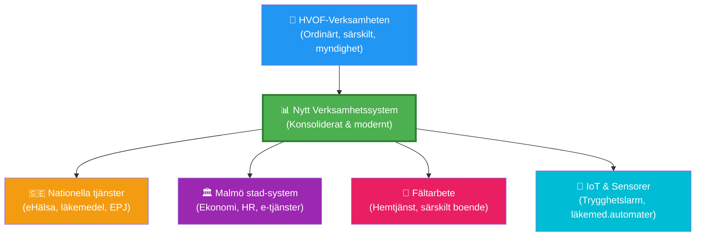
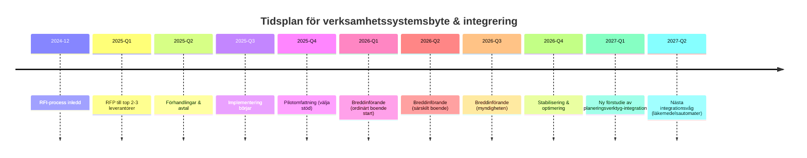

# Vision och målbild för verksamhetssystemsbyte
## Malmö stad | Hälsa, Vård och Omsorg (HVOF)

!!! info "Strategisk context för informationsinsamlingen"
    Denna målbild visar hur Malmö stads HVOF-förvaltning vill utveckla sin digitala verksamhet. Den tjänar som kontext för varför vi genomför denna RFI och vilka framtida integreringsmöjligheter som är viktiga för systemvalet.

---

## Övergripande vision

HVOF-förvaltningen arbetar strategiskt för att:

1. **Öka digital mognad** – Från pappersbaserad till digital dokumentation och planering
2. **Förbättra arbetsmiljön** – Genom automation av administrativa uppgifter
3. **Stärka patientsäkerheten** – Via bättre dataintegration och spårbarhet
4. **Möjliggöra innovation** – Genom öppna API:er och moderna arkitektur
5. **Efterleva lagkrav** – Cybersäkerhet, GDPR, arkivering

---

## Strategiska utvecklingsomfång (2025-2027)

### 1. Ordinärt boende (äldreomsorg hemma)

**Digitala initiativ i arbete:**

| Område | Syfte | Status | Relevans för RFI |
|--------|-------|--------|-----------------|
| Läkemedelshantering | Digitala läkemedelsautomater & säkra skåp | 2026-införande | System måste integrera med läkemedelsdistribution |
| Dokumentation i hemmet | Mobil dokumentation via plattor | Implementering pågår | Kräver cloud-access och offline-support |
| Digital hemtjänst | Digitalisering av hemtjänstprocesser | Förstudie planerad | Blir ett kärnområde för nytt system |
| Inventering & logistik | Just-in-time-system för förbrukningsvaror | Under utredning | Möjlig framtida integration |

**System-relevans:** Nytt system måste stödja mobil dokumentation, läkemedelshantering och schemaläggning från hemmet.

---

### 2. Särskilt boende (äldreboenden)

**Digitala initiativ i arbete:**

| Område | Syfte | Status | Relevans för RFI |
|--------|-------|--------|-----------------|
| Trygghetslarm & sensorer | Digitala trygghetsalternativ | Avrop & breddinförande 2026 | Kräver integration med larmsystem |
| Hotellås & åtkomst | Digitala lås på boenden | Utbytesprocess | Möjlig integration |
| Läkemedelshantering | Säkra medicineringsprocesser | Pågår | Samma som ordinärt boende |
| Planeringsverktyg | Digital planering av bemanning & brukaruppfoljning | Förstudie pågår | **Möjlig core-funktion i nytt system** |

**System-relevans:** Nytt system måste kunna stödja planering, bemanning och larmsystemintegrationer.

---

### 3. Myndigheten (administration & e-tjänster)

**Digitala initiativ i arbete:**

| Område | Syfte | Status | Relevans för RFI |
|--------|-------|--------|-----------------|
| E-tjänsteutveckling | Webbtjänster för medborgare | Löpande | Påverkar vilka API:er systemet måste exponera |
| Söktjänster | Enkel sökning i kontaktuppgifter | Under utredning | Möjlig framtida integration |
| Digitalisering av processer | Från papper till system | Kontinuerligt arbete | **Kärnbehov för nytt system** |

**System-relevans:** Systemet måste ha en sök- och rapporterings-API för myndighetens e-tjänster.

---

### 4. Hälsa och förebyggande

**Digitala initiativ i arbete:**

| Område | Syfte | Status | Relevans för RFI |
|--------|-------|--------|-----------------|
| Planeringsverktyg | Matchning mellan brukare & medarbetare | Kartläggning genomförd | **Potentiell core-funktion** |
| Digital dokumentation | Nya SOL-krav på gruppnivå-dokumentation | Juridisk utredning | Måste stödjas av systemet |
| Säkra möten | Video och meddelanden för patientsamtal | Pilot planerad | Integration med annat verktyg |

**System-relevans:** Systemet måste stödja gruppnivå-dokumentation enligt nya SOL.

---

## Integrationer som systemet måste stödja

### Nationella och regionala system

| System | Varför integration är viktig | Prioritet |
|--------|------------------------------|-----------|
| eHälsa-plattformen | Nationell standardisering av vård | Högt |
| Läkemedelsregistret | Säker medicineringskontroll | Högt |
| Nationell patientöversikt | Sjukhusvård-samordning | Medel |
| Arvoden & bidrag | Ekonomisk rapportering | Högt |

### Lokala Malmö stad-system

| System | Varför integration är viktig | Prioritet |
|--------|------------------------------|-----------|
| Ekonomisystem | Fakturering, budgetkontroll | Högt |
| HR-system | Anställd-data, bemanning | Högt |
| Planeringsverktyg | Bemanning & brukartilldelning | Medel-Högt |
| E-tjänsteplattform | Medborgarkontakt | Medel |
| Larmsystem | Trygghetslarm & sensorer | Högt |

### Framtida möjliga integrationer

| System | Syfte | Tidigaste införande |
|--------|-------|-------------------|
| Läkemedelsautomater | Säker läkemedelsdistribution | 2026 |
| Digitala lås | Åtkomstkontroll | 2026 |
| Just-in-time-inventering | Logistik & förbrukningsvaror | 2027 |
| VR-utbildning | Rehabilitering | Utredning pågår |

---

## Krav på den framtida arkitekturen

**Arkitektur-krav:**

1. **Cloud-ready** – Möjliggör molnutplacering med stark säkerhet
2. **API-först** – Enkla integrationer med nationella system, Malmö stad och IoT
3. **Mobil-först** – Stöd för fältarbete (hemtjänst, boenden)
4. **Open standards** – Använder HL7, REST, FHIR för interoperabilitet
5. **Skalbar** – Kan växa från 200 till 10 000 brukare utan att arkitektur brister

---

## Tidsplan för systemimplementering och integrering

---

## Framgångsfaktorer för systemvalet

För att lyckas med denna målbild behöver vi en leverantör som kan:

| Krav | Varför |
|------|--------|
| **Snabb integrering** | Vi behöver redan 2026 kunna integreras med Malmö stad & nationella tjänster |
| **God mobilstöd** | Många tjänster är ute på hemmet & i äldreboenden |
| **Flexibel arkitektur** | Vi lägger till nya integrationer nästan årligen |
| **Stark säkerhet** | Känslig patientdata kräver höga standarder (NIS 2, GDPR, OSL) |
| **Bra användarupplevelse** | Personal med låg digital mognad behöver enkel UI |
| **Stöd för både SaaS & on-prem** | Viss data kan behöva lagras lokalt pga säkerhet |
| **Exportmöjligheter** – BI, rapporter | Vi behöver data för analys och verifiering |

---

## Relaterade dokumentation

| Dokument | Syfte |
|----------|-------|
| [RFI-dokumentation](rfi-material-new.md) | Processöversikt för denna informationsinsamling |
| [Organisation och lagkrav](organizational-context.md) | Malmö stad, nuläge, juridiska ramverk |
| [Behov och förutsättningar](needs-basis-new.md) | Detaljerade funktionella & tekniska behov |
| [Frågor till leverantörer](supplier-questions-new.md) | 9 fokuserade frågor |
| [Cloud & Compliance](cloud-and-compliance-questions.md) | Säkerhet & lagkravsfrågor |

---

**Malmö stad | Hälsa, Vård och Omsorg (HVOF) | 2024-12-11**

*Denna målbild är ett levande dokument och uppdateras allteftersom strategin utvecklas.*
