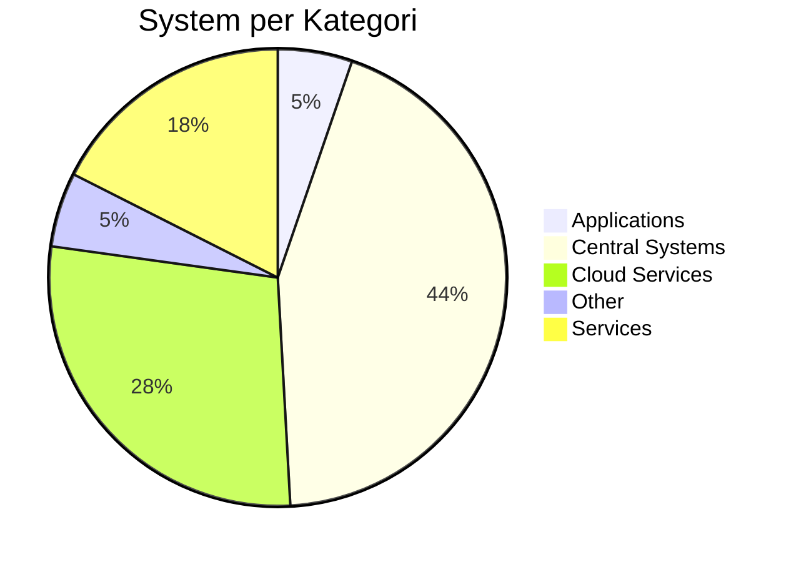
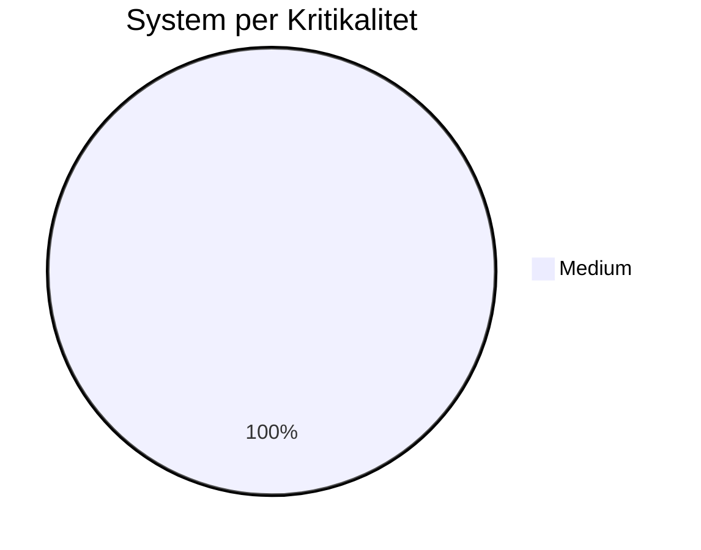
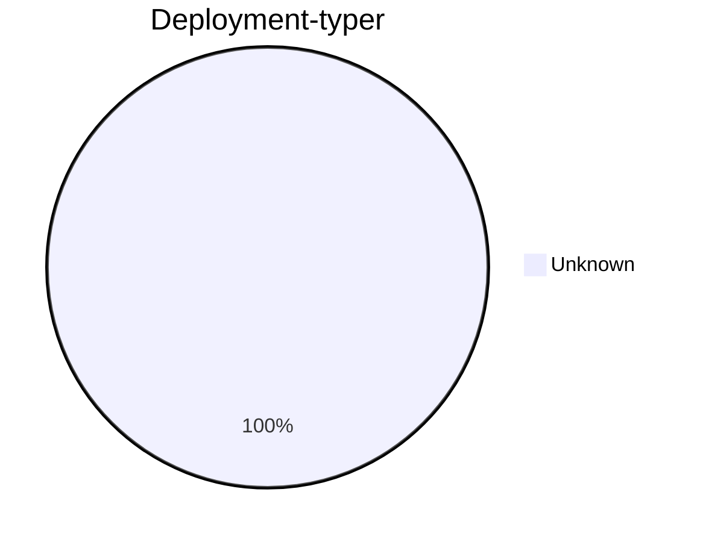

# Statistik och Översikt

## Systemöversikt

- **Totalt antal system:** 57
- **Totalt antal användare:** 0
- **Total årlig kostnad:** 0 SEK

## Fördelning per Kategori

## Fördelning per Kritikalitet

## Deployment-typer

## Tabeller

### System per Kategori

| Kategori | Antal System |
|----------|---------------|
| Applications | 3 |
| Central Systems | 25 |
| Cloud Services | 16 |
| Other | 3 |
| Services | 10 |
