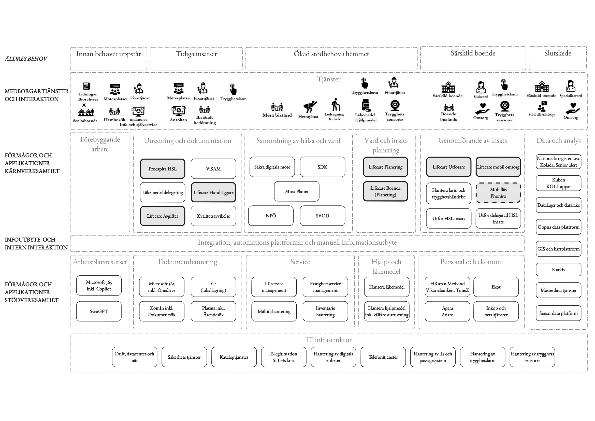

# Systemkarta - Nuläge

## Översikt

HVOF använder 57 system som kategoriseras i 5 huvudgrupper:
- **Centrala System** (25 system) - Malmö stads centrala system
- **Molntjänster** (15 system) - Cloud-baserade tjänster
- **Applikationer** (3 system) - Specifika applikationer
- **Tjänster** (10 system) - Extern tjänster och integrationer
- **Övriga System** (3 system) - Övriga system

## Systemkarta - Visuell översikt

{ width="100%" }

## Systemkategorier

### 1. Centrala System (25 system)

**Kärnsystem:**
- **3CX** - Telefonväxel för larmcentral
- **Interview (ISM)** - Larmmottagningsystem
- **Lifecare-Procapita** - Journal och vårdsystem (master för vårddata)
- **MSM (Marval)** - Ärendehantering IT
- **HRutan** - Personalsystem (master för personaldata)
- **Ekot (Raindance)** - Ekonomisystem (master för ekonomidata)

**Stödsystem:**
- Adato, Agera, Arx, Avvikelsehanteringssystem, IFacts, Intunes, Koll-Qlikview, Medvind, Open e-plattformen, Phoniro Care, Platina, RCO, Snipe-IT, Solicard, Stanley Unizon, Stratsys, Vikariebanken, Visma, Webb SESAM

### 2. Molntjänster (15 system)

**Larmcentral:**
- CMP - Remote administration trygghetslarm
- Guardtools - Väktaraviseringar
- Milestone - Kameralarm
- Optinet - Ärendehantering tekniker
- Securecloud - Securia

**Vård och Omsorg:**
- Kuben - Tidsplanering vårdbehov
- Sensio trygghetssensorer
- Smooth lite trygghetssensorer

**Administration:**
- Easyapp - Inventarie
- EcoTech - Kvalitet och dokumenthantering
- iBinder - Projektledning
- Keywin nyckelskåp
- Lime CRM - Kunddatabas
- Lärkan - Utbildning
- Mateo - Kostdata
- Senior alert - Kvalitetsregister

### 3. Applikationer (3 system)
- Mobilt e-Siths
- Net ID
- SITHS admin

### 4. Tjänster (10 system)

**Säkerhet och Inloggning:**
- Freja eID - Säker inloggning (LOA 2/3)

**Vårdtjänster:**
- NPÖ - Nationell patientöversikt (Inera)
- Pascal - Beställning läkemedel (Inera)
- MCSS - HVOF - Digital signering läkemedel
- Mina planer - Samordnad vårdplanering (KFSK)
- KomKat - HSA katalog (KFSK)

**Övrigt:**
- Phoniro Lock systems - Digitala lås
- Maskeringstjänsten - AI-tjänst
- Miro - Collaboration
- Chat-gpt - AI assistant

### 5. Övriga System (3 system)
- Imprivata
- Traka HVOF - Nyckelskåp
- Viser - Larmsystem säbo

## Masterdata - Systemansvar

| Datadomän | Master System | Sekundära System |
|-----------|--------------|------------------|
| Personal | HRutan | Medvind, Visma |
| Vårddata | Lifecare-Procapita | NPÖ, Pascal, MCSS |
| Ekonomi | Ekot (Raindance) | Koll-Qlikview, Stratsys |
| Larmdata | Interview (ISM) | 3CX, CMP, Guardtools |
| IT-ärenden | MSM (Marval) | - |
| Fastigheter | Lime CRM | - |

## Systemägare och Kontakter

Se detaljerad dokumentation per system i `02-system/` för:
- Systemägare
- Kontaktpersoner
- Organisation
- Autentisering
- Integrationer

