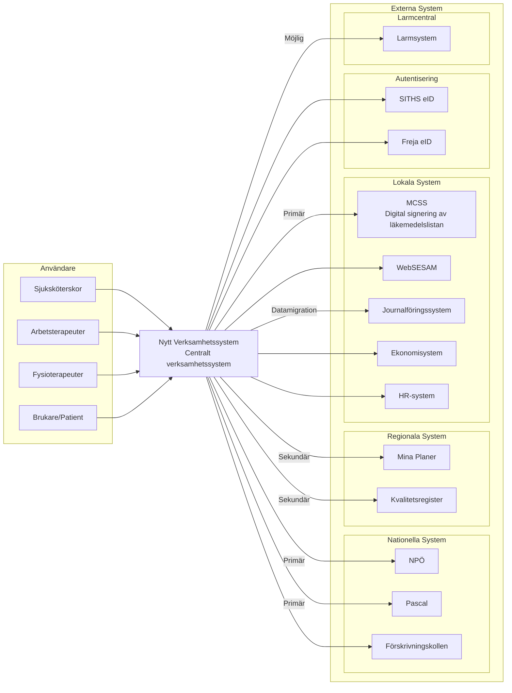
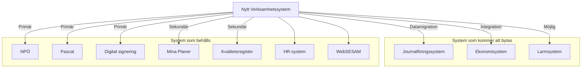

# Systemkontext
## Malmö stad | Hälsa, Vård och Omsorg (HVOF)

Systemet ska fungera som centralt verksamhetssystem för vårdhantering, journalföring och verksamhetsstöd. Det ska integrera med befintliga system och stödja alla verksamhetsområden inom HVOF.

## Systemkontext

Systemet ska fungera som central hub för vårddata och integrera med kritiska externa system för patientöversikt, läkemedel och digital signering av läkemedelslistan (MCSS). Integration med ekonomisystem och HR-system är nödvändig för kostnadsdata och personaladministration.

---

## Integrationer

Systemet måste integrera med ett stort antal befintliga system. Integrationerna är prioriterade enligt verksamhetskritiska behov.

### Integrationer per prioritet

| Prioritet | System | Syfte |
|-----------|--------|-------|
| **Primär** | NPÖ | Nationell patientöversikt |
| **Primär** | Pascal | Läkemedelshantering |
| **Primär** | MCSS | Digital signering av läkemedelslistan |
| **Sekundär** | Kvalitetsregister | Kvalitetssäkring |
| **Sekundär** | Mina Planer | Samordnad vårdplan |
| **Sekundär** | Tid- och insatsuppföljning | Planering och uppföljning |
| **Sekundär** | Välfärdsteknik | Trygghetslarm och välfärdsteknik |
| **Möjlig** | Larmcentral | Larmhantering |

**Totalt**: 30+ huvudintegrationer, 170+ tekniska kopplingar. Se [Behov och frågor](../rfi-material/behov-och-fragor.md#vara-behov-teknik-och-integration) för komplett lista.

---

## System som kommer att bytas

Flera system i nuvarande systemlandskap kommer att bytas ut. Detta påverkar planeringen för ett nytt verksamhetssystem och integrationsmöjligheter.

---

**Malmö stad | Hälsa, Vård och Omsorg (HVOF)**

