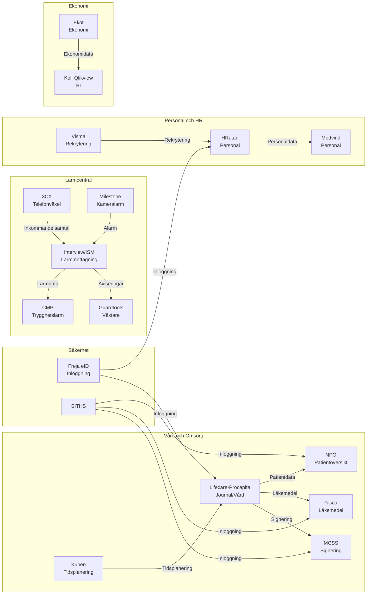
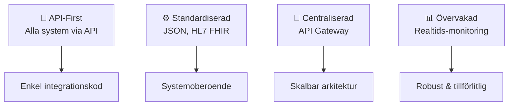

# 🔗 Integrationskarta - Nuläge

## 📌 Vad är detta?

!!! note "Definition"
    Denna karta visar huvudsakliga integrationer mellan system i HVOFs systemlandskap och identifierar kritiska dataflöden, integrationsproblem och framtida behov.

## Integrationskarta - Visuell översikt

## 📊 Integrationstyper

| Typ | Exempel | Fördelar | Utmaningar |
|-----|---------|----------|-----------|
| 🔌 **API (REST/SOAP)** | Freja eID, NPÖ, Pascal | Realtid, standardiserad | Kräver API-stöd |
| 📁 **Filöverföring (Batch)** | Ekot→Koll, HRutan→Medvind | Enkel, pålitlig | Långsam, felkänslig |
| 🗄️ **Direkta databaslänkar** | ISM→CMP, Kuben→Lifecare | Snabb | Säkerhet, beroende |
| 📨 **Meddelandeköer** | 3CX→ISM, Milestone→ISM | Asynkron, robust | Komplex |

---

## 🚨 Kritiska integrationer

### 🚨 Larmcentral

| Från | Till | Typ | Data | Kritikalitet | Status |
|------|------|------|------|--------------|--------|
| 3CX | Interview/ISM | Realtid | Samtal | 🔴 **Hög** | ✅ Aktiv |
| Milestone | Interview/ISM | Realtid | Alarm | 🔴 **Hög** | ✅ Aktiv |
| ISM | CMP | API/Batch | Larmdata | 🔴 **Hög** | ✅ Aktiv |
| ISM | Guardtools | API | Aviseringar | 🟡 **Medel** | ✅ Aktiv |

<strong>🚨 Kritisk:</strong> Dessa integrationer är livskritiska för larmhantering. Måste ha noll-downtime-migrering vid systembyte.

### 🏥 Vård och Omsorg

| Från | Till | Typ | Data | Kritikalitet | Status |
|------|------|------|------|--------------|--------|
| Lifecare | NPÖ | API | Patientjournal | 🔴 **Hög** | ✅ Aktiv |
| Lifecare | Pascal | API | Läkemedel | 🔴 **Hög** | ✅ Aktiv |
| Lifecare | MCSS | API | Signering | 🟡 **Medel** | ✅ Aktiv |
| Kuben | Lifecare | API/DB | Tidsplanering | 🟡 **Medel** | ⚠️ Batch |

<strong>💡 Viktigt:</strong> Patientjournal-integrationer måste följa HL7-standard och är säkerhetskritiska

### 👥 Personal & HR

| Från | Till | Typ | Data | Kritikalitet | Status |
|------|------|------|------|--------------|--------|
| HRutan | Medvind | Batch/Fil | Personaldata | 🟡 **Medel** | ✅ Aktiv |
| Visma | HRutan | API | Rekrytering | 🟢 **Låg** | ⚠️ Begränsad |
| Freja eID | Lifecare,HRutan | SSO/API | Autentisering | 🔴 **Hög** | ✅ Aktiv |

### 📊 Ekonomi

| Från | Till | Typ | Data | Kritikalitet | Status |
|------|------|------|------|--------------|--------|
| Ekot | Koll-Qlikview | Batch/Fil | Ekonomidata | 🟡 **Medel** | ✅ Aktiv |

---

## ⚠️ Integrationsproblem & utmaningar

| # | Problem | Påverkan | Lösning | Prioritet |
|---|---------|----------|--------|----------|
| 1 | 🔗 Många point-to-point integrationer | Svårunderhållet, ogenomskinligt | Centraliserad integrationstjänst | 🔴 Hög |
| 2 | 🎯 Blandade integrationstyper | Inkonsekvens, svårt att optimera | Standardisera på API | 🔴 Hög |
| 3 | 🏗️ Starka beroenden | Svårt att byta system | Arkitektur-refaktor | 🟡 Medel |
| 4 | 📚 Brist på dokumentation | Oklar data, tidskrävande debug | Dokumentera alla | 🟡 Medel |
| 5 | 📊 Ingen övervakning | Kan missa fel | Implementera monitoring | 🟡 Medel |

!!! danger "Högsta prioritet"
    Point-to-point integrationer är den största tekniska skulden. Vi behöver en integrationsstrategi.

---

## 🎯 Framtida målbild - Integrationsarkitektur

### Principer för framtiden

### Migreringsväg

| Fas | Tidslinje | Fokus | Effekt |
|-----|-----------|-------|--------|
| **1. Dokumentation** | Q1-Q2 | Mappa alla integrationer | 📚 Kunskap |
| **2. Standardisering** | Q2-Q3 | Migrera till REST API | 🔌 Modern |
| **3. Centralisering** | Q4+ | Implementera API-gateway | 🚪 Skalbar |
| **4. Optimering** | År 2+ | Monitoring & optimering | 📊 Robust |

---

## 🔗 Läs mer

- 🏗️ [Arkitekturprinciper](../overview/architecture-principles.md) - Designriktlinjer
- 🗺️ [Systemlandskap](./system-landscape.md) - Se alla system
- 🔴 [Pain Points](../analyses/pain-points.md) - Nuvarande problem
- 📈 [Gap-analys](../analyses/gap-analysis.md) - Vad behöver förbättras?

