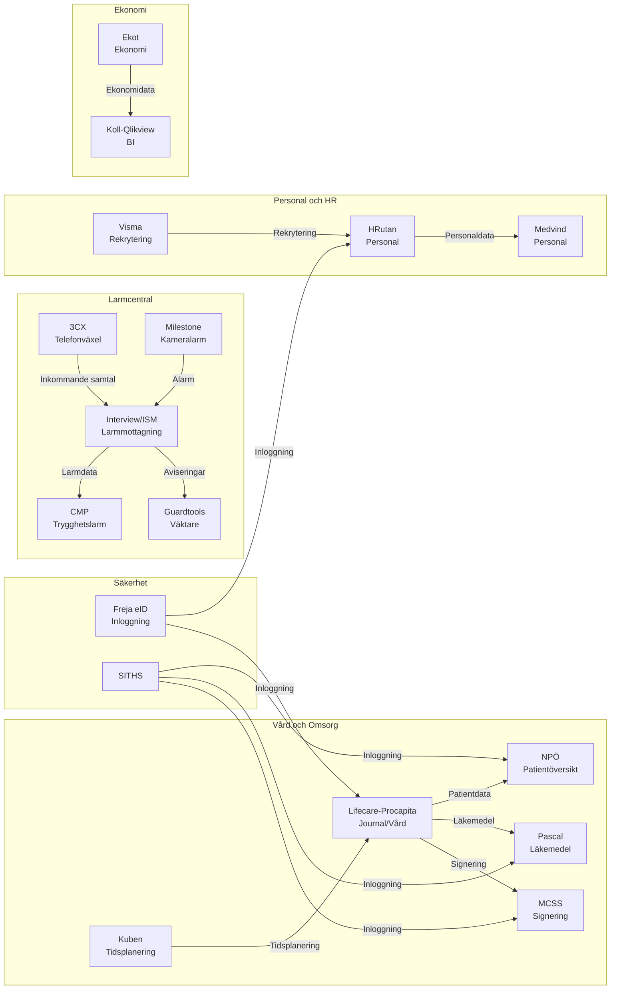

# Integrationskarta - Nuläge

## Översikt

Denna karta visar huvudsakliga integrationer mellan system i HVOFs systemlandskap.

## Integrationskarta - Visuell översikt

## Integrationstyper

### 1. API-integrationer (REST/SOAP)
- **Freja eID** → HRutan, Lifecare-Procapita
- **NPÖ** ↔ Lifecare-Procapita
- **Pascal** ↔ Lifecare-Procapita
- **KomKat** ↔ Externa system

### 2. Filöverföringar (Batch)
- **Ekot** → Koll-Qlikview (ekonomidata)
- **HRutan** → Medvind (personaldata)
- **Lifecare-Procapita** → Phoniro Care (tidsdata)

### 3. Direkta databaslänkar
- **Interview/ISM** → CMP (larmdata)
- **Kuben** → Lifecare-Procapita (tidsplanering)

### 4. Meddelandeköer
- **3CX** → Interview/ISM (samtal)
- **Milestone** → Interview/ISM (alarm)

## Kritiska Integrationer

### Larmcentral
1. **3CX → Interview/ISM**
   - Typ: Realtid
   - Data: Inkommande samtal
   - Kritikalitet: Hög

2. **Interview/ISM → CMP**
   - Typ: API/Batch
   - Data: Larmdata, trygghetslarm
   - Kritikalitet: Hög

3. **Interview/ISM → Guardtools**
   - Typ: API
   - Data: Aviseringar, larmorder
   - Kritikalitet: Medel

### Vård och Omsorg
1. **Lifecare-Procapita ↔ NPÖ**
   - Typ: API
   - Data: Patientdata, journal
   - Kritikalitet: Hög

2. **Lifecare-Procapita ↔ Pascal**
   - Typ: API
   - Data: Läkemedelsbeställningar
   - Kritikalitet: Hög

3. **Kuben → Lifecare-Procapita**
   - Typ: API/Databas
   - Data: Tidsplanering, vårdbehov
   - Kritikalitet: Medel

### Personal
1. **HRutan → Medvind**
   - Typ: Batch/Fil
   - Data: Personaldata
   - Kritikalitet: Medel

2. **Freja eID → HRutan, Lifecare-Procapita**
   - Typ: SSO/API
   - Data: Autentisering
   - Kritikalitet: Hög

## Integrationsproblem och Utmaningar

### Identifierade problem
1. **Många point-to-point integrationer**
   - Svårt att underhålla
   - Brist på centraliserad integrationstjänst

2. **Blandade integrationstyper**
   - API, Batch, Direkt databas
   - Olika standarder och format

3. **Beroenden mellan system**
   - Svårt att byta system
   - Kaskadeffekter vid ändringar

4. **Brist på dokumentation**
   - Många integrationer saknar dokumentation
   - Svårt att förstå dataströmmar

## Framtida Mål - Integrationer

### Principer
1. **API-first** - Alla integrationer via API
2. **Standardiserade format** - JSON, HL7 FHIR för vårddata
3. **Centraliserad integrationstjänst** - Eventuell API-gateway eller integration platform
4. **Dokumentation** - Alla integrationer dokumenterade
5. **Monitoring** - Övervakning av integrationer

### Prioriterade förbättringar
1. Dokumentera alla befintliga integrationer
2. Identifiera kritiska integrationer
3. Planera för centraliserad integrationstjänst
4. Standardisera integrationstyper

