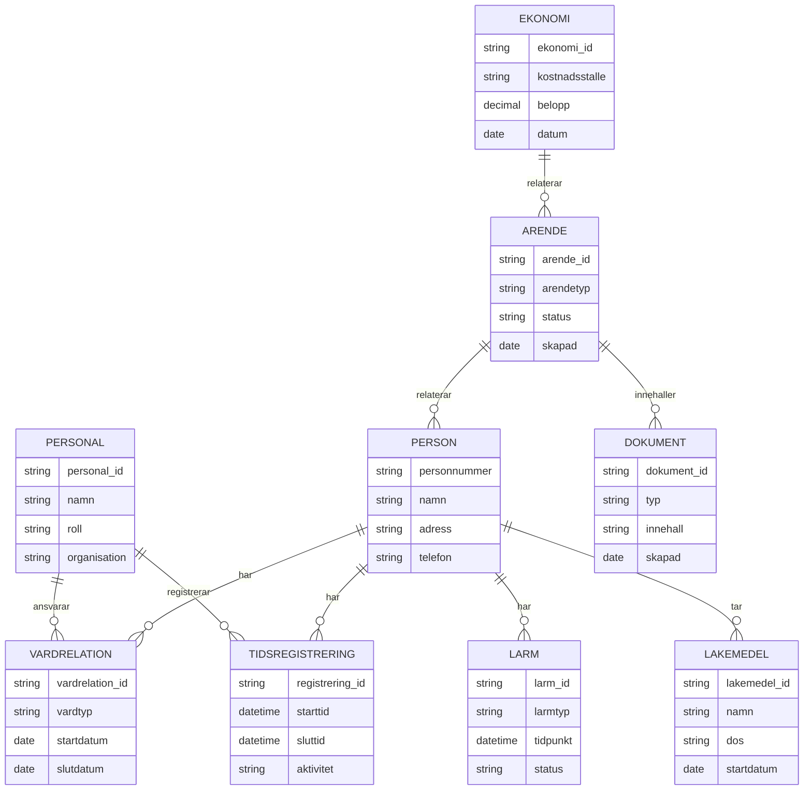

# Informationsmodell - Nuläge

## Översikt

Denna modell beskriver viktiga informationsdomäner och deras relationer i HVOFs systemlandskap.

## Informationsdomäner

## Huvuddomäner

### 1. Person (Master: HRutan, Lifecare-Procapita)

**Viktiga attribut:**
- Personnummer
- Namn
- Adress
- Kontaktuppgifter
- Vårdrelationer

**System som hanterar:**
- **HRutan** - Personal (master)
- **Lifecare-Procapita** - Brukare/patienter (master)
- **NPÖ** - Patientöversikt (referens)
- **Interview/ISM** - Larmmottagning

### 2. Vård och Omsorg (Master: Lifecare-Procapita)

**Viktiga attribut:**
- Journalanteckningar
- Vårdplaner
- Tidsplanering
- Insatser
- Uppföljning

**System som hanterar:**
- **Lifecare-Procapita** - Master för vårddata
- **Kuben** - Tidsplanering
- **Phoniro Care** - Tid och insatsuppföljning
- **NPÖ** - Nationell patientöversikt
- **Mina planer** - Samordnad vårdplanering

### 3. Läkemedel (Master: Pascal, MCSS)

**Viktiga attribut:**
- Läkemedelsbeställningar
- Dosering
- Signering
- Expedition

**System som hanterar:**
- **Pascal** - Beställning och expedition (Inera)
- **MCSS** - Digital signering
- **Lifecare-Procapita** - Journal (referens)

### 4. Larm och Trygghet (Master: Interview/ISM)

**Viktiga attribut:**
- Larmtyp (trygghetslarm, personlarm, inbrottslarm)
- Tidpunkt
- Status
- Hantering
- Uppföljning

**System som hanterar:**
- **Interview/ISM** - Master för larmdata
- **3CX** - Telefonväxel
- **CMP** - Trygghetslarm administration
- **Guardtools** - Väktaraviseringar
- **Milestone** - Kameralarm
- **Viser** - Larmsystem säbo
- **Sensio/Smooth lite** - Trygghetssensorer

### 5. Personal (Master: HRutan)

**Viktiga attribut:**
- Personalnummer
- Roll
- Organisation
- Kompetens
- Tidsregistrering

**System som hanterar:**
- **HRutan** - Master för personaldata
- **Medvind** - Personalsystem
- **Visma** - Rekrytering
- **Vikariebanken** - Timvikarier
- **Lärkan** - Utbildning

### 6. Ekonomi (Master: Ekot/Raindance)

**Viktiga attribut:**
- Kostnadsställen
- Budget
- Fakturor
- Betalningar
- Rapportering

**System som hanterar:**
- **Ekot (Raindance)** - Master för ekonomidata
- **Koll-Qlikview** - Business intelligence
- **Stratsys** - Statistik och rapportering

### 7. Ärenden (Master: MSM/Marval, Agera)

**Viktiga attribut:**
- Ärendenummer
- Ärendetyp
- Status
- Ansvarig
- Dokumentation

**System som hanterar:**
- **MSM (Marval)** - IT-ärenden (master)
- **Agera** - Incidentrapportering
- **Optinet** - Ärendehantering tekniker
- **Avvikelsehanteringssystem** - Avvikelser och synpunkter
- **Platina** - Nämndsfrågor

### 8. Dokument (Distribuerat)

**Viktiga attribut:**
- Dokumenttyp
- Innehåll
- Version
- Ägare
- Åtkomst

**System som hanterar:**
- **Platina** - Nämndsfrågor
- **EcoTech** - Kvalitet och dokumenthantering
- **Adato** - Rehabärenden
- **Lifecare-Procapita** - Journaldokument

## Masterdata - Dataägaransvar

| Datadomän | Master System | Dataägare | Sekundära System |
|-----------|--------------|-----------|------------------|
| Personal | HRutan | HR/SEF | Medvind, Visma |
| Brukare/Patienter | Lifecare-Procapita | ÖSA/FSF | NPÖ, Pascal |
| Vårddata | Lifecare-Procapita | ÖSA/FSF | Kuben, Phoniro Care |
| Larmdata | Interview/ISM | Larmcentralen | 3CX, CMP, Guardtools |
| Ekonomi | Ekot (Raindance) | Ekonomi | Koll-Qlikview, Stratsys |
| IT-ärenden | MSM (Marval) | ITD | - |
| Fastigheter | Lime CRM | Larmcentralen | - |

## Datakvalitet och Utmaningar

### Identifierade problem
1. **Flera masters för samma data**
   - Personal: HRutan och Medvind
   - Risk för inkonsekvent data

2. **Brist på datastandardisering**
   - Olika format och strukturer
   - Svårt att integrera

3. **Begränsad datakvalitetskontroll**
   - Brist på validering
   - Risk för felaktig data

4. **Distribuerad dokumentation**
   - Dokument i flera system
   - Svårt att hitta och hantera

## Framtida Mål - Informationshantering

### Principer
1. **En master per datadomän**
2. **Tydligt dataägaransvar**
3. **Standardiserade datamodeller**
4. **Datakvalitetskontroll**
5. **Dokumenterad datamodell**

### Prioriterade förbättringar
1. Definiera tydligt masterdata för varje domän
2. Etablera dataägaransvar
3. Standardisera datamodeller
4. Implementera datakvalitetskontroll
5. Dokumentera informationsmodell

