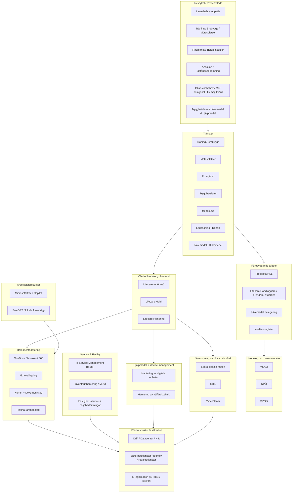

# Systemlandskap för informationsinsamling
## Malmö stad | Hälsa, Vård och Omsorg (HVOF)

!!! info "Fokus på RFI-relevanta system"
    Denna dokumentation fokuserar på system som är mest direkt relevanta för denna informationsinsamling - främst kärnverksamhetssystem, larmhantering, integration och data. För fullständig systemöversikt, se systemkatalogen.

---

## Systemöversikt (översatt från systemkartan)



---

## Kärnverksamhetssystem

### Lifecare-Procapita (Omsorgs- och sjukvårdssystem)

| Egenskap | Beskrivning |
|----------|------------|
| **Leverantör** | Tietoevry Care |
| **Systemtyp** | Integrerat omsorgs- och sjukvårdssystem |
| **Lagkrav** | SoL (Socialtjänstlagen), LSS (Lag om stöd och service), HSL (Hälso- och sjukvårdslagen) |
| **Användning** | Journalföring, ärendehantering, vårdplanering, tidsuppföljning |
| **Användartal** | Ca 200 dagliga användare |
| **Kritikalitet** | KRITISK - noll nedtid |
| **Systemstatus** | Core system - potentiell byteskandidat |

**Huvudfunktioner**:
- Elektronisk journal för äldreomsorg och socialtjänst
- Ärendehantering från anmälan till avslut
- Vårdplanering och uppföljning
- Handläggning och myndighetsutövning
- Tidsuppföljning för hemtjänst och särskilt boende
- Besluts- och verkställighetsdokumentation

**Befintliga integrationer**:

| Mottagare | Typ | Syfte |
|-----------|------|--------|
| **Phoniro Care** | API | Tid- och insatsuppföljning |
| **MCSS** | API | Digital signering |
| **Mina Planer** | API | Samordnad vårdplanering |
| **NPÖ** | HL7 FHIR | Nationell patientöversikt |
| **Pascal** | API | Läkemedel och ordinationer |
| **Senior Alert** | Export | Kvalitetsregister |
| **Ekot/Raindance** | API | Ekonomi och debitering |
| **QlikView** | API | Affärsanalys |

**RFI-betydelse**: Detta är utgångspunkten för informationsinsamlingen. Alla nya systemet måste kunna ersätta eller integrera med Lifecare-Procapita.

---

### Phoniro Care (Tid- och insatsuppföljning)

| Egenskap | Beskrivning |
|----------|------------|
| **Leverantör** | Phoniro (Assa Abloy/Tunstall) |
| **Systemtyp** | Mobilt insatsuppföljningssystem |
| **Användning** | Personal registrerar utförda besök, insatser och tider |
| **Dataflöde** | Lifecare → Phoniro → Debitering & Rapportering |
| **Kritikalitet** | HÖG - underlättar debitering |

**Funktioner**:
- GPS-spårning av hemtjänstpersonal
- Registrering av besök och insatser via mobil app
- Nyckel- och låshantering (Phoniro Lock)
- Tidsuppföljning för debitering
- Statistik och rapportering

**RFI-övervägande**: Bör nytt system ha inbyggd tid/insatsuppföljning eller fortsätta använda Phoniro via integration? Detta måste utredas i RFI.

---

### MCSS (Digital signering för HSL-uppgifter)

| Egenskap | Beskrivning |
|----------|------------|
| **Systemtyp** | Digital signeringssystem för läkemedel |
| **Användning** | Sjuksköterska ordinerar, undersköterska signerar utförda medicineringar |
| **Autentisering** | SITHS eller Freja eID |
| **Kritikalitet** | KRITISK - rättslig krav |
| **Status** | Pågående implementering - Q1-Q2 2025 |

**Integrationer**:
- Lifecare (ordinerade insatser)
- Pascal (läkemedelslista)

**RFI-betydelse**: Nytt system MÅSTE stödja digital signering av delegerade läkemedelsuppgifter enligt HSL-krav. Kan vara inbyggt eller via MCSS-integration.

---

## Vårddata och samordning

### Mina Planer (Samordnad vårdplanering)

| Egenskap | Beskrivning |
|----------|------------|
| **Leverantör** | Region Skåne + Skånes Kommuner |
| **Ändamål** | Samordnad vårdplanering mellan sjukhus, primärvård och kommun |
| **Användning** | SVP (Samordnad vårdsituation) och SIP (Samordnad individuell plan) |
| **Typisk process** | Utskrivningsklara patienter från sjukhus |

**RFI-relevans**: Nytt system måste kunna ta emot information från Mina Planer och presentera samordnade vårdplaner.

---

### NPÖ (Nationell patientöversikt)

| Egenskap | Beskrivning |
|----------|------------|
| **Leverantör** | Inera |
| **Ändamål** | Nationell tjänst för journaldatadelning |
| **Användare** | Hälso- och sjukvårdspersonal |
| **Datakällor** | Alla regioner, sjukhus och större vårdgivare |

**Funktioner**:
- Läsa journalinformation från andra vårdgivare
- Publicera egen journalinformation
- Säker datadelning mellan enheter

**RFI-krav**: Nytt system MÅSTE stödja både NPÖ-publicering och NPÖ-konsumtion.

---

### Pascal (Nationellt läkemedelsystem)

| Egenskap | Beskrivning |
|----------|------------|
| **Leverantör** | Inera |
| **Ändamål** | Ordination och beställning av dosdispenserade läkemedel |
| **Användning** | Sjuksköterska ordinerar, dosleverantör upprättar dospåsar |
| **Kritikalitet** | HÖG - patientsäkerhet |

**Integrationstyp**: Strukturerad läkemedelslista från Lifecare/nytt system → Pascal

**RFI-krav**: Direktlänk eller SSO-integration med Pascal krävs.

---

### Senior Alert (Nationellt kvalitetsregister)

| Egenskap | Beskrivning |
|----------|------------|
| **Leverantör** | CPUA Region Jönköpings län |
| **Ändamål** | Vårdprevention och kvalitetsmätning |
| **Fokusområden** | Fall, trycksår, nutrition, munhälsa, blåsdysfunktion |
| **Rapportering** | Nationell statistik på kommun- och enhetsnivå |

**RFI-krav**: Systemet måste kunna exportera riskbedömningsdata till Senior Alert.

---

## Larm- och välfärdsteknik

### Interview/ISM (Larmmottagningssystem)

| Egenskap | Beskrivning |
|----------|------------|
| **Systemtyp** | Core larmmottagningssystem |
| **Larmtyper** | Trygghets-, person- och inbrottslarm |
| **Kritikalitet** | KRITISK - säkerhet för brukare |
| **Operativ timmar** | 24/7 |

**Flöde**:
```
Larmgivare (sensor/knapp) → Interview/ISM → 3CX/Personal → Åtgärd → Dokumentation
```

**Krav på nytt system**:
- Möjlighet att dokumentera mottagna larm
- Koppla larm till brukare/patient
- Åtgärdshistorik och uppföljning

---

### 3CX (Telefonikommunikation)

| Egenskap | Beskrivning |
|----------|------------|
| **Leverantör** | 3CX |
| **Typ** | IP-PBX och kommunikationsplattform |
| **Funktioner** | VoIP, telefonväxel, video, chatt, köhantering |
| **Integration** | Interview/ISM, CMP-larmgivare |
| **SLA** | 99,9% tillgänglighet |

---

### CMP (Välfärdsteknisk plattform)

| Egenskap | Beskrivning |
|----------|------------|
| **Typ** | Central välfärdsteknisk plattform |
| **Sensorer** | Trygghetslarm, rörelsedetektorer, dörralarmer, fuktdetektorer |
| **Integration** | Interview/ISM, 3CX, hemtjänstssystem |
| **Status** | Pågående rollout av sensorer |

**RFI-övervägande**: Nytt system bör kunna ta emot larm och välfärdstekniska händelser från CMP-plattformen.

---

## Rapportering och affärsanalys

### QlikView / Qlik Sense (Business Intelligence)

| Egenskap | Beskrivning |
|----------|------------|
| **Leverantör** | Qlik |
| **Ändamål** | Affärsanalys och rapportering |
| **Datakällor** | Lifecare, Phoniro, ekonomisystem |
| **Användare** | Ledning, verksamhetsutveckling |

**RFI-krav**: Nytt system måste exponera data för Qlik-integration.

---

## Övergripande arkitekturbehov

### Integration och datautbyte

| Integrationsbehov | Prioritet | Beskrivning |
|------------------|-----------|------------|
| **HL7 FHIR API:er** | KRITISK | Moderna standarder för vårddata |
| **REST API:er** | KRITISK | Flexibel integration med systemlandskapet |
| **Batch-gränssnitt** | HÖG | För natt-processer (ekonomi, register) |
| **Real-time events** | HÖG | För larmar och akuta situationer |
| **SSO-integration** | KRITISK | Freja eID, SITHS, AD |

### Säkerhet och dataskydd

| Krav | Standard | Motivering |
|------|----------|-----------|
| **Encryption in transit** | TLS 1.2+ | Säker datakommunikation |
| **Encryption at rest** | AES-256 | Skydd av känslig data |
| **GDPR-efterlevnad** | GDPR | Lagkrav |
| **Audit logging** | 2 år lagring | Spårning av åtkomst |
| **Data residency** | Sverige/EU | Datahemvist |

### Molnstrategi

| Aspekt | Status | Impact |
|--------|--------|--------|
| **Azure-migration** | Pågår Q4 2024-Q3 2025 | Nytt system bör vara cloud-native |
| **Integrationsplattform** | Pilot Q1-Q2 2025 | Nya systemet måste stödja API-exponering |
| **On-premise migrering** | Full migration | Föredraget molnbaserat |

---

## Systembytesprojekt som påverkar denna process

### 1. Ekonomisystem-byte
- **Nuvarande**: Ekot/Raindance
- **Framtida**: Nytt ekonomi- och redovisningssystem
- **Tidsplan**: Q2-Q3 2025
- **Påverkan**: Nytt verksamhetssystem måste integrera med nytt ekonomisystem för kostnads- och debiteringsdata

### 2. Molnmigrering (Azure)
- **Strategi**: Alla system migreras till Azure (Microsoft-molnet)
- **Tidsplan**: Q4 2024 - Q3 2025
- **Påverkan**: Nytt verksamhetssystem bör vara cloud-native och kunna köras i Azure

### 3. Integrationsplattform (iPaaS)
- **Syfte**: Centraliserad integration mellan alla system
- **Typ**: API-baserad integrationsbuss
- **Tidsplan**: Pilot Q1-Q2 2025, lansering Q3 2025
- **Påverkan**: Nytt system måste kunna exponera API:er för integrationsplattformen

---

## Datamigration - Omfattning

| Datadomän | Volym | Källa | Migration |
|-----------|-------|-------|-----------|
| **Patientjournaler** | 100 000+ poster | Lifecare | Måste migreras helt |
| **Tid- och insats** | 1 miljon/år | Phoniro Care | Hela historiken |
| **Läkemedelsdata** | 20 000 aktiva | Pascal | Fullständig lista |
| **Kvalitetsregisterdata** | Register + rapporter | Senior Alert | Histor-koppling |
| **Persondata** | 350 anställda | HR-system | Integration eller manuell |

---

## Sammanfattning av RFI-fokus

Vi söker ett system som kan:

1. Ersätta eller integrera med Lifecare-Procapita
2. Stödja alla befintliga integrationer via moderna API:er
3. Migrera 100 000+ journalposter från Lifecare
4. Implementeras i Azure-molnet
5. Stödja digital signering (MCSS) och Freja eID
6. Integrera med välfärdsteknik och larmhantering
7. Möta höga tillgänglighetskrav (99,9%)
8. Implementeras parallellt med andra systembyte (ekonomi, integrationsplattform)

---

**Malmö stad | Hälsa, Vård och Omsorg (HVOF) | Senast uppdaterad: 2024-12-11**
