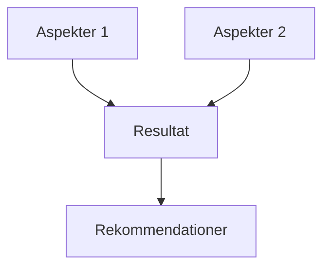

# [Analysnamn]

## Översikt

Kort beskrivning av analysen och dess syfte.

## Syfte

Varför görs denna analys? Vad är målet?

## Omfattning

Vad ingår i analysen? Vad ingår inte?

## Metod

Hur genomfördes analysen?

- [ ] Intervjuer
- [ ] Workshop
- [ ] Systemanalys
- [ ] Dataanalys
- [ ] Användarstudier
- [ ] Annat: [Beskrivning]

## Deltagare

| Roll | Namn | Organisation |
|------|------|--------------|
| Roll 1 | Namn 1 | Org 1 |
| Roll 2 | Namn 2 | Org 2 |

## Resultat

### Huvudresultat

1. Resultat 1
2. Resultat 2
3. Resultat 3

### Detaljerade fynd

#### Fynd 1: [Namn]

**Beskrivning**: [Detaljerad beskrivning]

**Påverkan**: [Vad påverkar detta?]

**Rekommendation**: [Vad bör göras?]

#### Fynd 2: [Namn]

[Upprepa struktur från Fynd 1]

## Diagram

### Översikt

## Rekommendationer

1. **Rekommendation 1**
   - Beskrivning
   - Prioritet: [Hög/Medel/Låg]
   - Effekt: [Beskrivning]

2. **Rekommendation 2**
   - [Upprepa struktur]

## Nästa steg

- [ ] Aktivitet 1
- [ ] Aktivitet 2
- [ ] Aktivitet 3

## Relaterade dokument

- [Dokument 1](link-to-doc1.md)
- [Dokument 2](link-to-doc2.md)

## Kontakt

För frågor om denna analys, kontakta [Kontaktperson].

## Uppdaterad

Senast uppdaterad: [Datum]
Uppdaterad av: [Namn]
Genomförd: [Datum]

