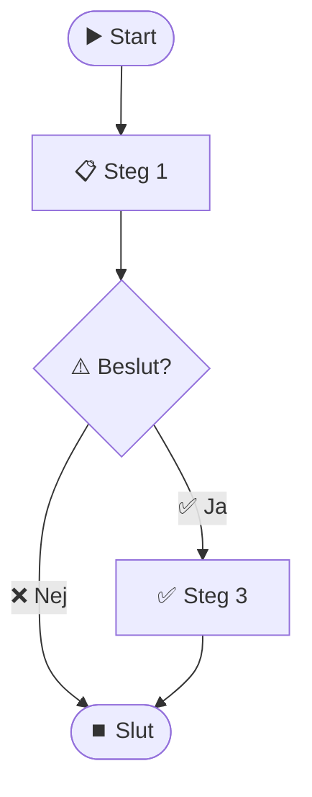
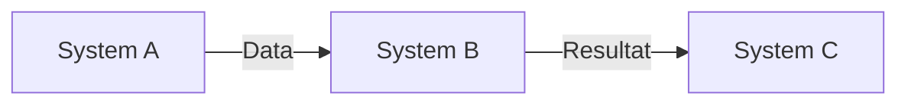

# [Processnamn]

## Översikt

Kort beskrivning av processen och dess syfte.

## Syfte

Varför finns denna process? Vad är målet?

## Omfattning

Vad ingår i processen? Vad ingår inte?

## Roller och ansvar

| Roll | Ansvar | System |
|------|--------|--------|
| Roll 1 | Ansvar 1 | System 1 |
| Roll 2 | Ansvar 2 | System 2 |

## Processflöde

### Steg 1: [Namn på steg]

**Beskrivning**: Vad händer i detta steg?

**Aktörer**: Vem utför steget?

**System**: Vilka system används?

**Input**: Vad behövs för att starta?

**Output**: Vad produceras?

**Undantag**: Vad kan gå fel? Hur hanteras det?

### Steg 2: [Namn på steg]

[Upprepa struktur från Steg 1]

## Diagram

### Processflöde

### Systeminvolvering

## Volym och frekvens

- **Volym**: Antal processer per [tidsperiod]
- **Frekvens**: [Dagligen/Veckovis/Månadsvis]
- **Toppar**: När sker toppbelastning?

## Pain Points

Vad fungerar dåligt idag?

1. Problem 1
2. Problem 2
3. Problem 3

## Förbättringsmöjligheter

Vad skulle kunna förbättras?

1. Förbättring 1
2. Förbättring 2

## Relaterade processer

- [Process 1](link-to-process1.md)
- [Process 2](link-to-process2.md)

## Relaterade system

- [System 1](../systems/system1/description.md)
- [System 2](../systems/system2/description.md)

## Kontakt

För frågor om denna process, kontakta [Kontaktperson].

## Uppdaterad

Senast uppdaterad: [Datum]
Uppdaterad av: [Namn]

