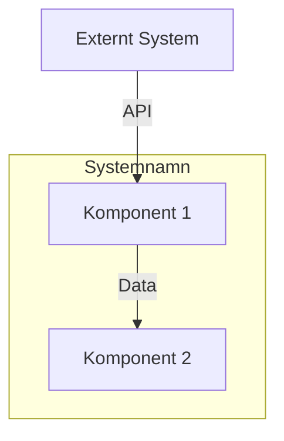
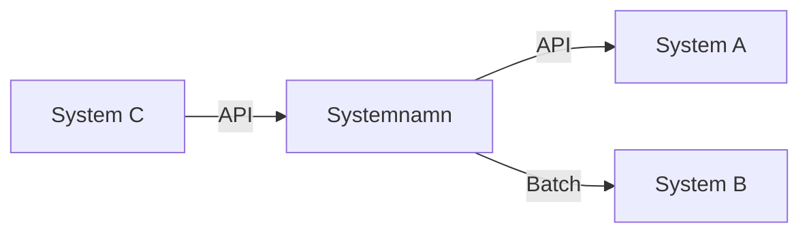
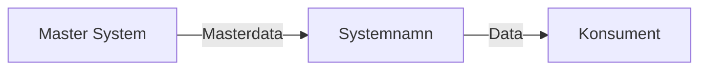

# [Systemnamn]

## Översikt

Kort beskrivning av systemet och dess syfte.

## Syfte

Varför finns detta system? Vad löser det?

## Kategori

- [ ] Centralt system
- [ ] Molntjänst
- [ ] Applikation
- [ ] Tjänst
- [ ] Övrigt

## Ägare och ansvar

- **Ägare**: [Organisation/Roll]
- **Förvaltare**: [Kontaktperson]
- **Support**: [Kontaktperson]
- **Avdelning**: [Avdelning]

## Användare

- **Totalt antal användare**: [Antal]
- **Användargrupper**: 
  - Grupp 1: [Antal] användare
  - Grupp 2: [Antal] användare

## Teknisk information

### Deployment

- [ ] On-premise
- [ ] Cloud (SaaS)
- [ ] Hybrid

### Leverantör

- **Företag**: [Leverantörsnamn]
- **Version**: [Version]
- **Support**: [Supportnivå]

### Databas

- **Typ**: [Databastyp]
- **Plats**: [Plats]

### API:er

- **API-typ**: [REST/SOAP/GraphQL]
- **Dokumentation**: [Länk]
- **Exponerade API:er**:
  - API 1: [Beskrivning]
  - API 2: [Beskrivning]

## Autentisering

- **Metod**: [Freja eID/SITHS/AD/Användarnamn+Lösenord]
- **SSO**: [Ja/Nej]
- **Tvåfaktorsautentisering**: [Ja/Nej]

## Integrationer

### Utgående integrationer

| Mål | Typ | Data | Frekvens |
|-----|-----|------|----------|
| System A | API | Data X | Realtid |
| System B | Batch | Data Y | Daglig |

### Inkommande integrationer

| Källa | Typ | Data | Frekvens |
|-------|-----|------|----------|
| System C | API | Data Z | Realtid |

## Masterdata

- **Är detta master för någon datadomän?**: [Ja/Nej]
- **Om ja, vilken?**: [Datadomän]
- **Tar emot masterdata från**: [System]

## Kritikalitet

- [ ] Kritisk (24/7, nedtid < 1 timme)
- [ ] Hög prioritet (daglig drift, nedtid < 4 timmar)
- [ ] Medel prioritet (viktigt stödsystem, nedtid < 24 timmar)
- [ ] Låg prioritet (stödsystem, nedtid < 48 timmar)

## Kostnad

- **Årlig kostnad**: [Belopp] SEK
- **Licenskostnad**: [Belopp] SEK
- **Supportkostnad**: [Belopp] SEK

## Status

- [ ] Aktiv
- [ ] Planerad
- [ ] Deprecated
- [ ] Pensionerad

## Diagram

### Systemöversikt

### Integrationer

### Dataflöde

## Pain Points

Vad fungerar dåligt?

1. Problem 1
2. Problem 2

## Framtida planer

- Plan 1
- Plan 2

## Relaterade system

- [System 1](system1/description.md)
- [System 2](system2/description.md)

## Relaterade processer

- [Process 1](../processes/core-processes/process1.md)
- [Process 2](../processes/core-processes/process2.md)

## Dokumentation

- **Användarhandbok**: [Länk]
- **Teknisk dokumentation**: [Länk]
- **API-dokumentation**: [Länk]

## Kontakt

För frågor om detta system, kontakta [Kontaktperson].

## Uppdaterad

Senast uppdaterad: [Datum]
Uppdaterad av: [Namn]

